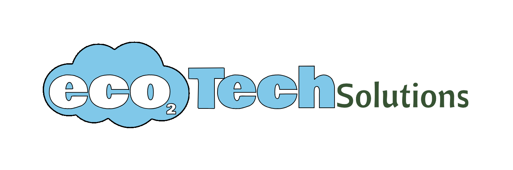

# **TSSR-2402-P3-G2-BuildYourInfra-EcoTechSolutions**

##  **Sommaire**

1) Présentation du Projet et Objectifs finaux

2) Mise en contexte

3) Présentation des membres du groupe et rôles par Sprint

4) Choix techniques et contraintes

5) Difficultés rencontrées

6) Solutions et/ou alternatives trouvées pour palier aux problèmes

7) Next-step : Améliorations possibles envisagées

8) Conclusion

## **Présentation du Projet et Objectifs finaux**

Le Projet **_BuildYourInfra_** consiste, en partant de bases minimalistes, à créer une Infrastructure complète pour l'entreprise **_EcoTech Solutions_**.

Le projet est découpé en sprint d'une semaine et s'étalera sur 11 semaines.
Une présentation de l'avancement du projet sera donnée à chaque fin de sprint, avec une démonstration (dans le cas où cela est possible).
Le projet devra être finalisé et rendu pour le 25 juillet 2024, une présentation exceptionnelle aura lieu ce jour durant le _Demo Day_.

Les objectifs du projet seront évolutifs, et correspondront aux besoins de **_EcoTech Solutions_**.

Les objectifs seront donnés par sprint, ils devront être catégoriser par priorité à chaque début de sprint :
* Objectif principal : il doit être impérativement atteint à la fin du sprint.
* Objectif secondaire : il doit être reporté sur le sprint suivant si il n'est pas achevé, sa priorité sera alors ré-évaluée.
* Objectif optionnel : pas de priorité avérée, mais il devra être réalisé d'ici à la fin du projet.

La documentation jointe au Projet est constituée de différents fichiers (au format markdown), ainsi que d'un dossier dans lequel seront placés toutes les annexes.

Un dépôt GitHub a été créé à cet effet : [TSSR-2402-P3-G2-BuildYourInfra-EcoTechSolutions](https://github.com/WildCodeSchool/TSSR-2402-P3-G2-BuildYourInfra-EcoTechSolutions)

Seront insérés dans le dépôt :
* un fichier README.md : documentation générale du projet.
* un fichier INSTALL.md par sprint (avec la nomenclature Sxx_INSTALL.md) : documentation administrateur.
* un fichier USER_GUIDE.md par sprint (avec la nomenclature Sxx_USER_GUIDE.md) : documentation utilisateur.
* un dossier _Ressource_ où seront placés toutes les annexes (images, scripts,...).

## **Mise en contexte**

Notre société **_DANAteCh_** a été mandatée par l'entreprise **_EcoTech Solutions_** pour répondre à ses besoins en termes d'infrastructure réseau.

**_EcoTech Solutions_**, basée à Bordeaux, est spécialisée dans le développement de solutions IoT (Internet des objets) pour la gestion intelligente de l'énergie et des ressources. En partenariat avec le gouvernement et les entreprises du secteur de l'énergie, elle déploie des systèmes de surveillance et de contrôle avancés pour optimiser l'utilisation des ressources naturelles, réduire les émissions de carbone et promouvoir la durabilité environnementale. Son expertise technologique et son engagement envers l'innovation en font un acteur clé dans la transition vers une économie verte.

Nous devons ainsi aider à la mise en place d'une infrastructure réseau complète, qui respectera les valeurs de **_EcoTech Solutions_**.

Cette infrastructure respectera également les [bonnes pratiques de la cybersécurité pour les TPE/TME](https://cyber.gouv.fr/publications/la-cybersecurite-pour-les-tpepme-en-treize-questions) publiées par l'ANSSI.

## **Présentation des membres du groupe et rôles par Sprint**

Le groupe du Projet **_BuildYourInfra_** est composé de :
* **Ahmed Ben Rebai**
* **Charles Caulier**
* **Damien Legay**
* **Anthony Javault**
* **Nicolas Maggiori**

### **S09 - Semaine du 23 au 30 avril 2024**

|PO|SM|
|:-:|:-:|
|Ahmed Ben Rebai|Nicolas Maggiori|

Activités et répartitions des tâches

|             Tâches              | Ahmed Ben Rebai | Charles Caulier | Damien Legay | Anthony Javault | Nicolas Maggiori |
| :-----------------------------: | :-------------: | :-------------: | :----------: | :-------------: | :--------------: |
|       Nomenclature de nom       |        x        |                 |              |        x        |        x         |
|       Listing du matériel       |                 |                 |      x       |        x        |        x         |
|     Plan d'adressage réseau     |        x        |                 |      x       |                 |        x         |
|   Plan schématique du réseau    |        x        |                 |      x       |                 |                  |
|      Création VM Serveurs       |                 |        x        |              |                 |        x         |
|        Création domaine         |                 |        x        |              |                 |                  |
|           Création OU           |                 |        x        |              |                 |                  |
|      Création Groups/Users      |                 |        x        |              |                 |                  |
|       Intégration dans AD       |                 |                 |              |                 |                  |
|     Préparation Scripts PS      |                 |                 |              |        x        |                  |
|          Documentation          |                 |        x        |      x       |        x        |        x         |
| Préparation slides Présentation |                 |                 |      x       |        x        |                  |
|          Présentation           |        x        |        x        |      x       |        x        |        x         |

### **S11 - Semaine du 13 au 17 mai 2024**

|PO|SM|
|:-:|:-:|
|||

Activités et répartitions des tâches

|             Tâches              | Ahmed Ben Rebai | Charles Caulier | Damien Legay | Anthony Javault | Nicolas Maggiori |
| :-----------------------------: | :-------------: | :-------------: | :----------: | :-------------: | :--------------: |
|                                 |                 |                 |              |                 |                  |
|                                 |                 |                 |              |                 |                  |
|                                 |                 |                 |              |                 |                  |
|                                 |                 |                 |              |                 |                  |
|                                 |                 |                 |              |                 |                  |
|                                 |                 |                 |              |                 |                  |
|                                 |                 |                 |              |                 |                  |
|                                 |                 |                 |              |                 |                  |
|                                 |                 |                 |              |                 |                  |
|                                 |                 |                 |              |                 |                  |
|                                 |                 |                 |              |                 |                  |
| Préparation slides Présentation |                 |                 |              |                 |                  |
|          Présentation           |        x        |        x        |      x       |        x        |        x         |

### **S12 - Semaine du 27 au 31 mai 2024**

|PO|SM|
|:-:|:-:|
|||

Activités et répartitions des tâches

|             Tâches              | Ahmed Ben Rebai | Charles Caulier | Damien Legay | Anthony Javault | Nicolas Maggiori |
| :-----------------------------: | :-------------: | :-------------: | :----------: | :-------------: | :--------------: |
|                                 |                 |                 |              |                 |                  |
|                                 |                 |                 |              |                 |                  |
|                                 |                 |                 |              |                 |                  |
|                                 |                 |                 |              |                 |                  |
|                                 |                 |                 |              |                 |                  |
|                                 |                 |                 |              |                 |                  |
|                                 |                 |                 |              |                 |                  |
|                                 |                 |                 |              |                 |                  |
|                                 |                 |                 |              |                 |                  |
|                                 |                 |                 |              |                 |                  |
|                                 |                 |                 |              |                 |                  |
| Préparation slides Présentation |                 |                 |              |                 |                  |
|          Présentation           |        x        |        x        |      x       |        x        |        x         |

### **S13 - Semaine du 3 au 7 juin 2024**

|PO|SM|
|:-:|:-:|
|||

Activités et répartitions des tâches

||Ahmed Ben Rebai|Charles Caulier|Damien Legay|Anthony Javault|Nicolas Maggiori|
|:-:|:-:|:-:|:-:|:-:|:-:|
|||||||
|||||||
|||||||
|||||||
|||||||
|||||||
|||||||
|||||||
|||||||
|||||||
|||||||
|Préparation slides Présentation||||||
|Présentation|x|x|x|x|x|

### **S14 - Semaine du 10 au 14 juin 2024**

|PO|SM|
|:-:|:-:|
|||

Activités et répartitions des tâches

||Ahmed Ben Rebai|Charles Caulier|Damien Legay|Anthony Javault|Nicolas Maggiori|
|:-:|:-:|:-:|:-:|:-:|:-:|
|||||||
|||||||
|||||||
|||||||
|||||||
|||||||
|||||||
|||||||
|||||||
|||||||
|||||||
|Préparation slides Présentation||||||
|Présentation|x|x|x|x|x|

### **S15 - Semaine du 17 au 21 juin 2024**

|PO|SM|
|:-:|:-:|
|||

Activités et répartitions des tâches

||Ahmed Ben Rebai|Charles Caulier|Damien Legay|Anthony Javault|Nicolas Maggiori|
|:-:|:-:|:-:|:-:|:-:|:-:|
|||||||
|||||||
|||||||
|||||||
|||||||
|||||||
|||||||
|||||||
|||||||
|||||||
|||||||
|Préparation slides Présentation||||||
|Présentation|x|x|x|x|x|

### **S16 - Semaine du 24 au 28 juin 2024**

|PO|SM|
|:-:|:-:|
|||

Activités et répartitions des tâches

||Ahmed Ben Rebai|Charles Caulier|Damien Legay|Anthony Javault|Nicolas Maggiori|
|:-:|:-:|:-:|:-:|:-:|:-:|
|||||||
|||||||
|||||||
|||||||
|||||||
|||||||
|||||||
|||||||
|||||||
|||||||
|||||||
|Préparation slides Présentation||||||
|Présentation|x|x|x|x|x|

### **S17 - Semaine du 1 au 5 juillet 2024**

|PO|SM|
|:-:|:-:|
|||

Activités et répartitions des tâches

||Ahmed Ben Rebai|Charles Caulier|Damien Legay|Anthony Javault|Nicolas Maggiori|
|:-:|:-:|:-:|:-:|:-:|:-:|
|||||||
|||||||
|||||||
|||||||
|||||||
|||||||
|||||||
|||||||
|||||||
|||||||
|||||||
|Préparation slides Présentation||||||
|Présentation|x|x|x|x|x|

### **S18 - Semaine du 8 au 12 juillet 2024**

|PO|SM|
|:-:|:-:|
|||

Activités et répartitions des tâches

||Ahmed Ben Rebai|Charles Caulier|Damien Legay|Anthony Javault|Nicolas Maggiori|
|:-:|:-:|:-:|:-:|:-:|:-:|
|||||||
|||||||
|||||||
|||||||
|||||||
|||||||
|||||||
|||||||
|||||||
|||||||
|||||||
|Préparation slides Présentation||||||
|Présentation|x|x|x|x|x|

### **S19 - Semaine du 15 au 19 juillet 2024**

|PO|SM|
|:-:|:-:|
|||

Activités et répartitions des tâches

||Ahmed Ben Rebai|Charles Caulier|Damien Legay|Anthony Javault|Nicolas Maggiori|
|:-:|:-:|:-:|:-:|:-:|:-:|
|||||||
|||||||
|||||||
|||||||
|||||||
|||||||
|||||||
|||||||
|||||||
|||||||
|||||||
|Préparation slides Présentation||||||
|Présentation|x|x|x|x|x|

### **S20 - Semaine du 22 au 26 juillet 2024**

|PO|SM|
|:-:|:-:|
|||

Activités et répartitions des tâches

||Ahmed Ben Rebai|Charles Caulier|Damien Legay|Anthony Javault|Nicolas Maggiori|
|:-:|:-:|:-:|:-:|:-:|:-:|
|||||||
|||||||
|||||||
|||||||
|||||||
|||||||
|||||||
|||||||
|||||||
|||||||
|||||||
|Préparation slides Présentation||||||
|Présentation|x|x|x|x|x|

## **Choix techniques et contraintes**

## **Difficultés rencontrées**

## **Solutions et/ou alternatives trouvées pour palier aux problèmes**

## **Next-step : Améliorations possibles envisagées**

## **Conclusion**