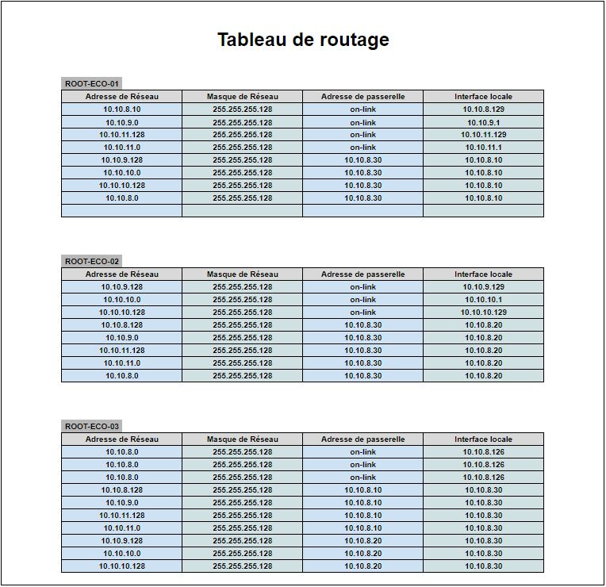

# **TSSR-2402-P3-G2-BuildYourInfra-EcoTechSolutions**

## **Sommaire**

1) Pré-requis techniques

2) Installation et Configuration des équipements et des ressources

3) FAQ : Solutions aux problèmes connus et communs liés à l'installation et à la configuration

## **Pré-requis techniques**

Voici la situation originelle de la société **_EcoTech Solutions_**
* Nombre d'employés : 54 répartis dans 7 départements distincts, incluant 6 personnes extérieures
* Pas de nomadisme, ni de télétravail
* 48 PC portables de marques hétérogènes, il n'est à ce jour pas prévu de les changer
* Aucun serveur, ni matériel réseau
* Réseau 10.10.8.0/24 en WIFI uniquement (fourni par la Box FAI) avec des répéteurs WIFI
* Messagerie hébergée en Cloud sur le Web, chaque collaborateur a une adresse mail du type `prenom.nom@ecotechsolutions.fr`
* Pas de matériel spécifique dédié à la Sécurité, les PC sont en workgroups avec connexion sans mot de passe
* Un NAS "grand public" indépendant sert au stockage des données, pas de rétentions ni de redondance
* Ligne téléphone fixe et portable aléatoire suivant les collaborateurs

Nous avons dans un premier temps réalisé un Organigramme, afin de mieux situer les besoins de **_EcoTech Solutions_**

Cet organigramme est sujet à remaniement, étant donné qu'un partenariat est en cours et pourrait aboutir dans un avenir proche.

Nous avons délibérement inclus les membres de notre société, dans le service DSI.

### Récapitulatif des ressources nécessaires

Afin de préparer au mieux la transition, nous avons réalisé une étude afin de déterminer :
* Les besoins matériel de l'entreprise, nécessaires à l'élaboration d'une infrastructure réseau complète
* Une nomenclature de nom pour standardisation
* Le plan schématique du futur réseau
* Le plan d'adressage du futur réseau

#### Les besoins matériel

Cette liste est un premier jet qui servira de base à la construction de l'infrastructure réseau nécessaire pour un bon fonctionnement spécifique à l'entité, elle pourra bien évidemment évoluer dans le temps en fonction des besoins de **_EcoTech Solutions_**.

### La nomenclature de nom

Cette nomenclature a été établie afin de standardiser l'infrastructure et les évolutions possibles de celle-ci.

Elle correspond à la mise en place à venir de **_Active Directory_** qui permet de fournir des services centralisés d'identification, d'authentification et de gestions de politiques dans un réseau d'ordinateurs.

En ce qui concerne la standardisation Matériel :
* Les PC Portables actuellement disponibles vont être renommés sous la forme `ECO-LP-xx` (où `xx` sera un numéro).
* Dans le cas où des PC fixe seraient mis en place, ils seront nommés sous la forme `ECO-WS-xx`.
* Les Téléphones sont aussi référencés, respectivement `ECO-FIX-xx` pour les téléphones fixes et `ECO-TEL-xx` pour les portables.
* Nous avons prévus également un standard pour les péréiphériques potentiellement utiles : `ECO-PRT-xx` pour les imprimantes, `ECO-FAX-xx` pour les Fax, `ECO-SCAN-xx` pour les scanners, `ECO-VOIP-xx` pour la téléphonie VOIp
* Les serveurs mis en place seront nommés sous la forme `ECO-SRV-App-xx` (où `App` correspondra à l'application du serveur et `xx` sera un numéro).

En ce qui concerne la standardisation Utilisateur :
* Les utilisateurs auront un identifiant sous la forme `ABCDx` (où `ABCD` sera composé de lettre de leurs prénoms et nom et `x` sera un chiffre partant de 0 et croissant dans les cas d'homonymie).
* Les collaborateurs ayant besoin d'un accés _Adminstrateur_  auront des comptes supplémentaires sous la forme `ABCDx-ADMINx`.

En ce qui concerne la standardisation du domaine _Active Directory_ :
* Le domaine en premier lieu sera nommé `ecotechsolutions.fr`
* Les unités organisationnelles (OU) seront sous la forme `EcoT_cible` (où la cible peut correspondre à une localisation, un département, un service ou un sous-service).
* Les groupes seront sous la forme `GRP_EcoT_cible` (où la cible peut être un matériel ou un utilisateur).
* Les stratégies de Groupes (GPO pour Group Policy Object) seront sous la forme `GPO_EcoT_cible_motif` (où la cible pourra être un OU, un groupe, un matériel, un utilisateur ET le motif facilitera la compréhension du GPO pour les Administrateurs).

### Le plan schématique du réseau

Nous avons découpé l'entreprise en deux parties : 
* D'une part, la Direction, comprenant également la Direction des Ressources Humaines (DRH) et la Direction des Systèmes d'Information (DSI)
* D'autre part, les autres départements : Développement, Communication, Finance et Comptabilité, ainsi que le Service Commercial

Dans la colonne de gauche, vous trouverez les _Clients_, nous utilisons le nom abrégé avec la plage de réseau correspondant au département.
- CLI_COM = Département Communication
- CLI_DEV = Département Développement
- CLI_BUS = Département Service Commercial
- CLI_FICO = Département Finance et Comptabilité
- CLI_DIR = Département Direction
- CLI_DRH = Département Direction des Ressources Humaines
- CLI_DSI = Département Direction des Systèmes Informatiques

Ainsi, nous avons un _Routeur_ pour chaque partie avec des _Switchs_ pour lier les machines au réseau.

Un _Routeur_ principal qui assurera la liaison entre ces deux parties, avec une _Zone Démilitarisée_ (DMZ) qui correspond à un sous-réseau isolé contenant les _Serveurs_ et les _Conteneurs_ de stockage, ainsi que le Cloud pour la _Messagerie_.

Au vu du potentiel partenariat à venir, il sera ainsi aisé d'intégrer une nouvelle partie.

### Le plan d'adressage du réseau

## **Installation et Configuration des équipements et des ressources**

### Installation et configuration du serveur DHCP

Le serveur dédié au DHCP se nomme `SRV-ECO-DHCP-01` avec l'IP `10.10.8.100/25`

#### Installation du rôle DHCP

1. Dans *Manage* > *Add Roles and Features*.

2. Dans *Before you begin* > *Next*.

3. Dans *Installation type* > *Role-based of feature-based installation* > *Next*.

4. Dans *Server Selection* > *Next*.

5. Dans *Server Roles*, on coche **_DHCP Server_** puis *Next*.

6. Cliquez sur *Add Features*.

  

7. Puis *Next*.

8. Dans la fenêtre *DHCP Server* > *Next*.

9. Enfin, dans *Confirm Installation selections* > **_Install_**.

#### Configuration du rôle DHCP sur Windows Server

1. Dans le Gestionnaire de serveur, cliquez sur le menu _Outils_ puis sur **_DHCP_**.

2. Déroulez **_DHCP_** nom du serveur, _IPv4_. Faites _clic droit_ sur _IPv4_ et choisissez _Nouvelle étendue_.

3. Donnez un _Nom_ à l’étendue **DHCP** et une _Description_ (optionnel).

4. Choisissez une plage d’adresse IP, en fonction de l’adresse IP fixe du serveur. Si le serveur a pour adresse IP 192.168.0.1, la plage DHCP sera aussi sur le sous réseau 192.168.0. Choisissez une plage plus ou moins large selon le nombre de postes et de périphériques (smartphones, tablettes) qui seront connectés. Laissez les valeurs « _Longueur_ » et « _Masque de sous-réseau_ » **_par défaut_**.

5. S’il y a des adresses IP à **_exclure_** de la plage sélectionnée, les indiquez sur l’écran « _Ajout d’exclusions et de retard_ » .

6. Par défaut, la **_Durée du bail_** est de 8 jours. Modifiez cette durée si nécessaire. La durée du bail est la durée pendant laquelle une adresse IP sera réservée à un appareil. Par exemple, si l’ordinateur de Michel se connecte le lundi matin, son adresse IP lui sera attribuée jusqu’au lundi suivant, même s’il ne se connecte pas. Le renouvellement se fera donc chaque semaine avec la valeur par défaut.

7. Demandez la **_Configuration des paramètres DHCP_** « _maintenant_ » .

8. Votre réseau informatique est certainement équipé d’un routeur ou d’une box pour l’accès à internet. A l’écran **_Routeur_**, indiquer l’**_adresse IP_** de ce boitier qui deviendra la passerelle par défaut des postes en [DHCP](https://www.windows8facile.fr/tag/dhcp/). Ainsi, pas besoin de configurer chaque PC pour qu’il puisse aller sur internet.

9. L’option suivante, **_Nom de domaine et serveurs DNS_**, doit être préremplie avec le nom du domaine et l’adresse IP du serveur principal. Laisser ainsi et cliquer sur _Suivant_.

10. S’il y a nécessité d’indiquer un serveur **_WINS_** (du temps de Windows NT 4.0, avant _Active Directory_), sinon laisser vide et _Suivant_.

11. Validez « _Oui, je veux activer cette étendue maintenant_ » pour commencer à utiliser le serveur DHCP.

12. Déroulez IPv4, Etendue [] pour voir l’étendue créée (Pool d’adresses), les Baux (c’est-à-dire la liste des postes clients qui recevront une adresse IP automatique), les Réservations et Options précédemment configurées.

### Installation et Configuration Serveur **DNS** et **Active directory**

Le serveur dédié au DNS et à l'AD se nomme `SRV-ECO-ADDNS-01` avec l'IP `10.10.8.120/25`

#### Installation DNS

1. Allez dans *Start* > *Server Manager*.

2. Allez dans *Manage* > *Add roles and Features*.

3. Dans *Installation type* > *Role-based of feature-based installation* > *Next*.

4. Dans *Server Selection* > *Next*.

5. Dans *Server Roles*, cochez *DNS Server* > *Next*.

6. Cliquez sur *Add Features*.

7. Dans *Feature* > *Next*.

8. Dans *DNS Server* > *Next*.

9. Enfin, dans *Confirm Installation selections* > **_Install_**.

#### Configuration DNS  

1. Allez dans *Start* > *Server Manager*.

2. _Clic-droit_ sur le serveur et sélectionner *DNS Manager*.

3. Ouvrez l’arborescence du serveur jusqu'à voir "*Forward Lookup Zones*", _clic-droit_ dessus et sélectionner *New Zone*.

4. Dans *New Zone Wizard* > *Next*.

5. Dans *Zone Type* > *Primary Zone* > *Next*.

6. Dans *Zone Name*, entrez le nom du domaine **_ecotechsolutions.fr_** > *Next*.

7. Dans *Zone File* > *Next*.

8. Dans *Dynamic Update* > *Next*.

9. Enfin, cliquez sur *Finish*.

10. Ouvrez l’arborescence du serveur jusqu'à voir "**_ecotechsolutions.fr_**", _clic-droit_ dessus et sélectionnez *New Host (A or AAAA)*.

11. Dans *New Host* entrez l'adresse IP du serveur (10.10.8.2) dans *IP Adrress* et cochez *Create associated pointer (PTR) record* > *Add Host*.

12. Ouvrez l’arborescence du serveur jusqu'à voir "*Reverse Lookup Zones*", _clic-droit_ dessus et sélectionnez *New Zone*.

13. Dans *New Zone Wizard* > *Next*.

14. Dans *Zone Type* > *Primary Zone* > *Next*.

15. Dans *Reverse Lookup Zone Name* > *IPv4 Reverse Lookup Zone* > *Next*.

16. Dans *Reverse Lookup Zone Name* > *Network ID*, entrer les 3 premiers octets de l'adresse IP en inversé (8.10.10) > *Next*.

17. Dans *Zone File* > *Next*.

18. Dans *Dynamic Update* > *Next*.

19. Enfin, cliquez sur *Finish*.

#### Installation Active Directory

1. Allez dans *Start* > *Server Manager*.

2. Allez dans *Manage* > *Add roles and Features*.

3. Dans *Installation type* > *Role-based of feature-based installation* > *Next*.

4. Dans *Server Selection* > *Next*.

5. Dans *Server Roles*, on coche *Active Directory Domain Services* > *Next*.

6. Cliquez sur *Add Features*.

7. Dans *Feature* > *Next*.

 
8. Dans *AD DS* > *Next*.

9. Enfin, dans *Confirm Installation selections* > *Install*.

#### Configuration Active Directory

1. Allerzdans *Start* > *Server Manager*.

2. Allez sur le drapeau et cliquez sur *Promote this server to a domain controller*.

3. Dans *Deployement Configuration*, sélectionnez *Add a new forest* et saisir le nom du domaine (ecotechsolutions.fr) > *Next*

4. Dans *Domain Controller Options*, saisissez le mot de passe et confirmez-le > *Next*.

5. Dans *DNS Options* > *Next*.

6. Dans *Additional Options* > *Next*.

7. Dans *Path* > *Next*.

8. Dans *Review Options* > *Next*.

9. Dans *Prerequisites Check* > *Install*.

10 . Confirmez l'installation, le serveur redémarrera.  

## **FAQ : Solutions aux problèmes connus et communs liés à l'installation et à la configuration**
