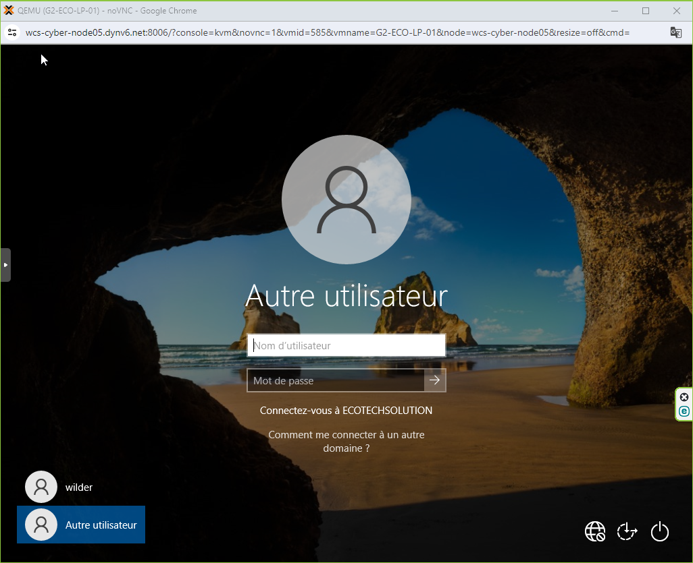
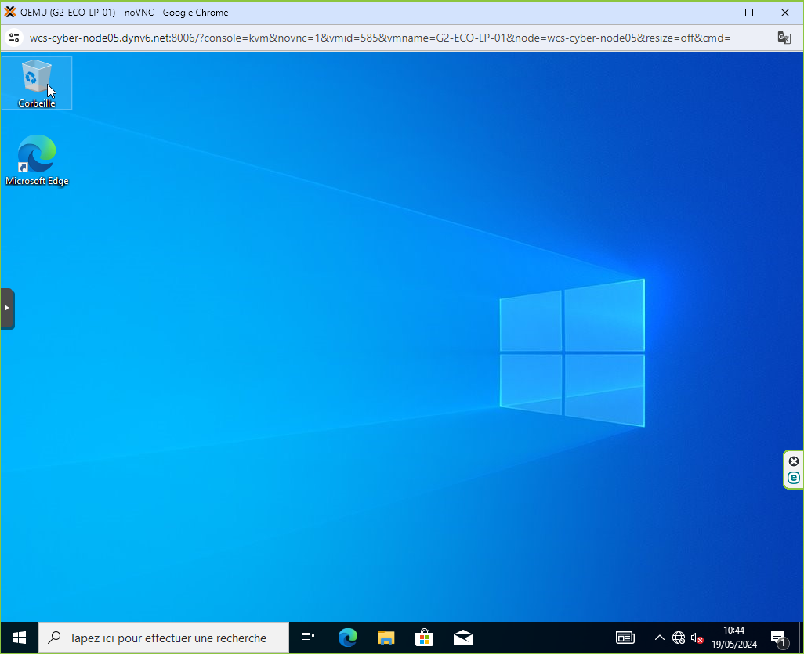

# **TSSR-2402-P3-G2-BuildYourInfra-EcoTechSolutions**

## **Sommaire**

1) Première connexion au Domaine ecotechsolutions.fr

2) FAQ : Solutions aux problèmes connus et communs liés à l'utilisation

## **1. Première connexion au Domaine ecotechsolutions.fr**

Nous vous avions annoncer dans le fichier `S09_USER_GUIDE.md` que des changements allaient être apportés avec la mise en place de la nouvelle Infrastructure.

Le premier changement qui va s'opérer dans votre méthode est la connexion à un Compte qui est personnel et individuel. Il ne sera désormais plus possible de vous connecter à une session commune sans mot de passe, comme c'était le cas auparavant.

Vous avez reçu dans votre boite mail professionnelle `prénom.nom@ecotechsolutions.fr`, les informations de connexion avec un *Identifiant* et un *Mot* de Passe*.

Votre Identifiant est sous la forme `ADCBx` où `ABCD` correspondent à des lettres de vos prénoms et noms et `x` est un numéro.

Vous allez donc arriver sur cette fenêtre pour vous connecter à votre session.

Saisissez les informations `Nom d'utilisateur` (qui correspond à l'Identifiant reçu) et `Mot de passe`.



Etant donné que c'est votre première connexion, il est exigé que vous changiez de mot de passe, le mot de passe qui vous a été transmis étant générique.

Remplissez les champs `Mot de passe actuel` avec les informations reçues, puis `Nouveau mot de passe`, puis `Confirmez mot de passe` et validez l'opération.


Vous êtes désormais connecter avec votre Session.



## **2. FAQ : Solutions aux problèmes connus et communs liés à l'utilisation**

```
Lors du changement de Mot de Passe, je rencontre une erreur et mon nouveau Mot de passe n'est pas validé.
```

1. Assurez-vous d'avoir rempli les champs `Nouveau mot de passe` et `Confirmez mot de passe` avec la même donnée. Vous pouvez vous en assurer en cliquant sur l'oeil dans la barre correspondante.

2. Les Mot de passe considérés à risque sont interdit, nous avons pour cela instaurer une règle concernant le Mot de Passe, votre Mot de passe doit :
* Être composé de 8 caractères minimum
* Avoir au moins une lettre Majuscule et une lettre minuscule
* Avoir au moins un chiffre
* Avoir au moins un caractère spécial du type `$!@`

Cette règle peut être amené à changer et être durcie, vous serez alors informer et une demande de nouveau Mot de Passe sera initialisée.