# **TSSR-2402-P3-G2-BuildYourInfra-EcoTechSolutions**

## **Sommaire**

1) Pré-requis techniques

2) Installation et Configuration des équipements et ressources

3) FAQ : Solutions aux problèmes connus et communs liés à l'installation et à la configuration

## **1. Pré-requis techniques**

* Serveur **_ECO-COOPER_**
    * Debian 12 en CLI
    * Service **_SSH_**
    * IP fixe : 10.10.8.40/16

* Serveur **_ECO-LUCY_**
    * Debian 12 en CLI
    * Service **_GLPI_**
    * IP fixe : 10.10.8.50/16

## **2. Installation et Configuration des équipements et ressources**

### Installation et Configuration du Service SSH sur _ECO-Cooper_

#### Installation de SSH sur le Serveur

1) Assurez-vous que le système est à jour avec la commande `apt update && apt upgrade -y`.

2) Installez ensuite le service ssh via la commande `apt install openssh-server`.


3) Lors de l'installation, confirmez par `O` pour continuer.


4) Votre service SSH est installé, vérifiez qu'il est bien actif avec la commande `systemctl status ssh`.


5) Générez ensuite une clé d'identification avec la comande `ssh-keygen -t rsa -b 4096`.


Les deux clés générées sont disponibles dans le `/root/.ssh/`.

#### Configuration de SSH sur le Serveur

Pour accéder au fichier de configuration SSH, vous devez modifier le fichier situé dans `/etc/ssh/sshd_config`.


1) Ajoutez les lignes ou modifiez les lignes existantes :

* `Port 2222` pour écouter sur le port _2222_ (par défaut c'est le port 22).
* `AddressFamily inet` pour prendre en compte uniquement l'_IPv4_.
* `ListenAddress 0.0.0.0` pour ne prendre en compte que l'_IPv4_ en écoute.
* `PubkeyAuthentication yes` pour autoriser la connexion SSH grâce à une clé.
* `PasswordAuthentication yes` pour autoriser la connexion SSH par mot de passe.
* `PermitRootLogin no` pour désactiver la connexion SSH en tant _root_.

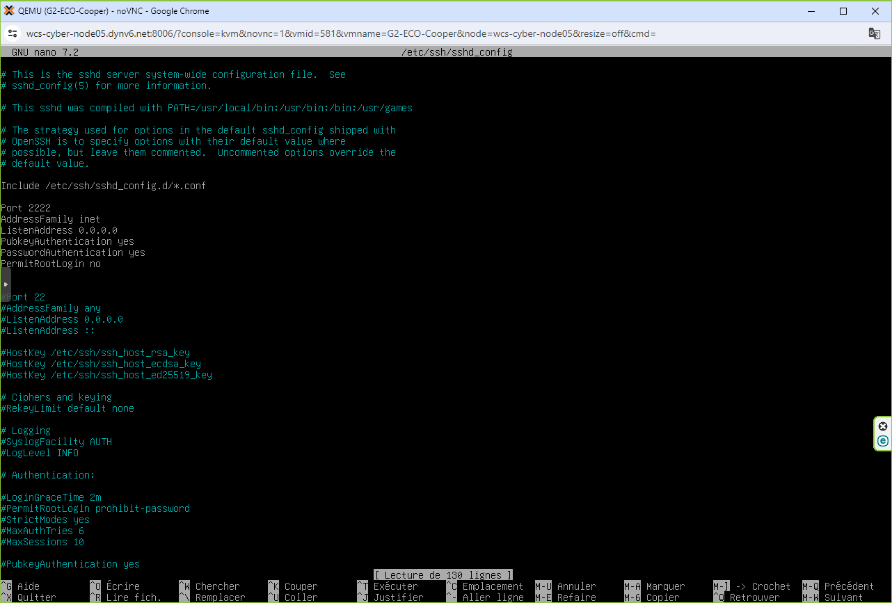

2) Assurez-vous que le fichier de configuration ne comporte pas d'erreur et redémarrez le service avec la commande `systemctl restart sshd`.

#### Ajout du serveur SSH sur le Domaine AD

Cette méthode est spécifique pour l'ajout des serveurs sous Linux du type Debian sur le Domaine Active Directory.

1) Commencez par modifier le fichier situé dans `/etc/resolv.conf` en spécifiant la recherche du domain et l'IP du Serveur de Domaine.


2) Editez ensuite le fichier situé dans `/etc/hostname` en incluant le nom de Domaine.


3) Testez la résolution DNs avec un ping du Domaine `ping ecotechsolutions.fr`.


4) Installez ensuite les paquets nécessaires à cet ajout avec la commande `apt-get install realmd sssd-tools sssd libnss-sss libpam-sss adcli samba-common`.

5) Une fois les paquets, vous pouvez ajouter le serveur au Domaine avec la commande `realm join ecotechsolutions.fr --user Administrator`.

6) Le mot de passe de l'Administrateur du Domaine vous sera alors demandé, saisissez-le et validez.

7) Dans le cas où une erreur ressort, vous pouvez procéder avec la commande `realm --install=/ join ecotechsolutions.fr --user Administrator`.

Votre Serveur SSH est désormais sur le Domaine, vous pouvez le vérifier avec la commande `realm list`.


### Installation et Configuration de Putty sur le Client _ECO-LP-01_

#### Installation de Putty

1) Commencez par installer [Putty](https://putty.org) sur votre Client.


2) Téléchargez le fichier `putty-64bit-0.81-installer.msi` et lancez l'installation en cliquant sur  `Ouvrir un fichier`.


3) L'assistant d'installation démarre, cliquez sur `Next`.


4) Laissez le dossier d'installation par défaut et cliquez sur `Next`.


5) Ajoutez l'option `Add shortcut to PuTTY on the Desktop` puis cliquez sur `Install`.


Votre installation est terminé, cliquez sur `Finish`.


#### Configuration de Putty

1) Commencez par rechercher `PuTTYgen`, ce soft s'est installé en même temps que PuTTY.


2) Une fois `PuTTYgen` lancé, sélectionnez votre type de clé (ici `RSA`), et mettez le nombre de bits à `4096` puis cliquiez sur `Generate`.


3) Il sera nécessaire de bouger votre souris afin de générer votre clé.

4) Une fois les clés publique et privée, enregistrez-les  en cliquant sur `save public key` `save private key`. Choisissez l'endoit où vous sauvegardez vos clés.

5) Il peut être nécessaire à cette étape de copier/coller la clé publique afficher tout en haut et l'insérer dans un fichier texte.


6) Lancez PuTTY.


7) Rendez-vous dans `Connection / SSH / Auth / Credential` et indiquez le lien vers votre clé privée.

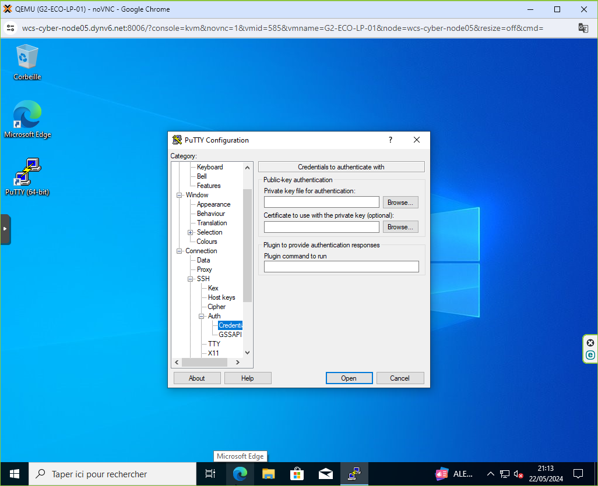

8) Indiquez le lien vers votre clé privée.


9) Rendez-vous dans `Connection / Data` et saisissez le champ Auto-login username.


10) Retournez au Menu `Session`, et saisissez l'IP du Serveur SSH, ainsi que le Port d'écoute de celui-ci. Donnez un nom dans le champ `Saved Sessions` et cliquez sur `Save`.


Votre session est désormais enregistrée. Cliquez sur `Open`.


La clé privée n'est pas encore connu du serveur, il vous ai demandé le mot de passe de connexion.


Une fois saisi le mot de passe, vous êtes connecté en SSH avec le Serveur.


### Installation et Configuration du Service GLPI sur _ECO-Lucy_

#### Préparation du serveur pour installation de GLPI

*Dans cette partie, la plupart des commandes évoquées sont présentées sans la commande **sudo** les précédant. En effet nous partons du principe que nous sommes déjà en élévation de privilèges lors du début de ces manipulations. Le cas échéant, il suffira de placer ladite commande devant la commande souhaitée.*  

Avant d'évoquer l'installation, il est d'usage d'établir les pré-requis et besoins de cette opération.
GLPI a besoin d'un serveur web, de PHP et d'une base de données pour fonctionner correctement. Sous Linux, ce trio est appelé socle **LAMP**.
Dans le cas présent, nous allons nous servir d'une machine sous Debian 12, et nous allons installer dessus Apache2, PHP 8.3 ainsi que MariaDB.
Ici, nous assemblons les versions 8.2 de PHP (par défaut dans les dépôts de Debian 12) et 15.1 de MariaDB.  

Nous commencons par la mise à jour des paquets sur la machine Debian 12:

`apt-get update && apt-get upgrade -y`

Maintenant, nous installons le socle LAMP:  

`apt-get install apache2 php mariadb-server`

Puis l'ensemble des extensions nécessaires au bon fonctionnement de GLPI:

`apt-get install php-xml php-common php-json php-mysql php-mbstring php-curl php-gd php-intl php-zip php-bz2 php-imap php-apcu`

Si l'on envisage d'associer GLPI avec un annuaire LDAP comme l'Active Directory, nous devons installer l'extension LDAP de PHP.

`sudo apt-install php-ldap`

Nous venons donc d'installer les pré-requis pour installer le serveur GLPI.
Nous allons passer à la préparation de la base de données GLPI. Il s'agit donc de préparer MariaDB pour qu'il puisse héberger la base de données de GLPI.
Il s'agit ici du minimum syndical en matière de sécurisation de la base de données:

`mysql_secure_installation`

Vous serez invité à changer le mot de passe root, mais aussi à supprimer les utilisateurs anonymes, désactiver l'accès root à distance, etc...
Voici une capture d'écran exposant la configuration proposée à titre d'exemple:

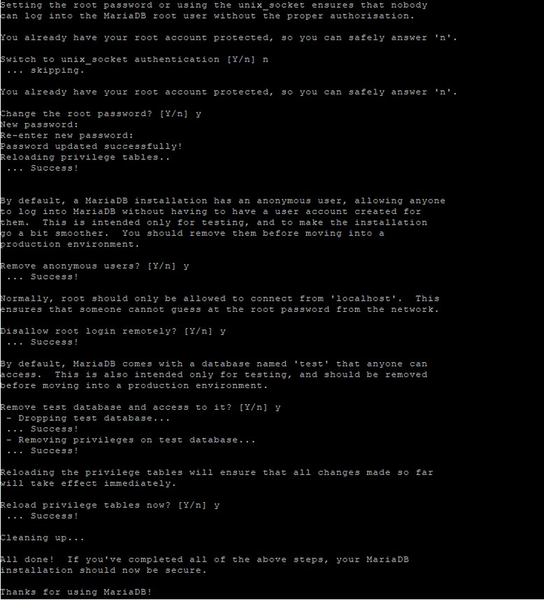

Ensuite, nous allons créer une base de données dédiée pour GLPI et celle-ci sera accessible par un utilisateur dédié.
Nous nous connectons donc à notre instance MariaDB:

`mysql -u root -p`

Nous saisissons le mot de passe root de MariaDB, définit juste avant.

Puis, nous allons exécuter les requêtes SQL ci-dessous pour créer la base de données "ecotechsolutions_glpi" ainsi que l'utilisateur "glpi_admin" avec le mot de passe "Azerty1*". Cet utilisateur aura tous les droits sur cette base de données (et uniquement sur celle-ci).

```
CREATE DATABASE db23_glpi;
GRANT ALL PRIVILEGES ON ecotechsolutions_glpi.* TO glpi_admin@localhost IDENTIFIED BY "Azerty1*";
FLUSH PRIVILEGES;
EXIT
```

Notre prochaine étape consiste à télécharger l'archive ".tgz" qui contient les sources d'installation de GLPI.
Voici le lien GitHub de GLPI (abritant la version 10.0.15). 

[GLPI GitHub](https://github.com/glpi-project/glpi/releases/)

On va télécharger l'archive dans le répertoire /tmp:

`cd /tmp`

`wget https://github.com/glpi-project/glpi/releases/download/10.0.15/glpi-10.0.15.tgz`

Puis, nous allons exécuter la commande ci-dessous pour décompresser l'archive .tgz dans le répertoire "/var/www/", ce qui donnera le chemin d'accès "/var/www/glpi" pour GLPI.

`sudo tar -xzvf glpi-10.0.15.tgz -C /var/www/`

Nous allons définir l'utilisateur "www-data" correspondant à Apache2, en tant que propriétaire sur les fichiers GLPI.

`sudo chown www-data /var/www/glpi/ -R`

Ensuite, nous allons devoir créer plusieurs dossiers et sortir des données de la racine Web (/var/www/glpi) de manière à les stocker dans les nouveaux dossiers que nous allons créer. Ceci va permettre de faire une installation sécurisée de GLPI, qui suit les recommandations de l'éditeur.

**Le répertoire /etc/glpi**

Commencez par créer le répertoire "/etc/glpi" qui va recevoir les fichiers de configuration de GLPI. Nous donnons des autorisations à www-data sur ce répertoire car il a besoin de pouvoir y accéder.

`sudo mkdir /etc/glpi`

`sudo chown www-data /etc/glpi/`

Puis, nous allons déplacer le répertoire "config" de GLPI vers ce nouveau dossier :

`sudo mv /var/www/glpi/config /etc/glpi`

**Le répertoire /var/lib/glpi**

Répétons la même opération avec la création du répertoire "/var/lib/glpi" :

`sudo mkdir /var/lib/glpi`

`sudo chown www-data /var/lib/glpi/`

Dans lequel nous déplaçons également le dossier "files" qui contient la majorité des fichiers de GLPI : CSS, plugins, etc.

`sudo mv /var/www/glpi/files /var/lib/glpi`

**Le répertoire /var/log/glpi**

Terminons par la création du répertoire "/var/log/glpi" destiné à stocker les journaux de GLPI. Toujours sur le même principe :

`sudo mkdir /var/log/glpi`

`sudo chown www-data /var/log/glpi`

Nous n'avons rien à déplacer dans ce répertoire.

Maintenant nous procédons à la création des fichiers de configuration.
Nous devons configurer GLPI pour qu'il sache où aller chercher les données. Autrement dit, nous allons déclarer les nouveaux répertoires fraichement créés.

Nous allons créer ce premier fichier :

`sudo nano /var/www/glpi/inc/downstream.php`

Afin d'ajouter le contenu ci-dessous qui indique le chemin vers le répertoire de configuration :

```
<?php
define('GLPI_CONFIG_DIR', '/etc/glpi/');
if (file_exists(GLPI_CONFIG_DIR . '/local_define.php')) {
    require_once GLPI_CONFIG_DIR . '/local_define.php';
}
```

Ensuite, nous allons créer ce second fichier :

`sudo nano /etc/glpi/local_define.php`

Afin d'ajouter le contenu ci-dessous permettant de déclarer deux variables permettant de préciser les chemins vers les répertoires "files" et "log" que l'on a préparé précédemment.

```
<?php
define('GLPI_VAR_DIR', '/var/lib/glpi/files');
define('GLPI_LOG_DIR', '/var/log/glpi');
```

Cette étape est terminée.

#### Préparation de la configuration d'Apache2

Passons à la configuration du serveur web Apache2. Nous allons créer un nouveau fichier de configuration qui va permettre de configurer le VirtualHost dédié à GLPI.
Dans notre cas, le fichier s'appelle "ecotechsolutions.fr.conf" en référence au nom de domaine choisi pour accéder à GLPI : **ecotechsolutions.fr**.

`sudo nano /etc/apache2/sites-available/ecotechsolutions.fr.conf`

En suivant la documentation GLPI, cela devrait donner la configuration suivante:

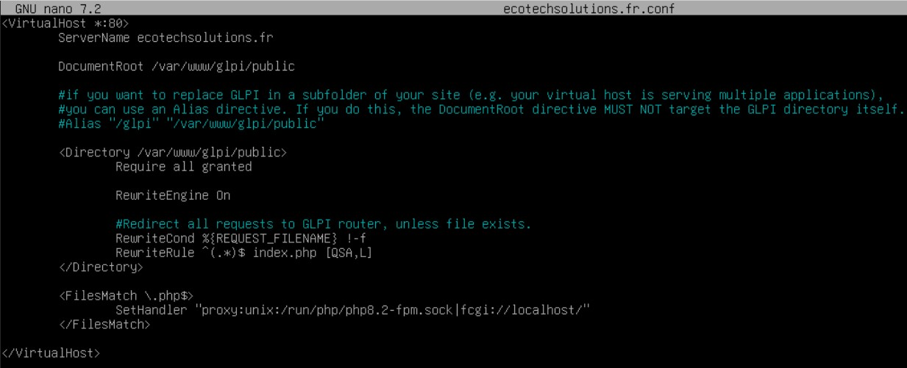

On enregistre le fichier, puis, nous allons activer ce nouveau site dans apache2:

`sudo a2ensite ecotechsolutions.fr.conf`

En même temps, nous désactivons le site par défaut car il n'est plus utile:

`sudo a2dissite 000-default.conf`

Nous allons aussi activer le module "rewrite" (pour les règles de réécriture) car on l'a utilisé dans le fichier de configuration du VirtualHost (RewriteCond / RewriteRule).

``sudo a2enmod rewrite``

Il ne reste plus qu'à redémarrer le service Apache2 :

`sudo systemctl restart apache2`

#### Gestion de PHP avec Apache2

Pour utiliser PHP en tant que moteur de scripts avec Apache2, il y a deux possibilités : utiliser le module PHP pour Apache2 (libapache2-mod-php8.2) ou utiliser PHP-FPM.
Il est recommandé d'utiliser PHP-FPM car il est plus performant et se présente comme un service indépendant. Dans l'autre mode, chaque processus Apache2 exécute son propre moteur de scripts PHP.
Si vous souhaitez utiliser PHP-FPM, suivez les étapes ci-dessous. Sinon, passez à la suite mais veillez à configurer l'option "session.cookie_httponly" évoquée ci-dessous.
Nous allons commencer par installer PHP8.2-FPM avec la commande suivante :

`sudo  apt-get install php8.2-fpm`

Puis, nous allons activer deux modules dans Apache et la configuration de PHP-FPM, avant de recharger Apache2 :

`sudo a2enmod proxy_fcgi setenvif`

`sudo a2enconf php8.2-fpm`

`sudo systemctl reload apache2`

Pour configurer PHP-FPM pour Apache2, nous n'allons pas éditer le fichier "/etc/php/8.2/apache2/php.ini" mais plutôt ce fichier :

`sudo nano /etc/php/8.2/fpm/php.ini`

Dans ce fichier, recherchez l'option "session.cookie_httponly" et indiquez la valeur "on" pour l'activer, afin de protéger les cookies de GLPI (elle se situe plus dans la seconde partie du fichier).

```
; Whether or not to add the httpOnly flag to the cookie, which makes it
; inaccessible to browser scripting languages such as JavaScript.
; https://php.net/session.cookie-httponly
session.cookie_httponly = on
```

Enregistrez le fichier quand c'est fait. Par la suite, vous pourriez être amené à effectuer d'autres modifications, notamment pour augmenter la taille des uploads sur GLPI, etc.

Pour appliquer les modifications, nous devons redémarrer PHP-FPM :

`sudo systemctl restart php8.2-fpm.service`

Pour finir, nous devons modifier notre VirtualHost pour préciser à Apache2 que PHP-FPM doit être utilisé pour les fichiers PHP :
**Vous trouverez les lignes déjà inscrites sur la capture d'écran plus haut**

```
<FilesMatch \.php$>
    SetHandler "proxy:unix:/run/php/php8.2-fpm.sock|fcgi://localhost/"
</FilesMatch>
```

Quand c'est fait, on relance Apache2:

`sudo systemctl restart apache2`

Nous pouvons à présent passer à l'installation de GLPI.


## Installation de GLPI


Pour effectuer l'installation de GLPI, nous devons utiliser un navigateur Web afin d'accéder à l'adresse du GLPI. Il s'agit de l'adresse déclarée dans le fichier de configuration Apache2 (ServerName). 
  
Si vous avez suivi toutes les étapes correctement, vous devriez arriver sur cette page. Nous allons commencer par choisir la langue.
  

  
On accepte la licence : **Continuer**.
  

  
Puisqu'il s'agit d'une nouvelle installation, nous cliquons sur "Installer".


Etape importante : GLPI vérifie la configuration de notre serveur pour déterminer si tous les prérequis sont respectés. Tout est bon, donc nous pouvons continuer.
  
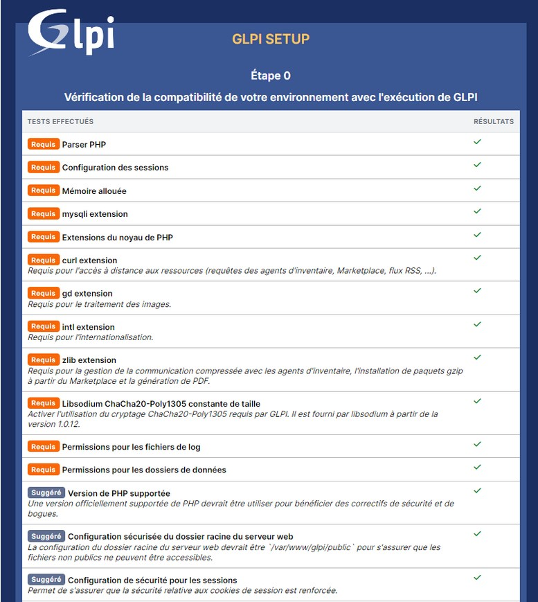
  
A l'étape suivante, nous devons renseigner les informations pour se connecter à la base de données. Nous indiquons "localhost" en tant que serveur SQL puisque MariaDB est installé en local, sur le même serveur que GLPI. Puis, nous indiquons notre utilisateur "glpi_admin" et le mot de passe associé.
  

  
Après avoir cliqué sur "Continuer", nous devons choisir la base de données "ecotechsolutions_glpi" créée précédemment.
  
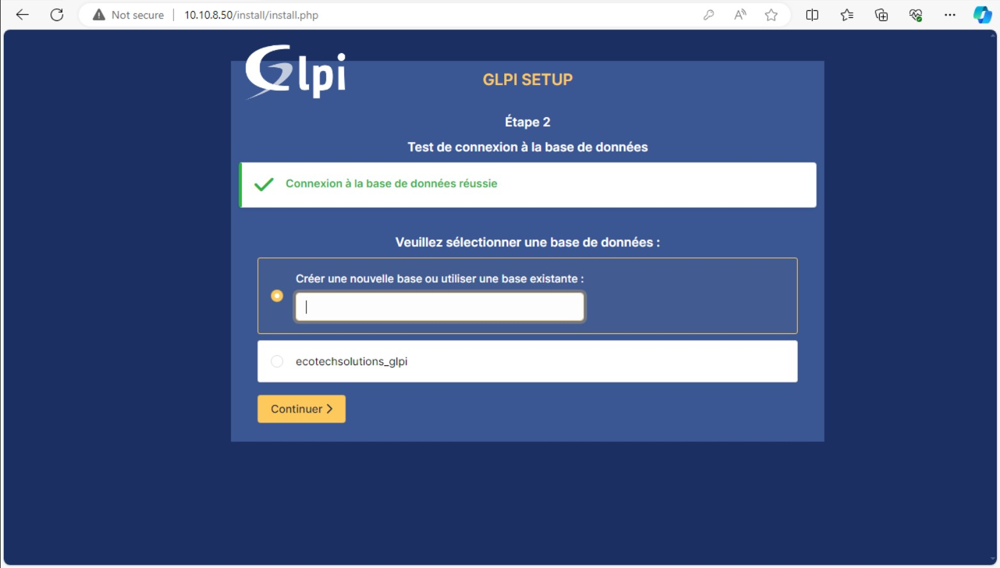
  
Nous poursuivons.
  
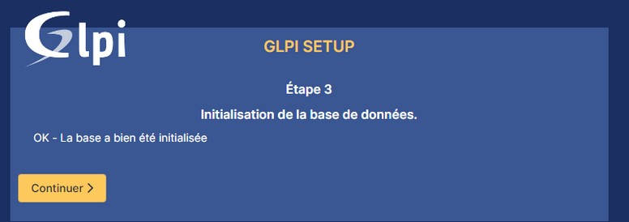
  
Nous venons alors d'installer GLPI. Comme le précise la dernière étape, le compte **administrateur** par défaut est "glpi/glpi".
  
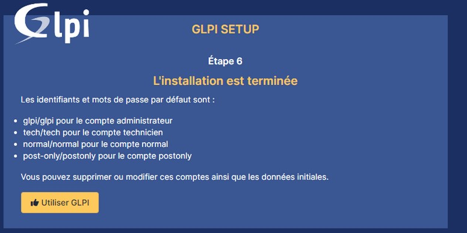
  
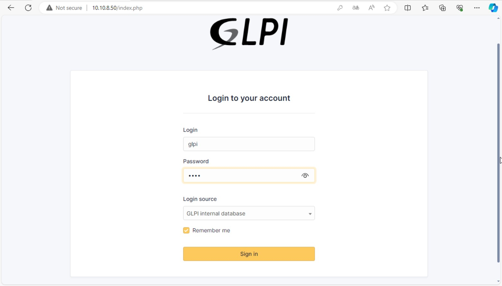
  
Une dernière étape à ne pas omettre pour finaliser l'installation:
 - Changer le mot de passe de tous les comptes par défaut (lien mis dans l'encadré orange);
 - Supprimer le fichier "install.php" puisqu'il n'est plus nécessaire et peut représenter un risque (relander l'installation) !
  
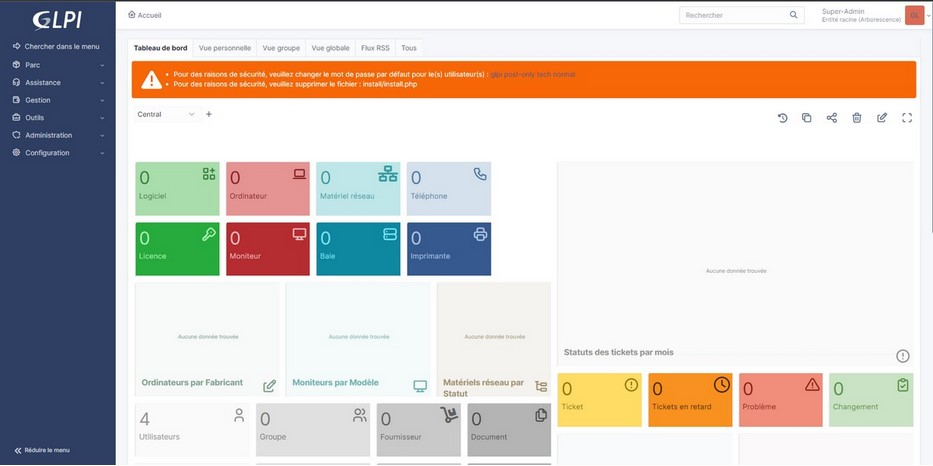
  


### Configuration de GLPI

#### Ajout d'un annuaire LDAP dans GLPI

Désormais, nous allons ajouter notre annuaire Active Directory à GLPI. Connectez-vous à GLPI avec un compte administrateur, puis dans le menu "Configuration", cliquez sur "Authentification".
Ensuite, cliquer sur "Annuaire LDAP" puis sur le symbole "+" en haut de l'écran pour 'Ajouter'.
  
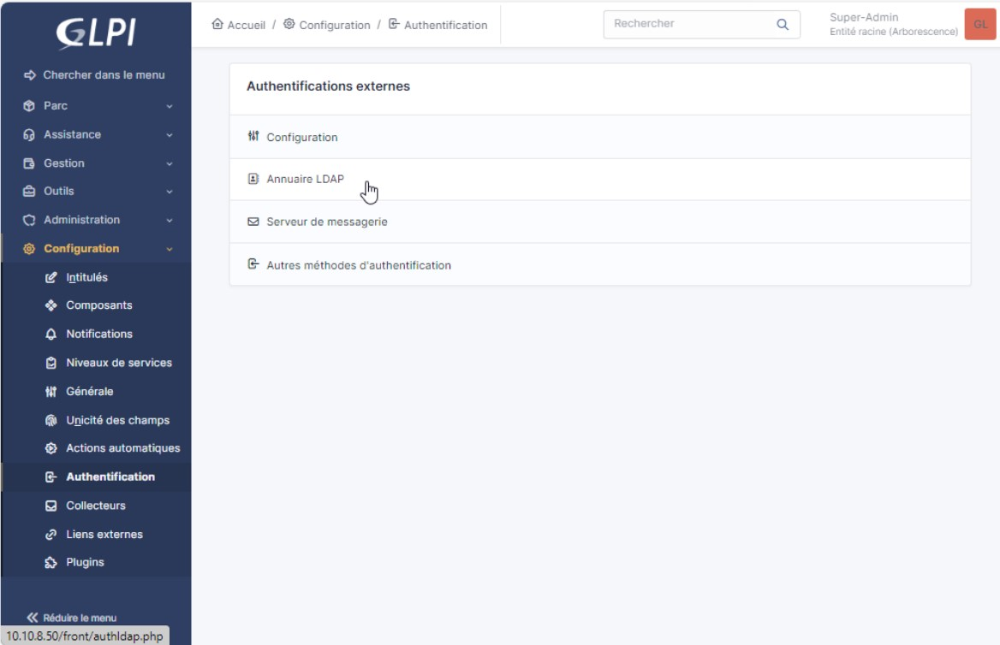

Un formulaire s'affiche alors à l'écran. 


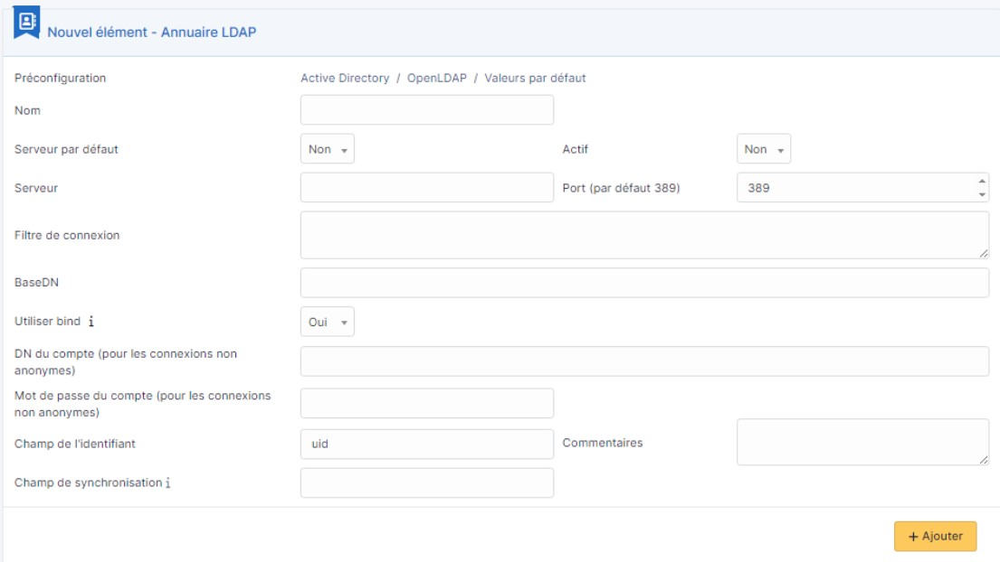

Voici ce à quoi correspond chaque encadré:
  
**Nom** : le nom de cet annuaire LDAP, vous pouvez utiliser un nom convivial, ce n'est pas obligatoirement le nom du domaine, ni le nom du serveur.

**Serveur par défaut** : faut-il s'appuyer sur ce serveur par défaut pour l'authentification LDAP ? Il ne peut y avoir qu'un seul serveur LDAP défini par défaut.
  
**Actif** : nous allons indiquer "Oui", sinon ce sera déclaré, mais non utilisé.
  
**Serveur** : adresse IP du contrôleur de domaine à interroger. Avec le nom DNS, cela ne semble pas fonctionner (malheureusement).
  
**Port** : 389, qui est le port par défaut du protocole LDAP. Si vous utilisez TLS, il faudra le préciser à postériori, dans l'onglet "Informations avancées", du nouveau serveur LDAP.
  
**Filtre de connexion** : requête LDAP pour rechercher les objets dans l'annuaire Active Directory. Généralement, nous faisons en sorte de récupérer les objets utilisateurs ("objectClass=user") en prenant uniquement les utilisateurs actifs (via un filtre sur l'attribut UserAccountControl).
  
**BaseDN** : où faut-il se positionner dans l'annuaire pour rechercher les utilisateurs ? Ce n'est pas nécessaire la racine du domaine, tout dépend comment est organisé votre annuaire et où se situent les utilisateurs qui doivent pouvoir se connecter. Il faut indiquer le DistinguishedName de l'OU.
  
**Utiliser bind** : à positionner sur "Oui" pour du LDAP classique (sans TLS)
  
**DN du compte** : le nom du compte à utiliser pour se connecter à l'Active Directory. En principe, vous ne pouvez pas utiliser de connexion anonyme ! Ici, il ne faut pas indiquer uniquement le nom du compte, mais la valeur de son attribut DistinguishedName.
  
**Mot de passe du compte** : le mot de passe du compte renseigné ci-dessus
  
**Champ de l'identifiant** : dans l'Active Directory, quel attribut doit être utilisé comme identifiant de connexion pour le futur compte GLPI ? Généralement, UserPrincipalName ou SamAccountName, selon vos besoins.
  
**Champ de synchronisation** : GLPI a besoin d'un champ sur lequel s'appuyer pour synchroniser les objets. Ici, nous allons utiliser l'objectGuid de façon à avoir une valeur unique pour chaque utilisateur. Ainsi, si un utilisateur est modifié dans l'Active Directory, GLPI pourra se repérer grâce à cet attribut qui lui n'évoluera pas (sauf si le compte est supprimé puis recréé dans l'AD).

Dans notre cas, voici la configuration "cible" :


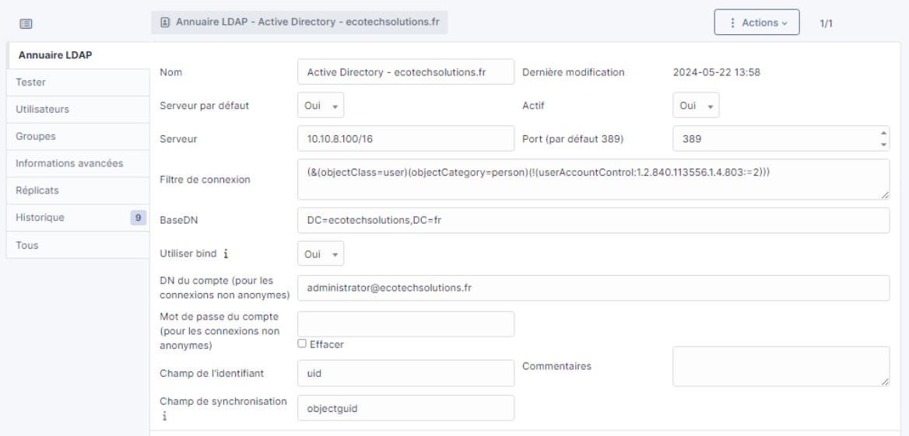

Dans la foulée, GLPI va effectuer un test de connexion LDAP et vous indiquer s'il est parvenu, ou non, à se connecter à votre annuaire.
  


L'annuaire correspondant à notre domaine "ecotechsolutions.fr" est maintenant lié.
Parmi les onglets présents dans la colonne de gauche, nous évoquons celui correpondant à "Réplicats". Nous soulignons sa présence, et son utilisation pour déclarer un ou plusieurs contrôleurs de domaine "de secours" à contacter si le serveur principal n'est plus joignable. Dans notre cas, il s'agit du serveur **Moldaver** en 10.10.8.120/16 qui communiquera via le port 389 (protocole LDAP).

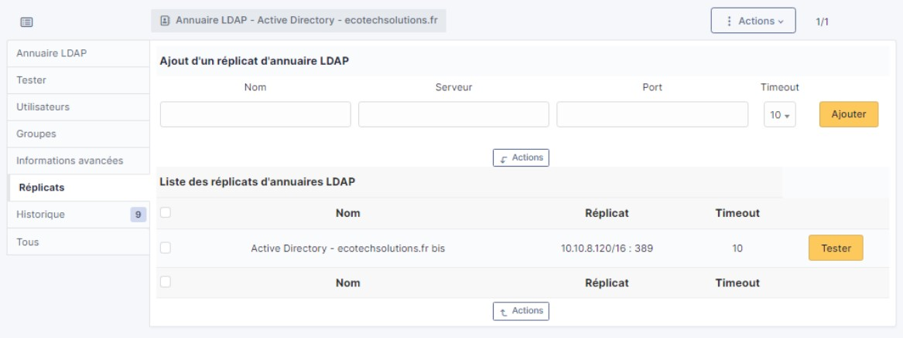


### Déploiement de l'agent inventaire GLPI 10 par GPO

Dans le but de transmettre l'activité de notre parc informatique directement au sein de notre serveur GLPI (dans notre cas **Lucy**), nous allons mettre en place un agent GLPI d'inventaire. En, effet, ce dernier doit être présent sur chaque machine de notre parc pour pouvoir "communiquer" avec le serveur GLPI. 
Voici les étapes de mise en place.

Nous commençons par télécharger l'agent en question directement depuis le dépôt GitHub. Ici en 64bits, .msi.


Une fois l'agent téléchargé, nous allons créer dans C:\ sur notre serveur Maximus, un dossier "AgentGLPI" dans lequel nous plaçons l'agent lui-même.
Nous allons partager ce dossier sur l'ensemble de notre réseau. Clic droit sur le dossier > **Propriétés** > **Partage avancé** > Nous cochons la case **Partager ce dossier** puis cliquons sur **Permissions**.
Alors, il sera rendu "accessible" à toutes les machines de notre domaine (ici, uniquement en "Lecture").


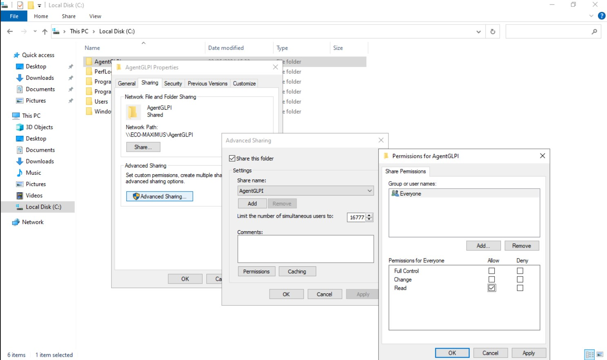

Dans le but d'affiner la sécurité concernant ce partage de dossier, nous allons maintenant dans l'onglet "Sécurité" pour "Désactiver l'héritage" (nous "Supprimons toutes les autorisations") et validons.

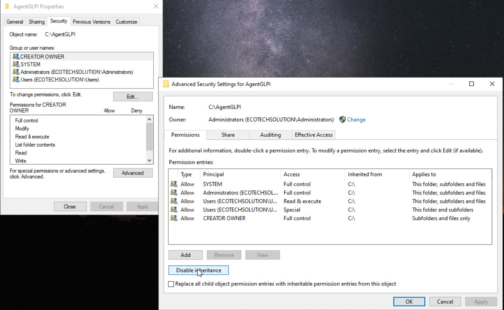

Nous allons ensuite modifier pour ajouter le groupe "Everyone" soit *tout le monde*. Ainsi nous appliquons la sécurité à l'ensemble des machines.
L'accès des PC client à l'agent d'inventaire est réalisé.

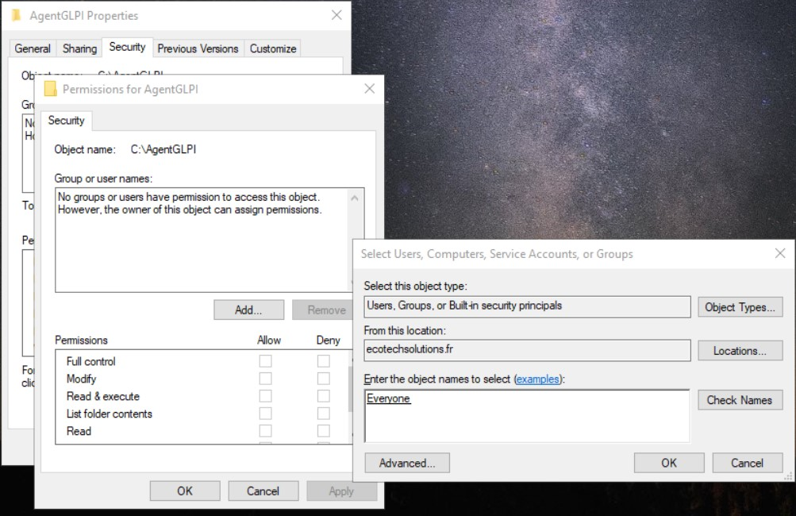

Nous confirmons nos manipulations.
A présent, nous allons modifier nos règles de parefeu, notamment ajouter une règle 'entrante' pour la communication entre serveurs et clients.


### Création GPO dans l'Active Directory

Pour créer un GPO, nous allons d'abord dans **`Server Manager`** --> **`All Servers`**, 
sélectionner le serveur où l'Active Directory est installé et aller dans **`Tools`** --> **`Group Policy Management`** 
comme dans l'image ci-dessous :


Maintenant que la fenêtre **Group Policy Management** est ouverte, allons dans **`Group Policy Objects`** : 


clique droit puis **`New`** :


Donnons un nom à notre GPO en suivant la nomenclature :


Une fois le nom établit validons, nous la voyons dans la liste. Clique droit dessus puis **`Edit`** :


Une fois à ce niveau, selon nos besoins, nous recherchons les règles, les restrictions, les accès ou les filtres à activer ou désactiver. Exemple :


#### Mise en place de GPO de Sécurité

|Nom|Affectation|Description|
|:-:|:-:|:-:|
|GPO_EcoT_Client_Restriction_Periph_Usb|EcoT_Users(Sauf DSI)|Bloquer tous les périphériques de stockage USB|
|GPO_EcoT_Users_Deco_RDP_Apres_Inactiv|EcoT_Computers|Déconnecte le bureau a distance apres 5min d'inactivité|
|GPO_EcoT_Computer_Desactiver_Hachages_LM|EcoT_Computers|Methode de stockage de mot de passes des utilisateurs désactivée|
|GPO_EcoT_Computer_Ecran_veille_par_MDP|EcoT_Computers|Après 5 min s'inactivité l'écran se vérouille|
|GPO_EcoT_FireWall_Bloc_Connection_|?|?|
|GPO_EcoT_Windows_Update_Planified|EcoT_Users|Lancement des mises à jour les samedi a 3:00 heures|
|GPO_EcoT_Users_Restriction_Install_Software|EcoT_Users(Sauf DSI)|bloquer des programmes et empêcher l’installation de logiciels(Sauf administrateurs local)|
|GPO_EcoT_Users_Security_Controlpanel_Deny|EcoT_Users(Sauf DSI)|Restriction d'accès au panneau de configuration|
|GPO_EcoT_Users_Complexite_MDP|EcoT_Users|Le mot de passe doit avoir des personnages de trois des quatre catégories suivantes (A à Z),(a à z),(0 à 9),Caractères non alphabétiques|
|GPO_EcoT_Computer_Desactiv_Wifi_si_Ethernet|EcoT_Users|Désactiver le WiFi lorsque le câble Ethernet est connecté|
|GPO_EcoT_Computer_Gestion_Alim_Haute_perfo|EcoT_Users(Developpement)|Maximisation de la puissance de traitement|

#### Mise en place de GPO Standard

|Nom|Affectation|Description|
|:-:|:-:|:-:|
|GPO_EcoT_User_Set_Desktop_Wallpaper|EcoT_Users|fond d'écran défini pour tous les utilisateurs specifié
|GPO_EcoT_Users_Map_Network_Drives|EcoT_Users| mappage automatique pour les lecteurs réseau specifié|
|GPO_EcoT_Computer_Gestion_Alimentation_disk|EcoT_Computers|arrêt du disque dur après des périodes d'inactivité|
|GPO_EcoT_Users_Redirection_Folder |EcoT_Users|redirection automatique de dossier Documents vers l'emplacement réseau centralisé|
|GPO_EcoT_Computer_définir_page_Accueil_internet|EcoT_Computers|Définir www.google.com comme page d'accueil par defaut sur EDGE|

## **3. FAQ : Solutions aux problèmes connus et communs liés à l'installation et à la configuration**
