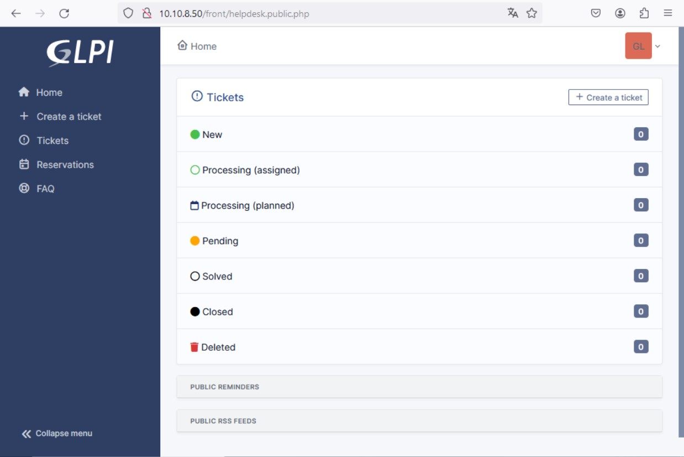
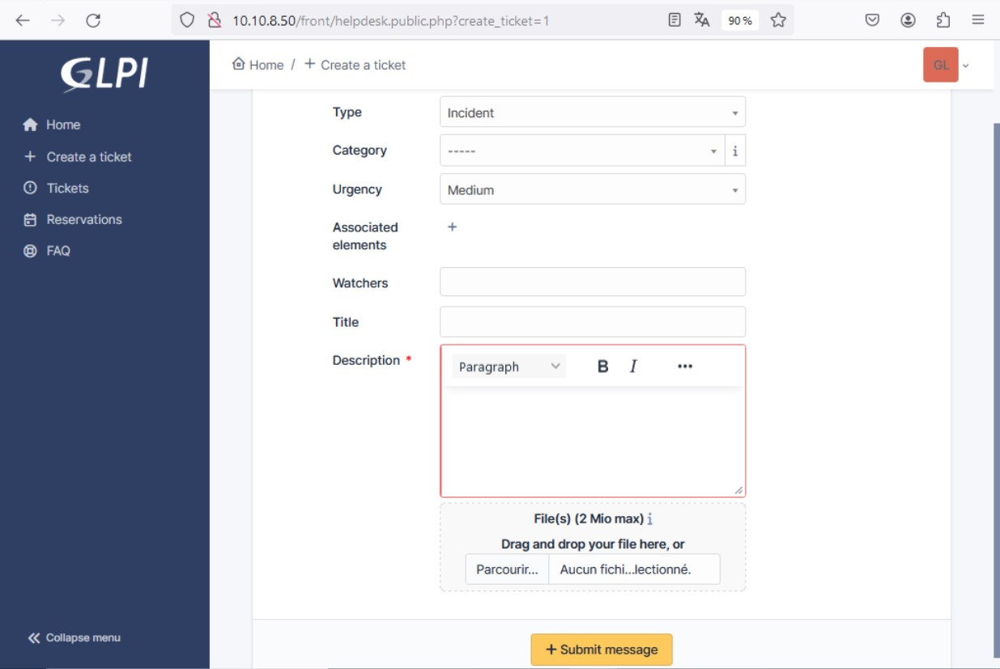
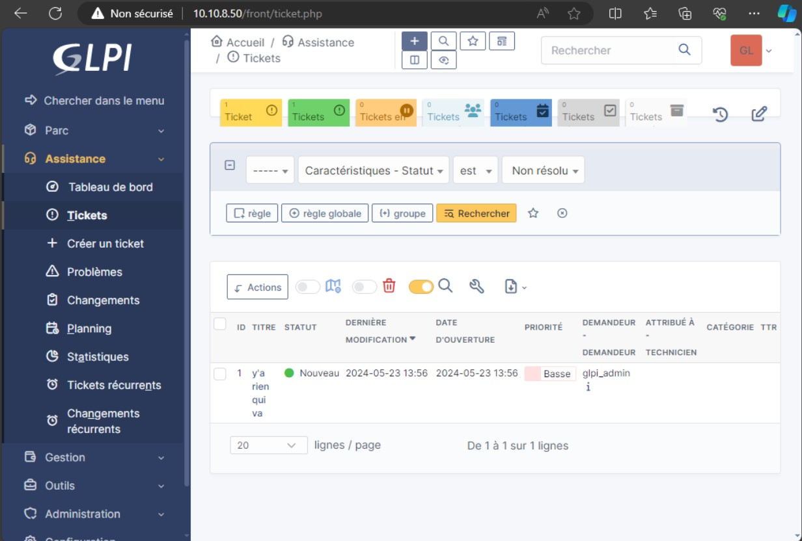
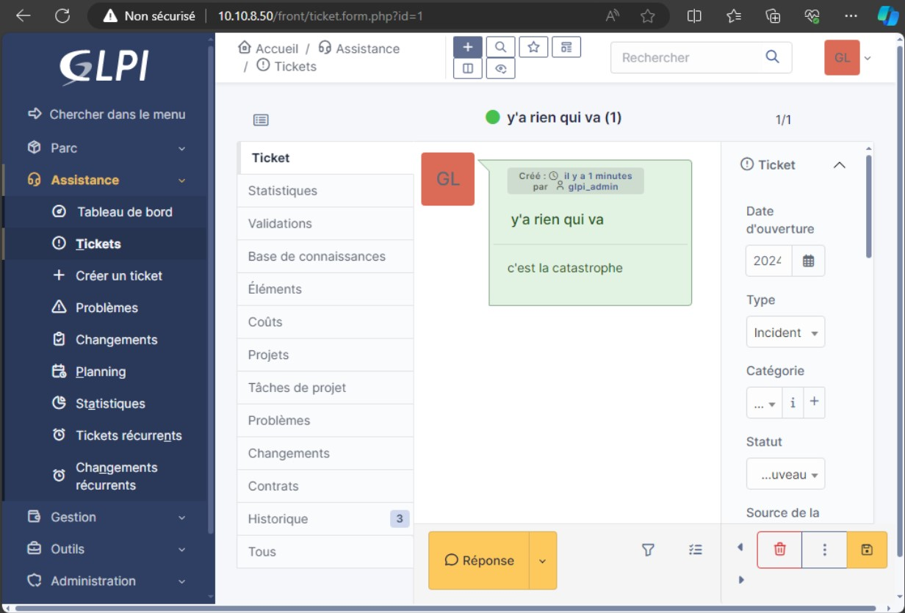

# **TSSR-2402-P3-G2-BuildYourInfra-EcoTechSolutions**

## **Sommaire**

1) Utilisation de base : Comment utiliser les fonctionnalités clés

2) Utilisation avancée : Comment utilliser au mieux les options

3) FAQ : Solutions aux problèmes connus et communs liés à l'utilisation

## **1. Utilisation de base : Comment utiliser les fonctionnalités clés**

### Gestion des incidents : ticketing

Un incident correspond donc à une interruption non planifiée ou une dégradation de la qualité d’un service informatique, qui sera donc souvent déclarée par un utilisateur. 

Mais ITIL va plus loin : un incident est aussi une défaillance d’un élément de configuration n’ayant pas encore impacté le service, qui sera donc détecté par un outil de supervision de l’exploitation informatique.

Par souci de simplification et de façon générale, un incident s’identifie par :

 - un dysfonctionnement : interruption imprévue d’un service SI ;
 - ou chaque fois qu’un événement détériore, perturbe ou menace le niveau d’un service.

Une fois que le technicien est informé de l’existence d’un incident, il va le prendre en charge dans l’objectif de le résoudre.

Décrivez l’incident : soyez précis

C’est le moment le plus important du processus de gestion des incidents, car il permet de comprendre l’incident et d’envisager les premières pistes de résolution.

 - Titre : résumez le dysfonctionnement en quelques mots (soyez clair et succinct) : Poste de travail ne démarre pas.

 - Description : décrivez le fonctionnement anormal du service, de façon précise et détaillée. Si un autre technicien que vous doit intervenir plus tard sur ce ticket, toutes les précisions (contexte, cas d’utilisation…) lui serviront pour résoudre l’incident : M. Lodez appuie sur le bouton Power de son poste de travail, et celui-ci ne démarre pas, même après plusieurs tentatives.

 - Catégorie : permet d’évaluer sur quel composant de l’infrastructure se situe l’incident. Si le technicien n’a pas la compétence ou la capacité à résoudre l’incident, cette catégorisation permet d’identifier le groupe de support vers lequel l’incident sera à diriger : Matériel.

Voici un exemple de formulation de ticket du point de vue d'un utilisateur utilisant une machine appartenant au domaine d'EcotechSolutions:

Nous ouvrons un navigateur et entrons comme URL : ``http://10.10.8.50/front/helpdesk.public.php`` ou simplement ``http://10.10.8.50`` (cela fonctionne aussi avec le nom de domaine ``ecotechsolutions.fr``).
Alors nous allons être (re)dirigés vers un page qui nous demande de nous identifier. Dans le cas présent, nous nous sommes servi des identifiants de l'utilisateur par défaut "glpi_admin" qui sont donc :
  
**Nom d'utilisateur** : glpi_admin@ecotechsolutions.fr  
**Mot de passe** : Azerty1*  

Nous arrivons alors sur la page suivante, considérée comme page d'accueil pour l'utilisateur du domaine (non admin):

  

Dans la colonne de gauche, nous cliquons sur "Create a ticket":
Ici, nous avons plusieur srenseignements à fournir pour la bonne formulation de notre requête
 - Type : "Incident" ou "Requête". Incident pour un événement qui entraîne une interruption ou une dégradation non planifiée d'un service informatique; Requête pour une demande de renseignements, de conseils ou de modifications d'un service informatique 
 - Category : à définir. ITIL regroupe plusieurs catégories de services (stratégie, conception, transition, exploitation, amélioration continue) 
 - Urgency : le degré d'urgence
 - Associated elements : les éléments associés (service ou matériel considéré comme déféctueux)
 - Watchers : individus référents (cela peut être un administrateur ou un manager)
 - Title : titre attribué à la description de l'incident ou de la requête
 - Description : coeur de la description de l'incident ou de la requête
 - Add files : possibilité d'ajouter un ou des fichiers permettant d'éclairer l'individu qui ouvrira le ticket
 - Submit message : pour valider et envoyer le ticket

Ici nous sommes face à l'interface "administrateur", devant lequel l'utilisateur lambda ne devrait se trouver à condition d'un usage correct et reglementé. Il est affiché à titre indicatif.
Nous avons pris l'exemple d'un ticket émis par un utilisateur x avec un titre d'incident "y'a rien qui va" et une description "c'est la catastrophe".

De nouveau l'interface "administrateur" une fois le ticket ouvert.

## Gestion Des Scripts d'Automatisation :

### Lancement du Script de configuration du Serveur Core:

##### Information

Nos scripts PowerShell sont dotés d'une variable qui enregistre le chemin depuis lequel on le lance. Le point le plus important est que le fichier CSV doit être situé dans le même dossier que le script PowerShell, et c'est la même chose pour le script Bash et son fichier texte. Sinon, l'ajout des données ne pourra pas se faire et créera des erreurs. 
Comme l'exemple ci-dessous dans la configuration d'un Serveur Core avec un Script d'automatisation .

## **2. Utilisation avancée : Comment utilliser au mieux les options**

## **3. FAQ : Solutions aux problèmes connus et communs liés à l'utilisation**
