# **TSSR-2402-P3-G2-BuildYourInfra-EcoTechSolutions**

## **Sommaire**

1) Pré-requis techniques

2) Installation et Configuration des équipements et ressources

3) FAQ : Solutions aux problèmes connus et communs liés à l'installation et à la configuration

## **1. Pré-requis techniques**

### Pré-requis de base Du Firewall Pfsense

1. Une interface réseau Wan :
   - IP : 10.0.0.3/24
   - Gateway : 10.0.0.1
   
2. Une interface réseau Lan :
   - IP : 10.10.255.254/16                           


## **2. Installation et Configuration des équipements et ressources**

### Configuration du Firewall Pfsense

1. Ajout d'une interface DMZ

La DMZ (Zone DéMilitarisée) est une zone isolée et séparée du reste du réseau. Son principal objectif est de protéger les données
et les systèmes internes d’une entreprise contre les attaques venant de l’extérieur.
Le fonctionnement d’une DMZ repose sur une série de règles de sécurité définies par l’entreprise. Ces règles
permettent de contrôler le trafic entre le réseau interne, la DMZ et le réseau externe, garantissant ainsi une
protection optimale des données et des systèmes internes.
La mise en place d’une DMZ présente plusieurs avantages :
 -  Sécurité renforcée
 -  Contrôle accru
 -  Flexibilité
 -  Performances

Pour ce faire, nous avons ajouté une carte réseau dans Proxmox, sur la VM de PfSense, pour la DMZ  


Maintenant, nous pouvons voir qu'elle est bien visible dans la VM  


Nous devons maintenant l'ajouter sur la page du serveur PfSense en entrant l'adresse **https://10.0.0.3** dans un navigateur web, 
ce qui nous mènera à l'image suivante 


Une fois à ce stade, nous saisissons les identifiants et accédons à la page de gestion du pare-feu PfSense 


Pour des raisons de sécurité, dans un premier temps, nous allons changer le mot de passe du compte administrateur (Admin).
Donc, nous appuyons sur "Change the password in the User Manager" encadré en rouge.
Et nous arrivons sur la page pour modifier le mot de passe


Changeons le mot de passe, puis validons et revenons à l'accueil


Arrivés ici, nous cliquons sur **Interfaces** puis sur **Assignments**


Nous cliquons sur **OPT1** et nous allons pouvoir configurer cette interface.
Dans un premier temps, nous cochons la case **Enable interface**, puis dans le champ **Description**, nous saisissons **DMZ**. Ensuite, dans le menu **IPv4 Configuration Type**, nous choisissons **Static IPv4**


Plus bas, nous saisissons l'adresse IPv4 statique


Et enfin, nous appliquons les changements


Nous pouvons voir les changements appliqués


## Mise en place de règles de pare-feu

L’objectif de ce document est de fournir les éléments organisationnels permettant de structurer la base de règles constituant la politique de filtrage réseau appliquée sur un pare-feu d’interconnexion. 
La politique de filtrage d’une passerelle peut être construite en suivant un modèle d’organisation de règles applicable dans la majorité des cas d’usage.  
L’organisation proposée a pour objectifs :  
• de renforcer la protection du pare-feu et des réseaux de confiance qu’il isole ;  
• de faciliter la lisibilité de la politique de filtrage ;  
• de minimiser les sources d’erreurs et les dérives.  

Nous pouvons d'or et déjà décomposer l'ensemble de ces règles en 6 sections, dont l'ordre suivant, ne tient pas rigueur quant à leur ordre d'application:

 - Règles d'autorisation des flux à destination du pare-feu : cette première section contient un nombre minimal de règles car un pare-feu n’offre qu’un nombre restreint de services, sa surface d’attaque doit être la plus réduite possible. Un pare-feu doit idéalement être administré et supervisé via une interface réseau physique dédiée connectée à un réseau d’administration (administration et supersivion de la passerelle)


 - Règles d'autorisation des flux émis par le pare-feu : règles autorisant l'envoi de journaux, les services d'alerte ainsi que le maintient en conditions opérationnelles de la passerelle (flux de sauvegarde)


  
 - Règles de protection du pare-feu : cette section ne comporte qu’une seule règle dite de protection de la passerelle. Il s'agit du principe de "Deny All" repliqué plus loin dans ce document.
   L’action « Interdire » correspond à une suppression du trafic sans réponse du pare-feu (action drop en anglais), cela permet d’éviter un signalement trop explicite de la passerelle aux éventuels attaquants. La mise en place d’une règle de protection du pare-feu est impérative pour prévenir l’ouverture de flux non légitimes à destination de la passerelle ; la journalisation de cette règle
permet de conserver la trace de ces flux illégitimes.


     
 - Règles d'autorisation des flux métiers : les règles qui autorisent les flux métiers doivent être regroupées et organisées selon unelogique établie et adaptée au contexte. Ces règles constituent l’essentiel de la politique defiltrage, elles doivent être définies précisement au niveau de leurs adresses sources, de leurs
adresses de destination et de leur services.

  
 - Règles "antiparasites" : les règles "antiparasites" peuvent être utilisées pour alléger les journaux de la passerelle,mais doivent être établies en accord avec la politique globale de journalisation de l’architecture.

   
 - Règles d'interdiction finale : l’ajout d’une règle explicite d’interdiction finale journalisée garantit l’application du modèle de sécurité positif (tout ce qui n’a pas été autorisé précédemment est interdit) et permet de conserver la trace des flux non légitimes.


  
### Principe du "Deny All"


Les zones établissent les frontières de sécurité de votre réseau. Une zone définit une borne où le trafic est soumis aux restrictions politiques à mesure qu'elle se dirige vers une autre region de votre réseau. La stratégie par défaut recommandée entre les zones est deny all. Si aucune stratégie n'est explicitement configurée, tout le trafic qui se déplace entre les zones est bloqué. Il s'agit d'une différence significative par rapport au modèle d'inspection avec état où le trafic était implicitement autorisé jusqu'à ce qu'il soit explicitement bloqué avec une liste de contrôle d'accès (ACL).
Nous retenons qu'il est courant de terminer la base de règles d'un pare‑feu par une règle « deny-all » (tout refuser), qui empêche le passage de tout trafic ne répondant pas à une autre règle. L'ajout de cette règle au début d'une base de règles bloquerait tout le trafic, attention !
  

### Règles de bonnes pratiques

  Nous avons regroupé dans cette partie l'ensemble des "règles" de bonne pratique qui, selon nous, facilite la configuration, la lisibilité, l'exécution et la pratique du parefeu. Nous précisons qu'il reste néanmoins fortement conseillé de commenter à la fois vos actions sur une note (physique ou virtuelle) afin de pouvoir reprendre votre travail là où vous étiez arrêté précédemment, ainsi que dès que vous en avez l'occasion lors de l'utilisation du logiciel (commentaires permettant d'expliquer la raison de votre manoeuvre où dans quel contexte vous l'avez appliquée, par exemple, un descriptif à l'origine d'une règle apposée, ou bien même l'auteur).

    
#### Utiliser des alias

  
L'utilisation d'alias permet un gain notable en lisibilité et permet de regrouper sur une seule règle de filtrage des adresses IP ou des ports associés.
Il est à noter que certains firewall obligent à l'utilisation d'alias dans l'écriture de leurs règles : il n'est pas possible de saisir une règle de filtrage comportant des adresses IP ou des ports réseaux ; il faut forcément qu'ils aient été préalablement renseignés dans des alias. PfSense n'impose pas ce mode de fonctionnement.
Sous PfSense, la création d'Alias se fait depuis le menu **Firewall** > **Aliases**

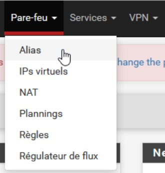 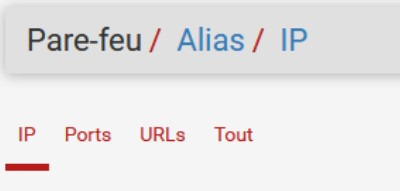

On peut alors en attribuer aux **IP**, **Ports**, **URL** où sur un ensemble:

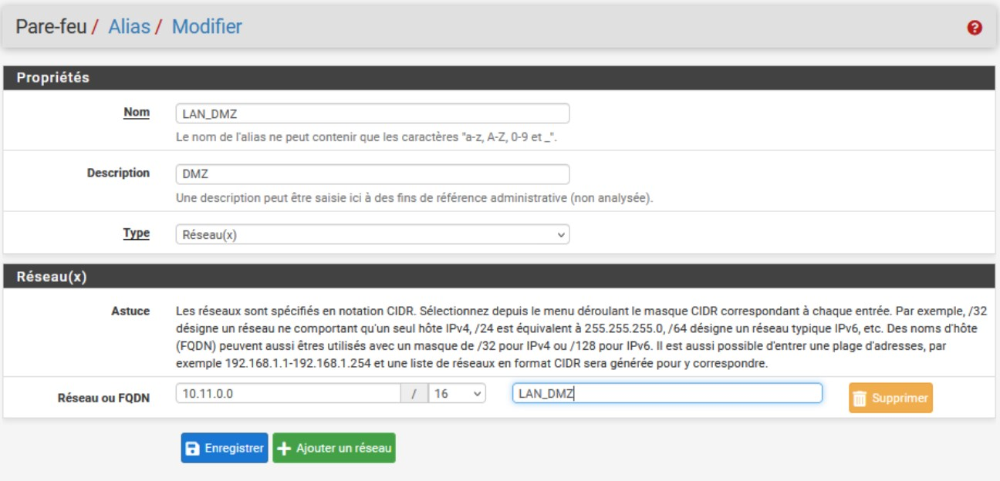

Une fois celui-ci crée, n'oubliez pas de sauvegarder pour que PfSense le prenne en compte !
Voici un exemple des alias que nous avons créer pour ce projet:

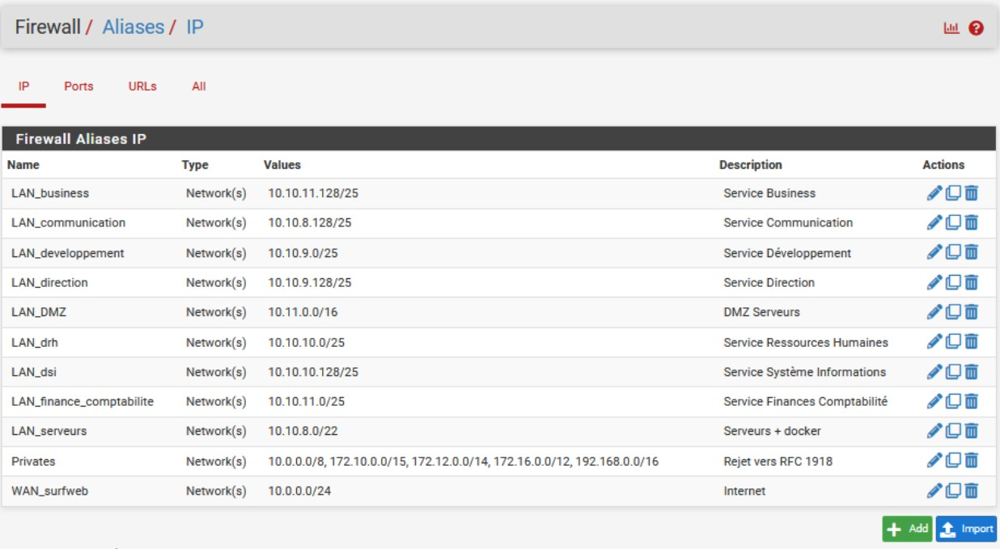  

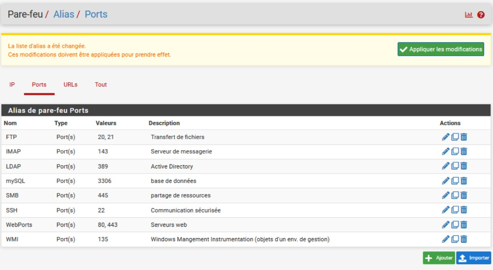


Au jour d'aujourd'hui nous n'avons pas encore besoin "d'appliquer" les règles du pare-feu étant donné que l'infrastructure derrière n'est pas encore opérante. Pour cette raison, les règles sont "désactivées", dans le but de ne pas compromettre la suite du projet.
Nous vous proposons une méthode de gestion des règles dite raisonnable, ou plutôt "de bonnes pratiques", notamment tirées de la documentation **NetGate** :

**Mise en place d'une isolation du LAN et de la DMZ, chacun avec un accès Internet non restreint:**

La configuration suivante peut être utilisée à la place si l'accès sortant est plus souple, mais toujours contrôlé entre les interfaces locales. Cela suppose que tous les réseaux locaux sont numérotés de manière privée et que les interfaces ont déjà été configurées.

#### Configuration LAN

Pour les DNS depuis le pare-feu :

 - Autoriser TCP/UDP du sous-réseau LAN vers l'adresse LAN sur le port 53.

Pour accéder à l'interface graphique :

 - Autoriser TCP du sous-réseau LAN vers l'adresse LAN sur le port 443.

Pour effectuer un ping vers le pare-feu depuis le LAN :

 - Autoriser ICMP du sous-réseau LAN vers l'adresse LAN.

Si un trafic est nécessaire du LAN vers la DMZ :

 - Autoriser tout trafic nécessaire du LAN vers la DMZ.

Ne pas autoriser le LAN à atteindre la DMZ ou d'autres réseaux privés :

 - Rejeter tout en provenance du sous-réseau LAN vers RFC1918.

Pour l'accès à Internet :

 - Autoriser tout du sous-réseau LAN vers n'importe quelle destination sur Internet.


  
  
#### Configuration DMZ


Pour les DNS depuis le pare-feu :

 - Autoriser TCP/UDP du sous-réseau DMZ vers l'adresse DMZ sur le port 53.

Pour accéder à l'interface graphique (facultatif) :

 - Autoriser TCP du sous-réseau DMZ vers l'adresse DMZ sur le port 443.

Pour effectuer un ping vers le pare-feu depuis la DMZ :

 - Autoriser ICMP du sous-réseau DMZ vers l'adresse DMZ.

Si un trafic est nécessaire de la DMZ vers le LAN :

 - Autoriser tout trafic nécessaire de la DMZ vers le LAN.

Ne pas autoriser la DMZ à atteindre le LAN ou d'autres réseaux privés :

 - Rejeter tout en provenance du sous-réseau DMZ vers RFC1918.

Pour l'accès à Internet :

 - Autoriser tout du sous-réseau DMZ vers n'importe quelle destination sur Internet.


2. Gestion des ID de VM de groupe

3. Mise en place de règles de pare-feu (WAN & LAN)

### Mise en place et Configuration de Routeurs

Suite à l'installation et la configuration du Pare-feu, nous avons mis en place des Routeurs **Vyos**

Nous avons par la même occasion revu notre plan schématique du réseau, pour que celui-ci corresponde à la réalité

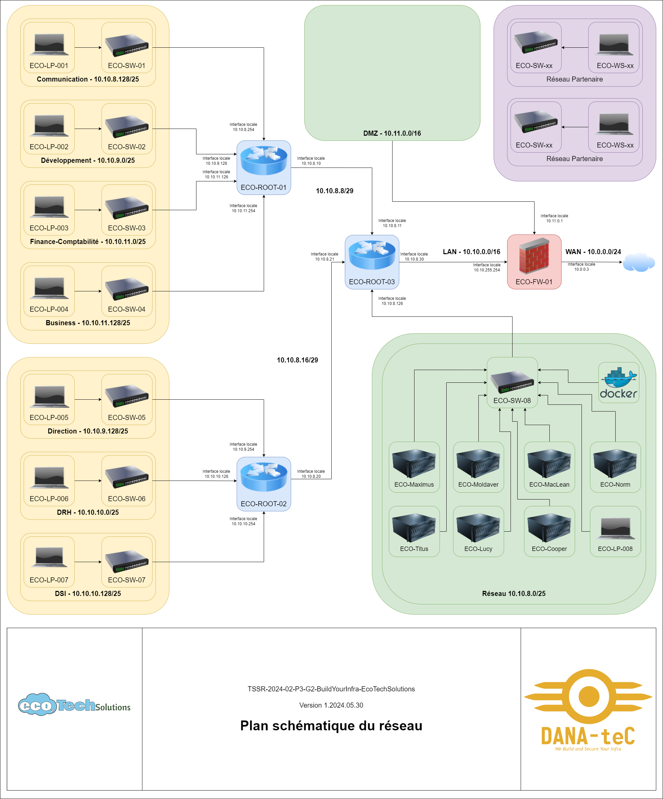

Une fois les routeurs installés, nous devons les parametrer

#### Configuration des cartes réseaux

1. Au démarrage du Routeur, saisissez le Login `vyos` et le mot de passe `vyos`.

2. Accédez au mode de configuration avec la comande `conf`.

3. Vérifiez la présence des cartes réseaux avec la commande `run show interfaces`.

4. Pour paramètrer l'IP d'une carte réseau, utilisez la commande `set interfaces ethernet <nom de la carte> address <IP de la carte>` puis `commit` puis `save`.
   Par exemple, pour la carte `eth2` et l'`IP 10.10.8.10/29`, saisissez la commande `set interfaces ethernet eth2 address 10.10.8.10/29` puis `commit` puis `save`.

Ce qui nous donne pour les différents Routeurs les interfaces suivantes :

Routeur ECO-ROOT-01

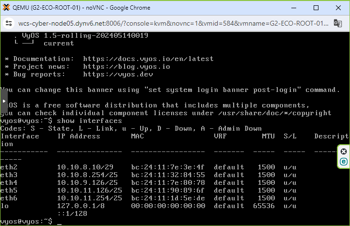

Routeur ECO-ROOT-02


Routeur ECO-ROOT-03

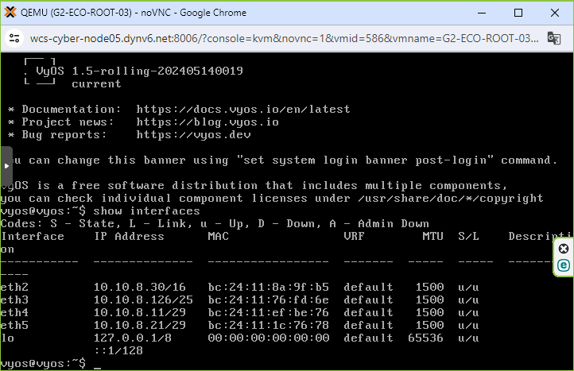

#### Configuration du Routage

1. De la même façon, une fois en mode Configuration, pour établir une règle de routage, utilisez la commande `set protocols static route <adresse de réseau à cibler> next-hop <adresse de la passerelle>` puis `commit` puis `save`.
   Par exemple, pour un routage vers le réseau `10.0.0.0/24`, saisissez la commande `set protocols static route 10.0.0.0/24 next-hop 10.10.255.254` puis `commit` puis `save`.

Nous aurons donc nos Routeurs configurés de la façon suivante : 

Routeur ECO-ROOT-01

|Adresse de réseau|Masque de réseau|Adresse de passerelle|Interface Locale|
|:---------------:|:--------------:|:-------------------:|:--------------:|
|   10.10.8.128   | 255.255.255.128|      on-link        |  10.10.8.254   |
|    10.10.9.0    | 255.255.255.128|      on-link        |  10.10.9.126   |
|    10.10.11.0   | 255.255.255.128|      on-link        |  10.10.11.126  |
|   10.10.11.128  | 255.255.255.128|      on-link        |  10.10.11.254  |
|    10.10.8.8    | 255.255.255.248|      on-link        |   10.10.8.10   |
|    10.10.8.16   | 255.255.255.248|      10.10.8.11     |   10.10.8.10   |
|   10.10.9.128   | 255.255.255.128|      10.10.8.11     |   10.10.8.10   |
|    10.10.10.0   | 255.255.255.128|      10.10.8.11     |   10.10.8.10   |
|   10.10.10.128  | 255.255.255.128|      10.10.8.11     |   10.10.8.10   |
|    10.10.0.0    |   255.255.0.0  |      10.10.8.11     |   10.10.8.10   |
|    10.10.8.0    | 255.255.255.128|      10.10.8.11     |   10.10.8.10   |
|     10.0.0.0    |  255.255.255.0 |      10.10.8.11     |   10.10.8.10   |
|     10.11.0.0   |   255.255.0.0  |      10.10.8.11     |   10.10.8.10   |


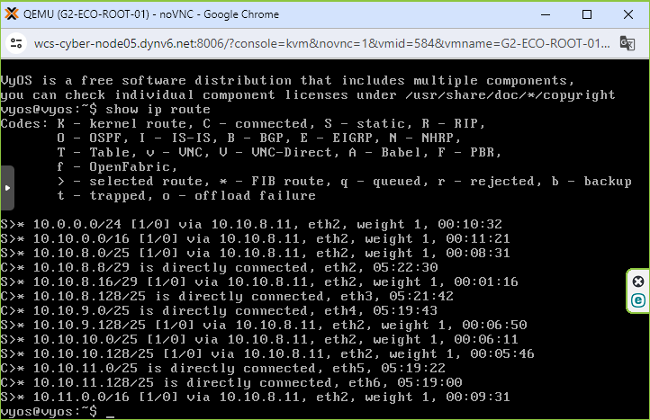

Routeur ECO-ROOT-02

|Adresse de réseau|Masque de réseau|Adresse de passerelle|Interface Locale|
|:---------------:|:--------------:|:-------------------:|:--------------:|
|   10.10.9.128   | 255.255.255.128|      on-link        |  10.10.9.254   |
|    10.10.10.0   | 255.255.255.128|      on-link        |  10.10.10.126  |
|   10.10.10.128  | 255.255.255.128|      on-link        |  10.10.10.254  |
|    10.10.8.16   | 255.255.255.248|      on-link        |   10.10.8.20   |
|    10.10.8.8    | 255.255.255.248|      10.10.8.21     |   10.10.8.20   |
|   10.10.8.128   | 255.255.255.128|      10.10.8.21     |   10.10.8.20   |
|    10.10.9.0    | 255.255.255.128|      10.10.8.21     |   10.10.8.20   |
|    10.10.11.0   | 255.255.255.128|      10.10.8.21     |   10.10.8.20   |
|   10.10.11.128  | 255.255.255.128|      10.10.8.21     |   10.10.8.20   |
|   10.10.10.128  | 255.255.255.128|      10.10.8.21     |   10.10.8.20   |
|    10.10.0.0    |   255.255.0.0  |      10.10.8.21     |   10.10.8.20   |
|     10.0.0.0    |  255.255.255.0 |      10.10.8.21     |   10.10.8.20   |
|     10.11.0.0   |   255.255.0.0  |      10.10.8.21     |   10.10.8.20   |

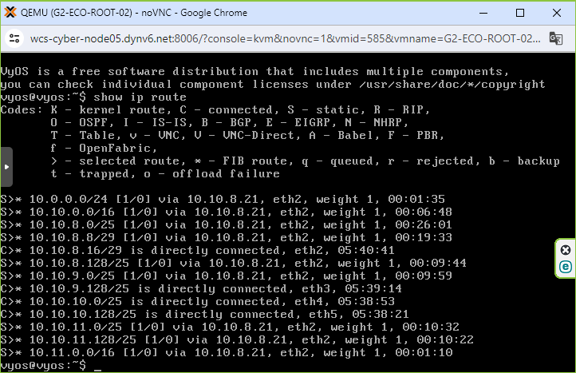

Routeur ECO-ROOT-03

|Adresse de réseau|Masque de réseau|Adresse de passerelle|Interface Locale|
|:---------------:|:--------------:|:-------------------:|:--------------:|
|    10.10.0.0    |   255.255.0.0  |      on-link        |   10.10.8.30   |
|    10.10.8.8    | 255.255.255.248|      on-link        |   10.10.8.11   |
|    10.10.8.16   | 255.255.255.248|      on-link        |   10.10.8.21   |
|    10.10.8.0    | 255.255.255.128|      on-link        |   10.10.8.126  |
|     10.0.0.0    |  255.255.255.0 |    10.10.255.254    |   10.10.8.30   |
|     10.11.0.0   |   255.255.0.0  |    10.10.255.254    |   10.10.8.30   |
|   10.10.9.128   | 255.255.255.128|      10.10.8.20     |   10.10.8.21   |
|    10.10.10.0   | 255.255.255.128|      10.10.8.20     |   10.10.8.21   |
|   10.10.10.128  | 255.255.255.128|      10.10.8.20     |   10.10.8.21   |
|   10.10.8.128   | 255.255.255.128|      10.10.8.10     |   10.10.8.11   |
|    10.10.9.0    | 255.255.255.128|      10.10.8.10     |   10.10.8.11   |
|    10.10.11.0   | 255.255.255.128|      10.10.8.10     |   10.10.8.11   |
|   10.10.11.128  | 255.255.255.128|      10.10.8.10     |   10.10.8.11   |

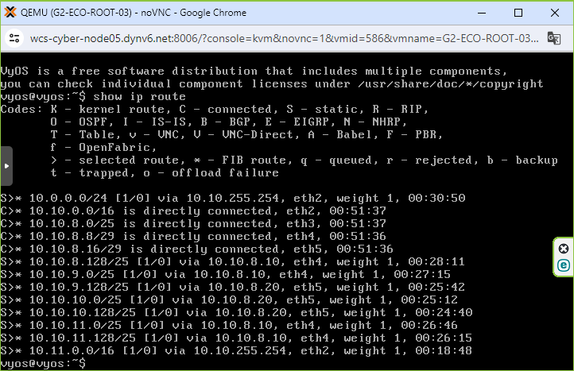

Vos Routeurs sont configurés.

## **FAQ : Solutions aux problèmes connus et communs liés à l'installation et à la configuration**

```
Au démarrage du routeur, lorsque j'utilise la commande `show interfaces`, je ne vois pas toutes mes cartes réseaux.
```
1. Malheureusement, c'est un problème connu, un `reboot` du routeur sera nécessaire, réitérez l'opération si besoin. Il est possible que les cartes réseaux ne reviennent qu'une à la fois par `reboot`.


```
Lors de la configuration d'une interface de Routeur et/ou d'une Route, je me suis trompé d'adresse de réseau ou d'adresse IP. Puis-je la modifier ?
```
1. Il n'est malheureusement pas possible de modifier une interface ou une route directement, vous devez avant supprimer les paramètres érronés avec la commande `delete interfaces ethernet <nom de la carte>` dans le cas d'une erreur d'interface ou la commande `delete protocols static route <adresse de réseau à cibler>` dans le cas d'une erreur de route.
