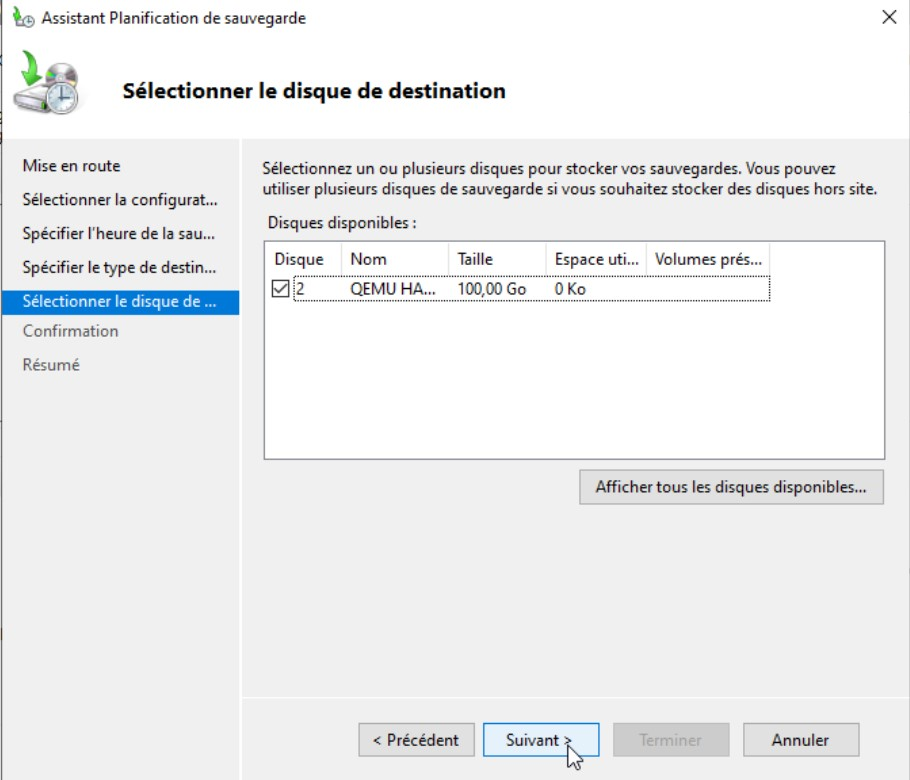
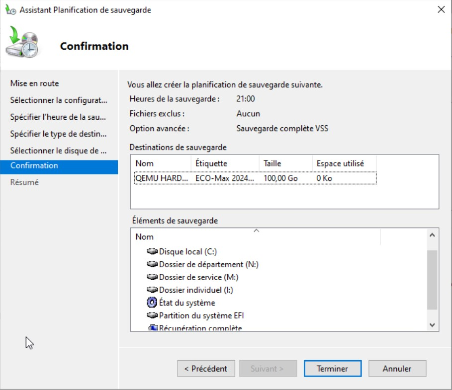
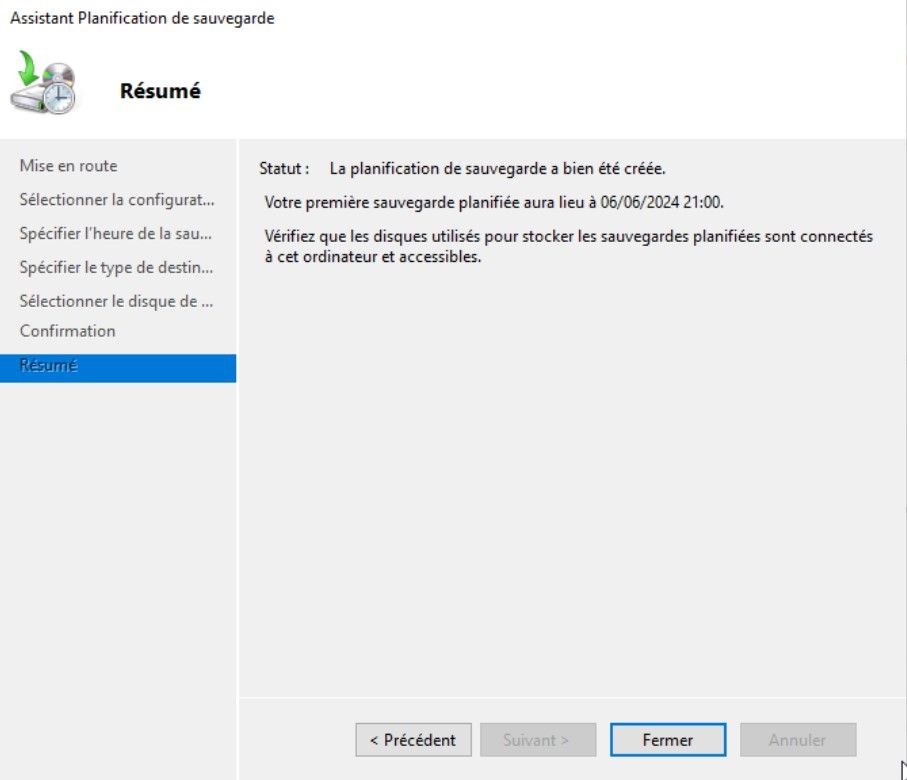

# **TSSR-2402-P3-G2-BuildYourInfra-EcoTechSolutions**

## **1. Sommaire**

1) Pré-requis techniques

2) Installation et Configuration des équipements et ressources

3) FAQ : Solutions aux problèmes connus et communs liés à l'installation et à la configuration

## **2. Pré-requis techniques**

## **3. Installation et Configuration des équipements et ressources**

### Mise en place du RAID 1

#### Serveur Debian - *Lucy*

L'objectif ici est de mettre en place un RAID 1, soit du mirroring entre les 2 disques. Les données sont copiées simultanément sur deux disques. Ainsi en cas de panne d'un des disques, les données sont toujours disponibles sur le disque restant. Pour réaliser cette objectif, nous avons dû installer une VM Debian depuis le début.

.png)

#### Mise en place du RAID logiciel
Débutez l'installation de Debian... Effectuez notamment le choix de la langue, la configuration réseau, choisissez un nom pour votre machine et un mot de passe pour le compte root. Ensuite, vous arriverez à la gestion du stockage (voir image ci-dessous), choisissez "Manuel" puisque les modes assistés ne nous seront pas utiles dans ce cas précis.

.png)

Sélectionnez le premier disque, pour ma part il s'agit de sda. Faites Entrée.

.png)

Sélectionnez "Oui" et poursuivez afin de créer une nouvelle table de partitions sur ce disque.

.png)

La table de partition étant créée, nous allons créer une nouvelle partition, sélectionnez la ligne sous sda mentionnant l'espace libre.

.png)

Sélectionnez "Créer une nouvelle partition" et appuyez sur Entrée.

.png)

On indique la taille de partition, il s'agira de ma partition principale où sera installé le système. J'attribue 32 Go sur les 34.4 Go disponibles. Sélectionnez "Continuer" et validez.

.png)

Choisissez de créer une partition "Primaire" et l'emplacement "Début".

.png)

.png)

Au niveau des caractéristiques, sélectionnez la ligne "Utiliser comme :" et appuyez sur "Entrée".

.png)

A la place de l'entrée par défaut "système de fichiers journalisé ext4", sélectionnez plutôt "volume physique pour RAID" et validez.

.png)

Il ne reste plus qu'à faire "Fin du paramétrage de cette partition".

.png)

Répétez les opérations précédentes afin de créer une partition avec l'espace disque restant sur le disque sda, puis, une partition 32 Go sur le second disque sdb mais aussi une seconde partition avec l'espace disque restant. Pensez bien à sélectionnez "volume physique pour RAID" à chaque fois. Vous devez arriver au résultat suivant :

.png)

.png)

Si c'est le cas, sélectionnez "Configurer le RAID avec gestion logicielle" et appuyez sur Entrée.

Lorsque l'on vous demande si vous souhaitez appliquer des changements à vos disques sda et sdb, choisissez "Oui".

.png)

La création et la gestion du RAID logiciel s'appuie sur MDADM, c'est par son intermédiaire que se configure le RAID que nous mettons en place. Choisissez "Créer un périphérique multidisque".

.png)

Nous devons choisir "RAID1" puisque ce tutoriel concerne le RAID1.

.png)

Indiquez "2" puisque l'ensemble RAID contiendra deux périphériques actifs, c'est à dire sda et sdb. Continuer.

.png)

Indiquez "0" car nous n'avons pas de périphériques de réserve, c'est à dire de disque dur de spare déjà présent dans la machine et prêt à prendre le relais en cas de panne.

.png)

Sélectionnez les partitions à ajouter à ce premier groupe de RAID logiciel, sélectionnez "sda1" et "sdb1" qui correspondent aux deux partitions de 32 Go pour le système. Continuer.

.png)

Sélectionnez à nouveau "Créer un périphérique multidisque" et effectuez la même procédure que précédemment sauf que cette fois-ci on sélectionnera les deux autres partitions (sda2 et sdb2).

.png)

.png)

Nous avons terminé la création des deux groupes de RAID, faites donc Terminer.

.png)

Vous devriez obtenir un résumé précisant la présence de deux périphériques RAID1, le numéro 0 d'une taille de 32 Go et le numéro 1 d'une taille de 2.4 Go.

Pour le premier (32 Go), sélectionnez le volume et appuyez sur Entrée afin de définir le système de fichiers ext4 et le point de montage "/". Pour le second, faites la même chose et sélectionnez SWAP afin d'utiliser cet espace comme de la SWAP.

Vous devez obtenir un résultat semblable à la copie d'écran ci-dessous. Si c'est bien le cas, sélectionnez "Terminer le partitionnement et appliquer les changements".

.png)

.png)

Validez avec "Oui" pour appliquer les changements sur les disques.

.png)

#### Vérifier le RAID
Pour finir, une fois que la machine a terminée l'installation, nous allons vérifier que le RAID est bien opérationnel.

Commencez par saisir la commande suivante **`cat /proc/mdstat`**

Nous obtenons cette sortie :

.png)

Vous pouvez voir sur la sortie ci-dessus, que les RAID 1 sont bien présent et bien décris. Ce qui est intéressant, c'est la mention [UU] qui permet de voir que les deux disques sont opérationnels. Cela ne serait pas le cas si l'on aurait [_U] ou [U_].

De plus, chaque grappe RAID est définie sous la forme d'un identifiant "md<x>" où X est le numéro de la grappe RAID.

Voyons une seconde commande dans le but de visualiser en détails l'état d'un RAID, par exemple le md0 avec la commande suivante **`mdadm -D /dev/md0`**

Nous obtenons cette sortie :

.png)

On peut remarquer que deux périphériques sont actif et en cours (Active Devices / Working Devices), mais aussi qu'ils sont bien en synchronisation active (State = active sync) ce qui est essentiel dans le cas de cette mise en place.


### SAUVEGARDE - Mettre en place une sauvegarde du volume qui contient les dossiers partagés des utilisateurs (C:\)

Pour l'exercice de sauvegarde, il est important de considérer la nécessité d'ajouter au minimum un disque à notre serveur, ou bien même d'utiliser un disque de stockage externe !
Nous proposons de se servir directement du rôle Windows Server Backup présent dans Server Manager. Pour cela, nous nous rendons en haut à droite dans l'onglet **Gérer** puis dans "Ajouter des rôles et fonctionnalités". Nous suivons l'assistant d'installation puis une fois dans la fenêtre *Fonctionnalités*, nous cochons "Windows Server Backup".


Nous procédons à l'installation du rôle:


Une fois celle-ci terminée, nous allons dans l'onglet "Outils" en haut à droite > **Sauvegarde Windows Server**:


Une nouvelle fenêtre s'ouvre. Une fois la reconnaissance de l'environnement terminée, clic droit sur "Sauvegarde locale" > **Planification de sauvegarde**:


Poursuivons en compagnie de l'assistant:


Ici, nous pouvons choisir entre "Serveur complet" pour tout comprendre dans la sauvegarde, ou "Personnalisé" pour ne sélectionner que certaines partie de notre système. Dans notre cas, nous avons laisser coché "Serveur complet"


Ici, nous pouvons sélectionner nos paramètres de planification : "Tous les jours" à "21:00".


Nous sélectionnons le volume de destination en cliuant sur "Afficher tous les disques disponibles":
  


Choisissons celui qui nous intéresse (ici nous avons ajouté un disque à notre machine serveur, je rappelle plus haut que nous pouvons aussi très bien choisir d'ajouter un disque dur externe pour que la sauvegarde soit faire "en dehors" de la machine, ce qui est par ailleurs recommandé):



Comme nous avions sélectionné "Serveur complet", nous observons dans le cadre du bas la présence de tous les éléments du systèmes. **Terminer**.



La planification est bien prise en compte !



Nous retrouvons sur la fenêtre de départ la confirmation ainsi que les "statuts" du service.


  

### Mise en place de LAPS - Mot de passe administrateur local.

LAPS pour Local Administrator Password Solution est une solution gratuite proposée par Microsoft qui va permettre de gérer les mots de passe des comptes "Administrateur" locaux des postes de travail et des serveurs. Dès lors que le compte Administrateur local d'une machine est géré par Microsoft LAPS, le mot de passe de ce compte va être généré aléatoirement (selon certains critères) et stocké dans l'Active Directory au sein de l'objet "ordinateur" (computer) correspondant à la machine. De cette façon, l'administrateur système n'a pas à gérer ces mots de passe lui-même, ni à les stocker dans un gestionnaire de mots de passe un par un.

Une fois en place, Microsoft LAPS s'assure que tous les appareils disposent de mots de passe uniques et robustes afin de lutter contre les connexions malveillantes ou non autorisées.
  
#### Console de gestion sur un AD en GUI

Avant de commencer, téléchargez LAPS gratuitement sur le site de Microsoft. Vous devez télécharger à minima "LAPS.x64.msi" pour les machines 64 bits et "LAPS.x86.msi" pour les machines 32 bits, en fonction de vos besoins. Ici, nous optons pour une version 64 bits.


Sur le contrôleur de domaine, nous allons installer les outils de gestion LAPS. Cela pourrait être installé sur un autre serveur où vous avez les outils d'administration Active Directory déjà installés.

Exécutez le package MSI correspondant à la version de Windows de votre serveur : 32 bits ou 64 bits. Vous allez voir, l'installation est simple et s'effectue en quelques clics... Cliquez sur "Next".
    


Cochez l'option "I accept the terms in the License Agreement" et cliquez sur "Next".
  


Ensuite, vous devez installer tous les outils d'administration (comme sur l'image ci-dessous) et vous pouvez désélectionner l'entrée "AdmPwd GPO Extension" car elle n'est pas utile sur le contrôle de domaine. En fait, le composant "AdmPwd GPO Extension" doit être déployé sur l'ensemble des machines à gérer via LAPS. Poursuivez.
  


Voici l'utilité des différents outils de gestion :

 - Fat client UI : outil graphique pour la gestion de LAPS
 - PowerShell module : commandes PowerShell pour LAPS
 - GPO Editor templates : modèle ADMX de LAPS

Démarrez l'installation, quelques secondes seront suffisantes. Cliquez sur "Finish" une fois que c'est fait.

  
Ouvrez une console Windows PowerShell sur votre contrôleur de domaine. Il faut que ce soit un contrôleur de domaine en écriture (donc pas un RODC !) et qu'il dispose du rôle FSMO "Maître de schéma" puisque l'on va modifier le schéma Active Directory.

Si vous avez besoin de localiser le contrôleur de domaine qui dispose de ce rôle FSMO, voici une commande PowerShell qui vous donnera la réponse :
  
  


Cette modification du schéma Active Directory va ajouter deux attributs au sein des objets de la class "computers" :

- ms-MCS-AdmPwd : stocker le mot de passe en clair
- ms-MCS-AdmPwdExpirationTime : stocker la date d’expiration du mot de passe

Exécutez la commande suivante pour importer le module PowerShell de LAPS :
  


Ensuite, exécuter la commande ci-dessous pour mettre à jour le schéma AD, la commande doit retourner trois lignes avec le statut "Success" à chaque fois.


Si l'on ouvre la console "Utilisateurs et ordinateurs Active Directory" et que l'on regarde les propriétés d'un ordinateur membre du domaine, on peut voir la présence des deux nouveaux attributs. Voici un exemple :


  
La première étape est faite, passons à la suite.

Les machines qui doivent être managées via LAPS ont besoin de mettre à jour les attributs ms-MCS-AdmPwdExpirationTime et ms-MCS-AdmPwd au sein de notre annuaire Active Directory. Sinon, il ne sera pas possible de stocker dans l'AD la date d'expiration et le mot de passe.

Le module LAPS de PowerShell contient un cmdlet pour réaliser cette action. Pour l'utiliser, c'est tout simple puisqu'il suffit d’indiquer le nom de l’OU cible. Pour ma part, je vais cibler l'OU "PC" (visible sur la copie d'écran ci-dessus) car elle contient les machines que je souhaite gérer avec LAPS. Je vous recommande de préciser le DistinguishedName de l'OU pour être sûr de cibler la bonne OU, sauf si vous êtes sûr qu'il n'y en a qu'une seule qui a ce nom.
Pour ce faire nous éxecutons la ligne de commande suivante :


Maintenant, l'installation sur les postes clients par GPO ou script:

Nous commençons par créer un nouveau dossier partgagé dans lequel nous plaçons le fichier ``LAPS.x64.msi``, de telle sorte à ce qu'il soit rendu accessible sur chaque poste client de notre domaine.

Ensuite, nous créeons une nouvelle GPO:


Nous suivons le chemin indiqué ci-dessous jusqu'à "Package...": ici nous allons renseigner le chemin du dossier partagé où se trouve notre fichier ``.msi`` pour l'installation de LAPS sur les ostes clients.


Puis nous finissons la configuration en laissant cocher "Attribué"


Nous pouvons constater son ajout.


Maintenant, nous suivons le chemin comme indiqué ci-dessous, pour s'attaquer à la configuration de notre logiciel unef ois installé sur le poste client: nous commençons par "Enable local admin password management"


Que nous activons...


Même chose pour "Password settings"...
  


Et pour "Name of administrator account to manage"...
  


Une fois cette GPO paramètrée, nous pouvons uassi opter pour le déploiement via un script PowerShell. Voici comment nous pouvons procéder: création d'une autre GPO, elle, dédiée à l'exécution du script.
  


Nous suivons le chemin indiqué ci-dessous, pour le lancement du script au démarrage:
  


Voici une proposition simplifié du script applicable :

```
#Script d'installation de LAPS sur les clients

#Installation
Start-Process -FilePath "\\Eco-Maximus\LAPS\laps.x64.msi" -ArgumentList "/quiet /norestart" -Wait

#Importer le module LAPS PowerShell
Import-Module AdmPwd.PS

#Config paramètres LAPS
Set-AdmPwdAuditing -AuditedPrincipals "Domain Admins"
Set-AdmPwdPasswordPolicy -Complexity 3 -Length 14 -Age 30
```


  
### RESTRICTION D'UTILISATION DES MACHINES - Restriction horaire

Nous avons décidé de mettre en place une restriction horaire au sein de notre domaine. Voici les mesures prises :
 - 1. Bloquer la connexion pour les utilisateurs non-admin (domaine et local)
 - 2. Connexion autorisée de 7h30 à 20h, du lundi au samedi


  
Pour ce faire, on peut procéder "à la main" pour chaque *user* en faisant clic droit sur *lui* > "Propriétés" > "Compte" > "Horaires d'accès". Il faudra alors l'appliquer pour chaque utilisateur.
Nous proposons ce script pour la gestion détaillée des horaires de connexion pour les utilisateurs :

```
# Fonction pour définir les heures de connexion
function Set-LogonHours {
    param (
        [Parameter(Mandatory=$true)]
        [byte[]]$Hours,
        [Parameter(Mandatory=$true)]
        [string]$Day
    )
    
    # Conversion du nom du jour en index (0=Dimanche, 6=Samedi)
    $dayIndex = switch ($Day.ToLower()) {
        "dimanche"  { 0 }
        "lundi"     { 1 }
        "mardi"     { 2 }
        "mercredi"  { 3 }
        "jeudi"     { 4 }
        "vendredi"  { 5 }
        "samedi"    { 6 }
        default { throw "Jour invalide spécifié: $Day" }
    }
    
    # Calcul des intervalles de 7h30 (15ème demi-heure) à 20h00 (40ème demi-heure)
    for ($i = 15; $i -le 40; $i++) {
        $Hours[$dayIndex * 24 + $i] = 1
    }
    
    return $Hours
}

# Tableau initialisé avec des zéros pour toute la semaine
$logonHours = @(0) * 168

# Mise à jour des heures de connexion pour chaque jour de la semaine souhaité
$jours = @("lundi", "mardi", "mercredi", "jeudi", "vendredi", "samedi")
foreach ($jour in $jours) {
    $logonHours = Set-LogonHours -Hours $logonHours -Day $jour
}

# Application des heures de connexion aux utilisateurs
Get-ADUser -SearchBase "OU=Utilisateurs,DC=ecotechsolutions,DC=fr" -Filter * | ForEach-Object {
    $_ | Set-ADUser -LogonHours $logonHours
}

```

Définition de la fonction Set-LogonHours :

 - La fonction prend deux paramètres :
        $Hours : Un tableau d'octets représentant les heures de connexion autorisées.
        $Day : Le jour de la semaine pour lequel nous définissons les heures de connexion.

Conversion du nom du jour en index :

 - Utilise une instruction switch pour convertir le nom du jour en index numérique (0 pour dimanche, 6 pour samedi).

Calcul des intervalles de 7h30 à 20h00 :

 - Utilise une boucle for pour définir les bits correspondants aux demi-heures de 7h30 (15ème demi-heure) à 20h00 (40ème demi-heure) pour le jour spécifié.
    Le calcul $dayIndex * 24 + $i positionne correctement chaque demi-heure dans le tableau de 168 éléments.

Initialisation du tableau logonHours :

 - Un tableau de 168 éléments est créé, initialisé à zéro, représentant chaque demi-heure de la semaine comme non autorisée.

Mise à jour des heures de connexion pour chaque jour :

 - Une boucle foreach itère sur les jours spécifiés (lundi à samedi) et met à jour les heures de connexion en appelant Set-LogonHours pour chaque jour.


Nous avons choisi de mettre en place une GPO de restriction horaire. Ci-dessous les étapes de mise en place :

#### Créer une nouvelle GPO pour la restriction horaire 

  - Ouvrir la console de gestion des stratégies de groupe: on accède à "Outils" > "Gestion des stratégies de groupe".
  


 - Création de la nouvelle GPO : clic droit sur l'UO interessée pour y lier la GPO (dans notre cas **EcoT_Users**) > "Créer un objet de stratégie de groupe dans ce domaine, et le lier ici"
 - Nommer la nouvelle GPO de manière toujours explicite.


#### Configuration de la restriction horaire pour les utilisateurs

 - Nous commençons par éditer la GPO créée : clic droit sur la GPO créée et sélectionner "Modifier".


 - Puis nous configurons les paramètres de retriction en eux-mêmes : ``Configuration de l'ordinateur`` > ``Stratégies`` > ``Paramètres Windows`` > ``Paramètres de sécurité`` > ``Stratégies locales`` > ``Options de sécurité``.
   (Ici nous pouvons double-cliquer sur ``Connexion intéractive`` et ajuster le ``nombre maximal de connexions simultanées`` que nous définissons à **1**)


  
#### Serveur Windows **_Maximus_**

Rendez-vous sur l'annexe disponible [RAID Windows GUI](https://github.com/WildCodeSchool/TSSR-2402-P3-G2-BuildYourInfra-EcoTechSolutions/blob/main/S13/annex/Raid_Windows_GUI.md)

#### Serveur Windows **_Moldaver_**

Rendez-vous sur l'annexe disponible : [RAID_Windows_Core](https://github.com/WildCodeSchool/TSSR-2402-P3-G2-BuildYourInfra-EcoTechSolutions/blob/main/S13/annex/Raid_Windows_Core.md)

## **FAQ : Solutions aux problèmes connus et communs liés à l'installation et à la configuration**
