# **TSSR-2402-P3-G2-BuildYourInfra-EcoTechSolutions**

## **Sommaire**

1) Pré-requis techniques

2) Installation et Configuration des équipements et ressources


### Serveur mail "iRedMail"
  
#### Pré-requis à considérer :
  
Nous avons choisi de déployer un conteneur sous Debian 12 pour pouvoir monter le serveur mail **IRedMail**
Voici son paramètrage :
  
 - Mémoire : 20Go
 - 1 coeur de processeur
 - Mémoire RAM : **2Go** (attention ici par défaut il est proposé 512Mo, il est recommandé de mettre un minimum de 1Go pur que l'installation des fonctionnalités du serveur se déroule bien)
 - SWAP : 512Mo
 - Réseau : configuration sur le LAN correspondant à notre réseau, on enlève le Firewall par défaut, on attribue l'adresse fixe 10.10.8.116/16 avec la passerelle correspondant à notre pare-feu (10.10.255.254)
 - DNS : nous renseignons ici notre domaine : ecotechsolutions.fr
  
Avant de démarrer notr econteneur fraichement crée, nous allons sur le DNS manager de notre serveur DNS (ici *Maximus*), *Forward Lookup Zones*, *ecotechsolutions.fr* pour :
 - Créer un **Host name A** mail : 10.10.8.116
 - Créer un **MX** : 10.10.8.116
  
Nous démarrons alors le conteneur puis :
 - ``apt-get update && apt-get upgrade -y``
 - Dans le fichier ``/etc/hosts`` nous modifions pour écrire ``127.0.0.1 mail.ecotechsolutions.fr``
 - Dans le fichier ``/etc/hostname`` nous plaçons le nom en FQDN (Full Qualified Domain Name) : ``mail.ecotechsolutions.fr``
  
Nous pouvons alors procéder à l'installation de iRedMail. Voici les premiers pas :
  
 - Nous tapons la ligne de commande suivante : ``wget https://github.com/iredmail/iRedMail/archive/refs/tags/*.tar.gz`` où * correspond à la dernière version stable de **iRedMail**.
 - Nous extrayons avec la commande suivante : ``tar -xzf *.tar.gz``
 - On peut alors supprimer le fichier archive avec : ``rm *.tar.gz`` puis se rendre dans le dossier iRedMail-* : ``cd iRedMail-*``
 - Un fois placé dans ce dossier, nous exécutons le script : ``bash iRedMail.sh``
  
Nous voici alors en présence de l'assistant d'installation, aussi appelé *Wizard*. 

Pour commencer l'installation, validez avec **< YES >**.

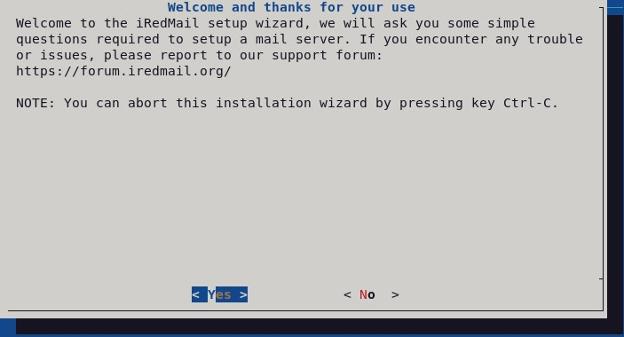

Pour le chemin par défaut, nous le laissons par défaut, continuez avec **< NEXT >**.

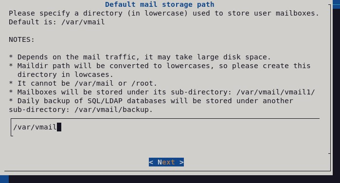

Pour le serveur web, sélectionnez **Nginx** et continuez avec **< NEXT >**.

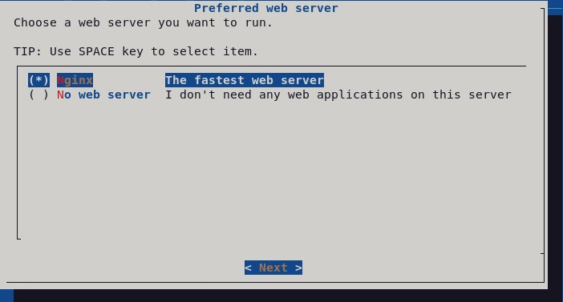

Pour la base de donnée des mails, sélectionnez **OpenLDAP** et  continuez avec **< NEXT >**.

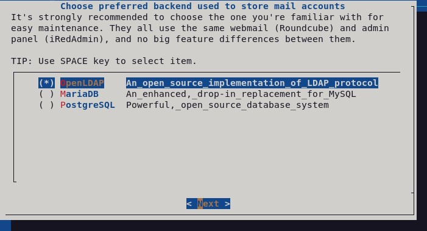

Pour le suffixe LDAP, entrez le domaine comme suit, continuez avec **< NEXT >**.

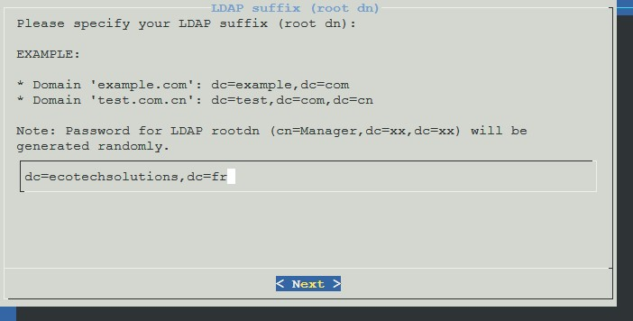

Saisissez le mot de passe Administrateur mail "_Azerty1*_" , continuez avec **< NEXT >**.

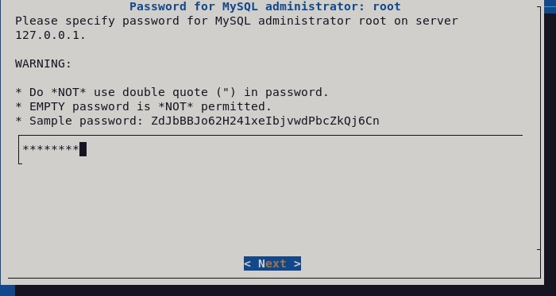

Saisissez le nom domaine comme suit, continuez avec **< NEXT >**.

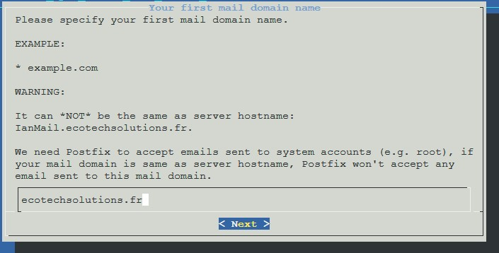

Saisissez le mot de passe Administrateur "_Azerty1*_" , continuez avec **< NEXT >**.

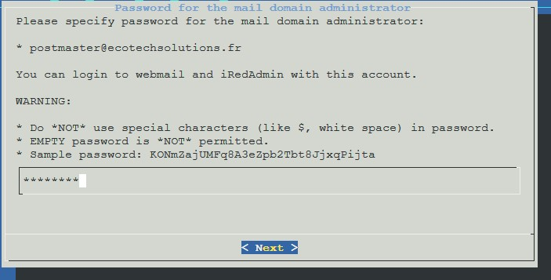

Pour les options, sélectionnez: **_Roundcubemail_**, **_netdata_**, **_iRedAdmin_** et **_Fail2ban_**. Continuez avec **< NEXT >**.

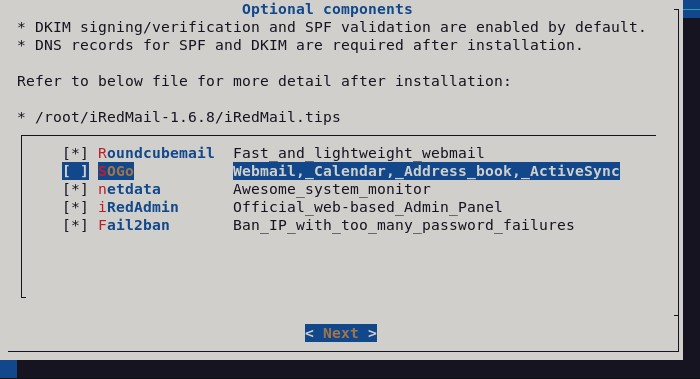

L'installation et la configuration sont terminées. 
Aux questions _File: /etc/nftables.conf, with SSHD ports: 22_ et _Restart firewall now (with ssh port: 22)?_ , validez les deux questions avec **y**.


Connectons-nous à la page de connexion de _Roundcube Webmail_ avec l'adresse IP **10.10.8.116/mail/**. Saisissez le nom d'utilisateur "_postmaster@ecotechsolutions.fr_" et le mot de passe "_Azerty1*_" et cliquez sur **CONNEXION**.

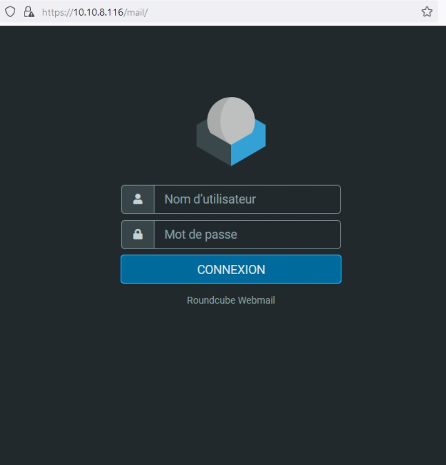

Voici la page d'accueuil de _Roundcube Webmail_.

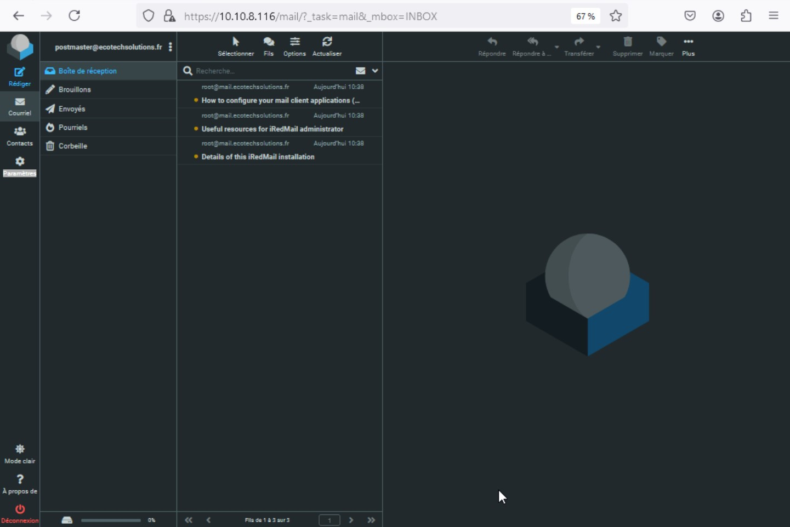

Pour créer un nouveau contact, allez à gauche sur l'encart _Contacts_ et ensuite cliquez sur l'encart _Créer_ en haut au milieu.

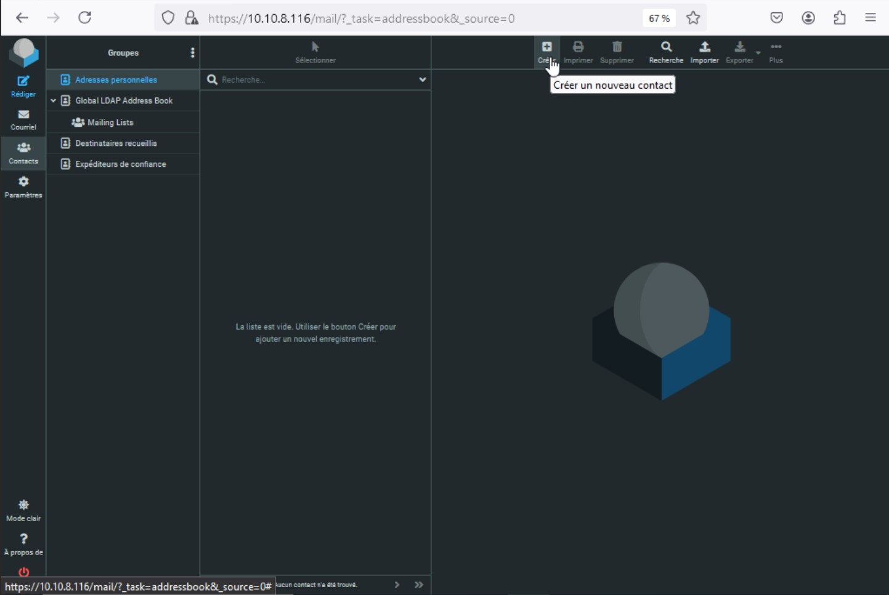

Connectons-nous à la page de connexion de _iRedAdmin_ avec l'adresse IP **10.10.8.116/iredadmin/**. Saisissez le nom d'utilisateur _postmaster@ecotechsolutions.fr_ et le mot de passe _Azerty1*_ et cliquez sur **CONNEXION**.

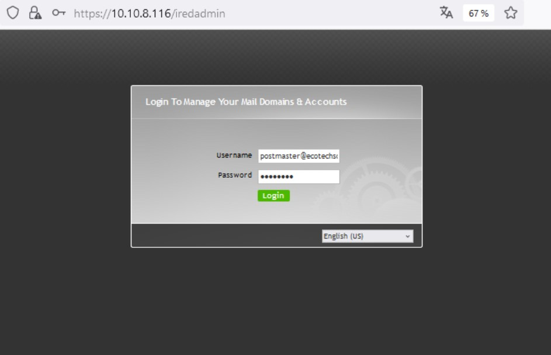

Pour Créer un utilisateur, allez sur l'onglet **+Add**.

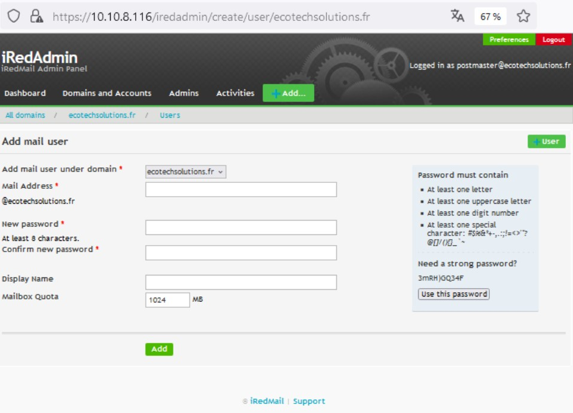

Pour créer l'utilisateur, remplir tout les champs contenant une étoile rouge et cliquez sur **Add** en bas de page.

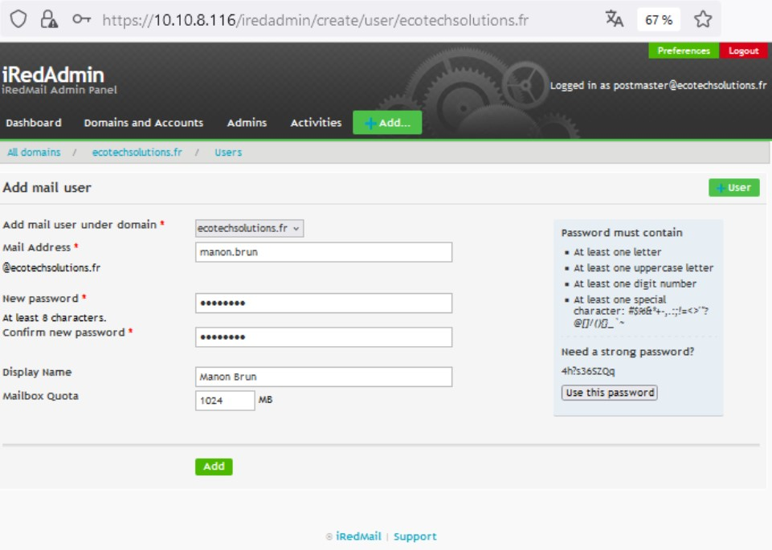

Une fois créee, vérifions en allant sur l'onglet **Domains and Accounts**

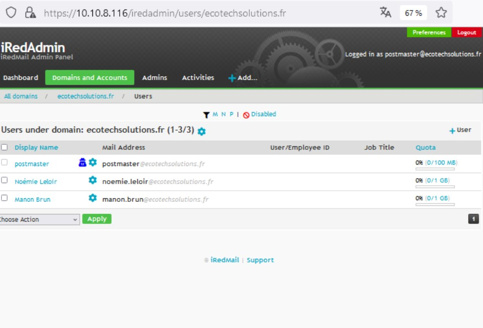

Retournons sur la page d'accueuil de _Roundcube Webmail_ pour verifier que l'utilisateur crée apparait bien dans les contacts.

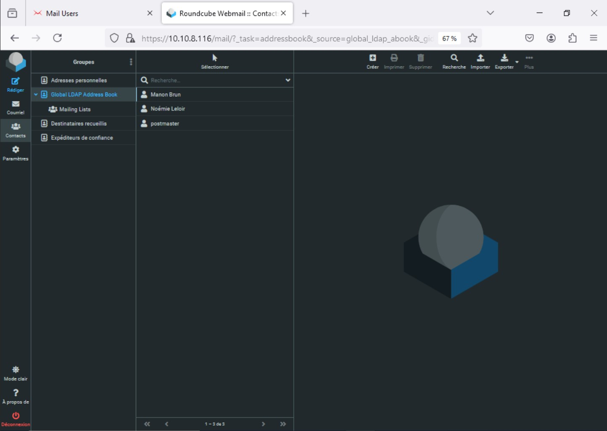

Connectons-nous sur un compte crée précédemment.

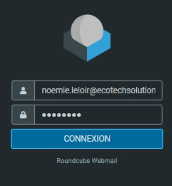

Créeons un mail test vers un autre contact et cliquez sur **Envoyer**.

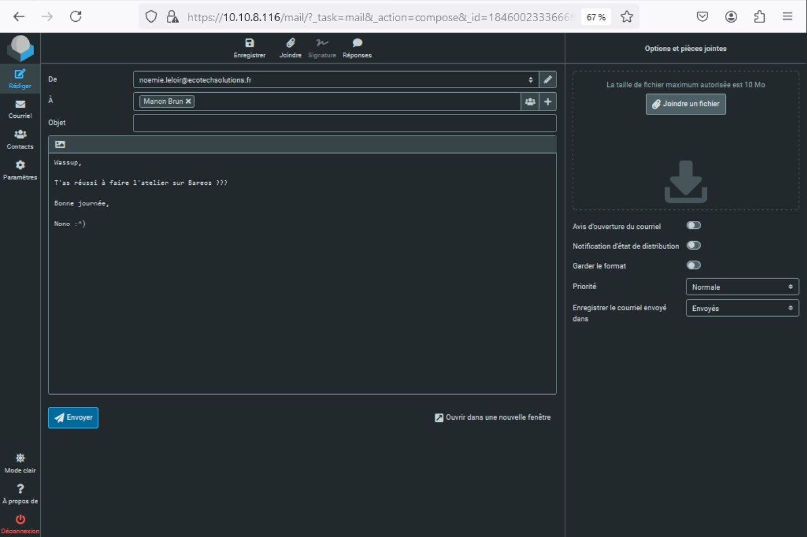

Notre contact a bien reçu le mail test que nous avons envoyé.

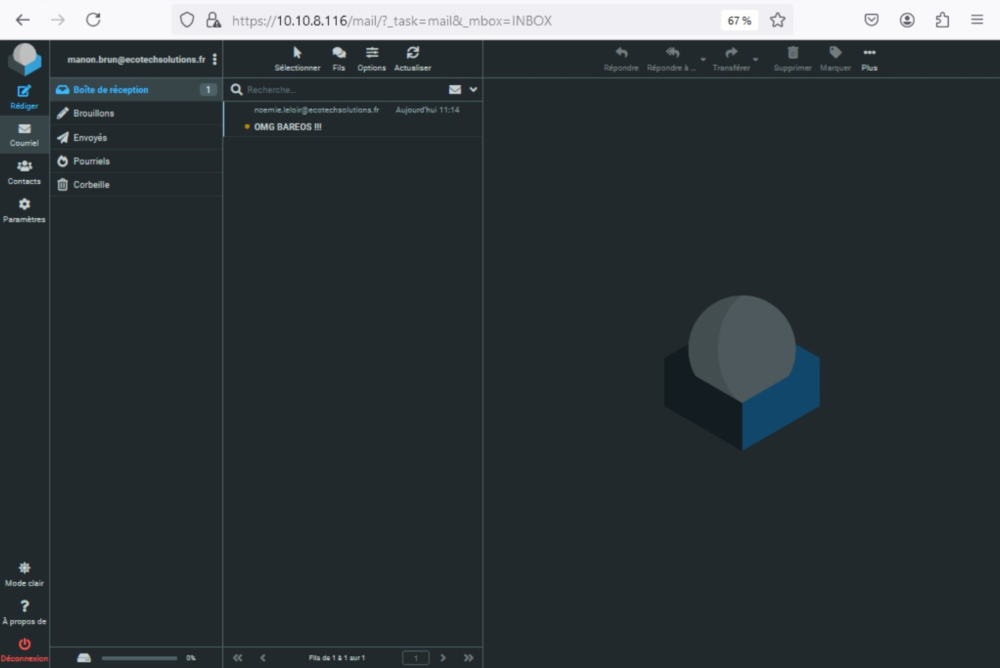

La création et la configuration de l'adresse mail est operationelle.

### Gestion de projet / suivi de tâches avec **Redmine**

#### Installation

Nous avons déployé un template Turnkey sur Proxmox afin de disposer des outils nécessaires à l'installation de Redmine. Premièrement, nous devons définir les mots de passe pour la base de données et pour l'administrateur.


Ensuite nous rentrons l'adresse mail de l'admin


Puis nous allons "skip" les deux prochains encadrés


Ensuite, nous lançons l'installation.


Normalement, nous devrions obtenir l'interface suivante


#### Configuration

Nous allons maintenant nous connecter à l'interface web de Redmine à l'aide du compte administrateur.

- identifiant : admin
- mot de passe : Azerty1*

Une fois sur la page d'administration de Redmine, nous cliquons sur le menu "Administration" situé en haut à gauche de l'écran.

Maintenant, nous allons pouvoir synchroniser notre annuaire Active Directory dans la section "Authentification LDAP".


Puis, nous cliquons sur "Nouveau mode d'authentification"


### Objectifs Personnalisés
1. Tiering Model

La mise en place d'un modèle de hiérarchisation (tiering) dans Active Directory est une approche recommandée par Microsoft et l'ANSSI pour renforcer la sécurité de notre environnement. Ce modèle consiste à segmenter notre forêt AD en plusieurs niveaux (tiers) en fonction de leur criticité et de leur fonction. Cela permet de limiter l'accès aux ressources sensibles et de réduire l'impact d'une compromission.

Dans notre cas, avec une seule forêt et une OU France contenant l'ensemble de notre société, voici la structure de hiérarchisation :

Tier 0 : Forêt et Domaine

OU = EcoT_Tier0
Placé au même niveau que la le contrôleur de domaine
Contient:
Contrôleurs de domaine
Serveurs de gestion privilégiés (bastions)
Rôles: Administrateurs de forêt et de domaine


Tier 1 : Unités d'organisation critiques

OU: EcoT_Tier1
Contient:
OU Admin (comptes administrateurs locaux)
OU Secure (comptes à privilèges élevés)
OU User (comptes utilisateurs standard)
OU Computer (ordinateurs)
Rôles: Administrateurs de domaine et administrateurs locaux privilégiés


Tier 2 : 

Sous-OUs de l'OU Bordeaux : EcoT_Tier2
Département
Contient:
Comptes utilisateurs et ordinateurs spécifiques à chaque métier
Rôles: Administrateurs de domaine et administrateurs locaux avec des privilèges limités aux ressources de leur métier

2. VM Pentest

Nous allons mettre en place un serveur de test d'intrusion avec Kali Linux dans l'infrastructure de ecotechsolutions, car cela présente plusieurs avantages et utilités, principalement axés sur l'amélioration de la sécurité et la préparation face aux cybermenaces. Voici quelques-unes des principales utilités :
a. Détection des vulnérabilités

  Identifications des failles : Un serveur Kali Linux permet de réaliser des tests de pénétration pour identifier les failles de sécurité potentielles dans les systèmes, les applications et le réseau.
  Évaluation des risques : En découvrant les vulnérabilités, l'entreprise peut évaluer les risques associés et prioriser les correctifs.

b. Amélioration de la sécurité proactive

  Renforcement de la sécurité : Les résultats des tests d'intrusion peuvent être utilisés pour renforcer les défenses de l'entreprise en appliquant des correctifs, des mises à jour et en améliorant les configurations de sécurité.
  Préparation aux attaques : Simuler des attaques permet de mieux comprendre comment les systèmes réagissent face à des menaces réelles, permettant de développer des stratégies de défense plus robustes.

c. Conformité réglementaire

  Respect des normes : De nombreuses normes de sécurité, telles que PCI-DSS, ISO 27001 et HIPAA, exigent des tests réguliers de sécurité. L'utilisation de Kali Linux pour ces tests aide l'entreprise à se conformer à ces exigences.
  Audit et rapports : Les tests d'intrusion peuvent fournir des rapports détaillés nécessaires pour les audits de sécurité et démontrer la conformité aux régulateurs.

e. Formation et sensibilisation

  Éducation des équipes : Un serveur Kali Linux peut être utilisé pour former les équipes de sécurité et les administrateurs système à identifier et à répondre aux menaces. C'est un outil précieux pour l'éducation continue en cybersécurité.
  Sensibilisation : En réalisant des tests d'intrusion internes, les employés prennent conscience des risques et de l'importance des pratiques de sécurité.

f. Détection des intrusions

  Simulations d'attaques : Les outils de Kali Linux permettent de simuler des attaques réalistes, aidant à tester et à améliorer les systèmes de détection d'intrusion (IDS) et les systèmes de prévention d'intrusion (IPS).
  Réaction aux incidents : Tester les réponses aux incidents dans un environnement contrôlé aide à améliorer les procédures de réponse aux incidents.

g. Gestion des correctifs

  Priorisation des correctifs : En identifiant les vulnérabilités critiques grâce aux tests d'intrusion, l'entreprise peut prioriser les correctifs et les mises à jour, optimisant ainsi l'utilisation des ressources.

h. Amélioration continue

  Cycle de rétroaction : Les résultats des tests d'intrusion fournissent un retour d'information continu sur l'état de la sécurité de l'infrastructure, permettant une amélioration constante des mesures de sécurité.

**Conclusion**

Mettre en place un serveur de test d'intrusion avec Kali Linux dans l'infrastructure de l'entreprise est une démarche proactive essentielle pour améliorer la sécurité globale, se préparer aux cyberattaques, se conformer aux réglementations et former les équipes de sécurité. Cela permet non seulement de détecter et de corriger les failles de sécurité, mais aussi de renforcer la posture de sécurité de l'entreprise de manière continue et évolutive.

#### Installation du système d'exploitation Kali linux

Une fois la VM lancée, après l'avoir créée et ajouté l'ISO d'installation de Kali Linux, nous devrions tomber sur la fenêtre ci-dessous. Nous choisissons alors l'option **'graphical install'**.


Après avoir choisi la langue de la machine, la géographie de notre emplacement et la langue du clavier en français, nous allons donner un nom à la machine.


Maintenant, nous allons entrer le nom de notre domaine **'ecotechsolutions.fr'** pour l'intégrer à celui-ci.


Puis, il nous demandera si nous voulons configurer la route du réseau et ajouter un DNS. Nous ne rentrons rien dans cette partie pour le moment, donc nous tapons **'Entrée'**. Ensuite, nous entrons le nom complet de l'utilisateur. Nous inscrivons **'wilder'** et validons deux fois. Enfin, nous entrons et confirmons le mot de passe **'Azerty1*'**.


Nous sélectionnons **'Assisté - utiliser un disque entier'**.


Puis, nous validons le premier choix.


Nous répondons **'OUI'** pour confirmer les changements sur les disques.


Nous laissons les cases cochées par défaut.


Nous validons l'installation du programme de démarrage GRUB et sélectionnons le disque principal.


Nous validons **'Continuer'** pour redémarrer.


Une fois redémarré, nous entrons les identifiants.


 

Nous pouvons constater l'écran d'accueil et, en haut à gauche, la barre de recherche où se trouvent les outils nécessaires pour l'utilisation que nous avons choisie. Ensuite, nous pouvons passer à la configuration.


#### Configuration de Kali linux

Dans un premier temps, nous avons configuré l'adresse IP, la passerelle et le DNS de la machine virtuelle.


Puis, nous avons défini un mot de passe pour le compte root.


Ensuite, nous avons lancé la mise à jour du système et des applications.


Nous lançons la commande suivante qui va nous permettre d'installer tous les paquets nécessaires pour effectuer des tests de pénétration et d'évaluer la sécurité des systèmes d'information et des réseaux.


#### Outils Kali Linux

##### Nmap

1. Introduction :

Nmap est un scanner de ports libre créé par Fyodor et distribué par Insecure.org. Il est conçu pour détecter les ports ouverts, identifier les services hébergés et obtenir des informations sur le système d'exploitation d'un ordinateur distant.

2. Utilisation :

Dans un premier temps, on retrouve l'outil dans la barre de recherche à gauche de l'écran.


Une fois la console ouverte, nous pouvons effectuer une recherche dans le réseau choisi ou une plage de réseau. Bien sûr, il existe plusieurs moyens d'établir des scans.


ou


Nous pouvons voir plusieurs adresses IP s'afficher, appartenant au réseau ciblé 10.10.8.0/24, ainsi que les ports ouverts de chaque machine.


Il existe un script prédéfini dans Nmap, accessible via une commande, qui permet aux utilisateurs d'exécuter un scan de vulnérabilités. Cela est donc très pratique pour s'assurer que notre système est à jour et non vulnérable.

Voici une commande pour lancer un script prédéfini :


Nous pouvons remarquer que nous avons obtenu davantage d'informations sur l'adresse IP ciblée et les vulnérabilités :


Ces résultats montrent que l'hôte 10.10.8.100 a plusieurs services critiques ouverts, mais les vulnérabilités majeures testées (XSS, CSRF, SMB) n'ont pas été confirmées ou n'ont pas pu être vérifiées en raison d'erreurs de connexion. Il peut être nécessaire d'examiner plus en détail ces services pour identifier d'autres éventuelles vulnérabilités ou sécurités.

Nous pouvons lancer un script par défaut pour obtenir le nom, l'adresse MAC et le domaine de la machine.


Cette sortie de nmap montre que l'hôte 10.10.8.100 a les ports 3389 (RDP) et 5357 ouverts, avec des certificats SSL associés au service RDP et des informations détaillées sur l'intégration Active Directory de l'hôte. Les informations sur l'adresse MAC et la résolution DNS de l'hôte sont également fournies. Ces données peuvent être utiles pour comprendre la configuration réseau de l'hôte, vérifier les certificats SSL, et diagnostiquer les services exposés et leur sécurité.

**Voici une liste des options Nmap**

|           Options            |                                          Commandes                                           |
| :--------------------------: | :------------------------------------------------------------------------------------------: |
|          --exclude           |                                  Exclure des hôtes du scan                                   |
|              -n              |                                 Désactiver la résolution DNS                                 |
|            --open            |                                Afficher que les ports ouverts                                |
|             -oN              |               Enregistrer le résultat du scan dans un fichier au format texte                |
|             -oX              |                Enregistrer le résultat du scan dans un fichier au format XML                 |
|              -p              |                            Spécifier les ports réseaux à scanner                             |
|             -Pn              |                               Désactiver la découverte d’hôte                                |
|              -r              |                              Analyser les ports consécutivement                              |
|             -sT              |                                  Faire un scan de port TCP                                   |
|             -sU              |                                  Faire un scan de port UDP                                   |
|             -sV              |                               Trouver les versions du service                                |
|           --script           |         Utilise un script interne à nmap pour scan de vulnérabilité, bruteforce, etc         |
|              -v              |                                         Mode bavard                                          |
|             -vv              |                                       Mode très bavard                                       |
|              -A              | Activer la détection du système d'exploitation, le scan de version et les scripts par défaut |
|              -O              |                              Détecter le système d'exploitation                              |
|             -sC              |                               Exécuter les scripts par défaut                                |
|             -sP              |                                      Faire un ping scan                                      |
|              -F              |                 Faire un scan rapide (seulement les ports les plus courants)                 |
|           -T<0-5>            |     Définir le niveau d'agressivité du scan (par exemple, -T4 pour un scan plus rapide)      |
|             -iL              |                        Lire les hôtes à scanner à partir d'un fichier                        |
|           --reason           |            Afficher la raison pour laquelle un port est dans un état particulier             |
| --version-intensity <niveau> |                   Régler l'intensité de la détection de version (de 0 à 9)                   |
|             -oG              |              Enregistrer le résultat du scan dans un fichier au format Grepable              |
|             -oA              |          Enregistrer le résultat du scan dans tous les formats principaux (N, X, G)          |
|              -6              |                                     Activer le scan IPv6                                     |

  
### Installation d'un bastion d'administration Apache-Guacamole
  
**Pré-requis** 
  
Au niveau de notre parefeu, quelques ajustements étaient nécessaires :
  
 - Configuration du NAT *Outbound* pour autoriser la DMZ à utiliser la WAN donc pour sortir du réseau local privé vers l'extérieur: 
  Pour cela, sur l'interface web de notre parefeu Pfsense, nous allons dans **Firewall** > **NAT** > **Outbound** et on clique sur **Add**. Nous configurons comme suit :

  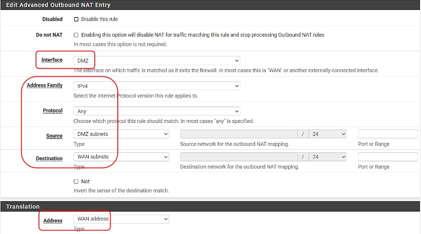

Nous cliquons sur **Save** et **Apply changes** pour valider la règle.
  
#### => Installation
  
Guacamole est composé de deux parties :

**Guacamole-server** : fournit le proxy guacd et tous les composants natifs côté serveur nécessaires à Guacamole pour se connecter à des bureaux distants.
**Guacamole-client** : fournit le client à servir par le conteneur de servlets, généralement Tomcat.

Pour configurer le client de bureau à distance web Apache Guacamole, vous devez installer ces deux composants.
  
Mise à jour du système : ``apt update``

Installer les outils de construction nécessaires
  
```
apt install -y build-essential libcairo2-dev libjpeg62-turbo-dev libpng-dev libtool-bin uuid-dev libossp-uuid-dev libavcodec-dev libavformat-dev libavutil-dev libswscale-dev freerdp2-dev libpango1.0-dev libssh2-1-dev libvncserver-dev libtelnet-dev libwebsockets-dev libssl-dev libvorbis-dev libwebp-dev libpulse-dev sudo
```

Télécharger le code source de Guacamole
```
VER=1.5.4
wget https://downloads.apache.org/guacamole/$VER/source/guacamole-server-$VER.tar.gz
tar xzf guacamole-server-$VER.tar.gz
cd guacamole-server-$VER
```

Configurer le serveur Guacamole

``./configure --with-systemd-dir=/etc/systemd/system/``

Compiler et installer Guacamole Server
```
make
make install
ldconfig
```
  
Démarrer et activer guacd
```
systemctl daemon-reload
systemctl enable --now guacd
systemctl status guacd
```

Installation de Tomcat 9 sur Debian 12 : **Ajouter le dépôt Debian 11**
```
echo "deb http://deb.debian.org/debian/ bullseye main" > /etc/apt/sources.list.d/bullseye.list 
apt update
```
Installer Tomcat 9
```
apt install tomcat9 tomcat9-admin tomcat9-common tomcat9-user -y
sed -i 's/^/#/' /etc/apt/sources.list.d/bullseye.list 
systemctl status tomcat9.service
```
#### Installation de Guacamole Client

Créer le répertoire de configuration Guacamole

``mkdir /etc/guacamole``

Télécharger et installer le client Guacamole
```
wget https://downloads.apache.org/guacamole/$VER/binary/guacamole-$VER.war -O /etc/guacamole/guacamole.war
ln -s /etc/guacamole/guacamole.war /var/lib/tomcat9/webapps/
systemctl restart tomcat9 guacd
```
Configuration de Guacamole : créer les répertoires de configuration

``mkdir /etc/guacamole/{extensions,lib}``

Configurer les propriétés de Guacamole

``echo "GUACAMOLE_HOME=/etc/guacamole" >> /etc/default/tomcat9``

Configurer les connexions du serveur Guacamole
```
cat > /etc/guacamole/guacamole.properties << EOL
guacd-hostname: 127.0.0.1
guacd-port: 4822
user-mapping:   /etc/guacamole/user-mapping.xml
auth-provider:  net.sourceforge.guacamole.net.basic.BasicFileAuthenticationProvider
EOL
```
  

``ln -s /etc/guacamole /usr/share/tomcat9/.guacamole``

Configurer l'authentification Guacamole : générez le hash MD5 du mot de passe :

``echo -n password | openssl md5`` (copier la clé !)

Créez le fichier user-mapping.xml :
```
    <user-mapping>

      <authorize username="guacadmin" password="5f4dcc3b5aa765d61d8327deb882cf99" encoding="md5">

        <connection name="Kali">
          <protocol>ssh</protocol>
          <param name="hostname">10.10.200.50</param>
          <param name="port">2222</param>
        </connection>

        <connection name="Maximus">
          <protocol>rdp</protocol>
          <param name="hostname">10.10.8.100</param>
          <param name="port">3389</param>
          <param name="username">Administrator</param>
          <param name="ignore-cert">true</param>
        </connection>

        <connection name="Moldaver">
          <protocol>rdp</protocol>
          <param name="hostname">10.10.8.120</param>
          <param name="port">3389</param>
          <param name="username">Administrator</param>
          <param name="ignore-cert">true</param>
        </connection>

      </authorize>
      
    </user-mapping>
```
Redémarrer Tomcat et guacd

``systemctl restart tomcat9 guacd``

Accès à Apache Guacamole depuis le navigateur

=> Utilisez l'adresse http://IP-du-serveur:8080/guacamole pour accéder à l'interface web de Guacamole.
Connectez-vous avec les informations d'identification configurées.
  
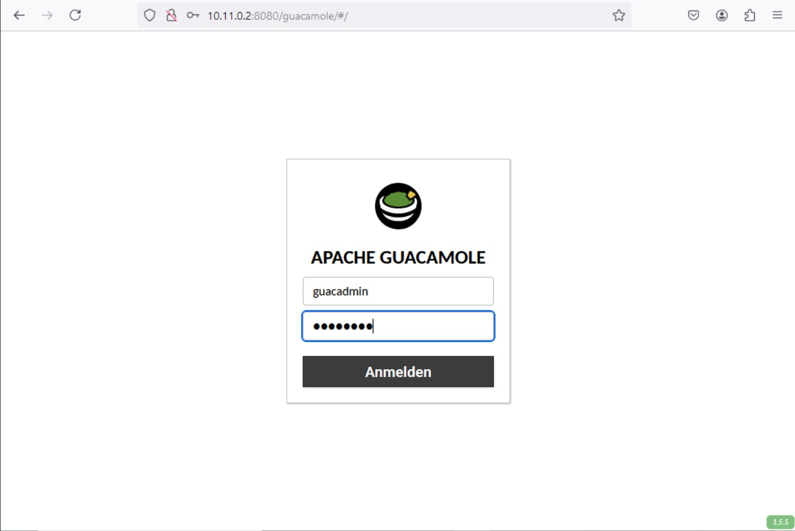
  
login indiqué plus haut : *guacadmin* // mdp : **Azerty1\***
  
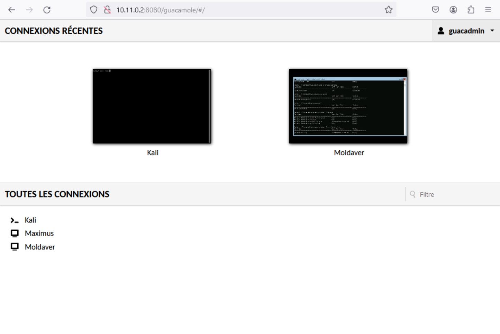
1) FAQ : Solutions aux problèmes connus et communs liés à l'installation et à la configuration

## **Pré-requis techniques**

## **Installation et Configuration des équipements et ressources**

## **FAQ : Solutions aux problèmes connus et communs liés à l'installation et à la configuration**
