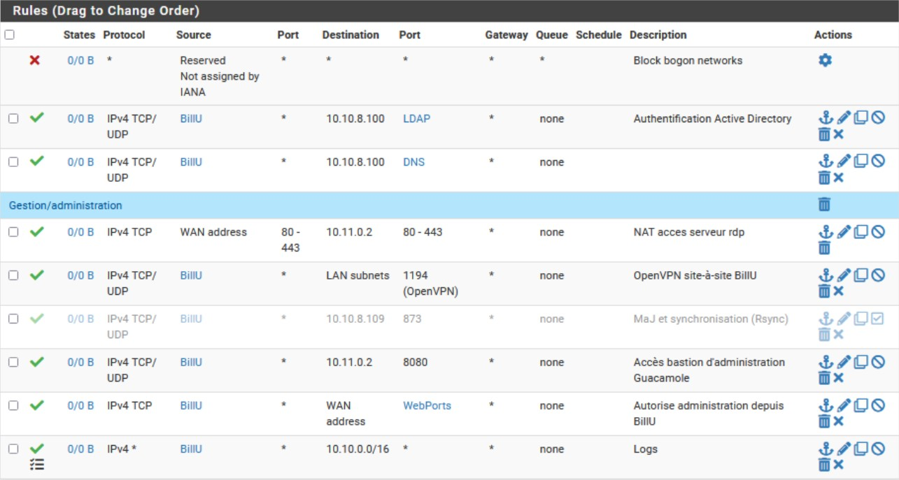
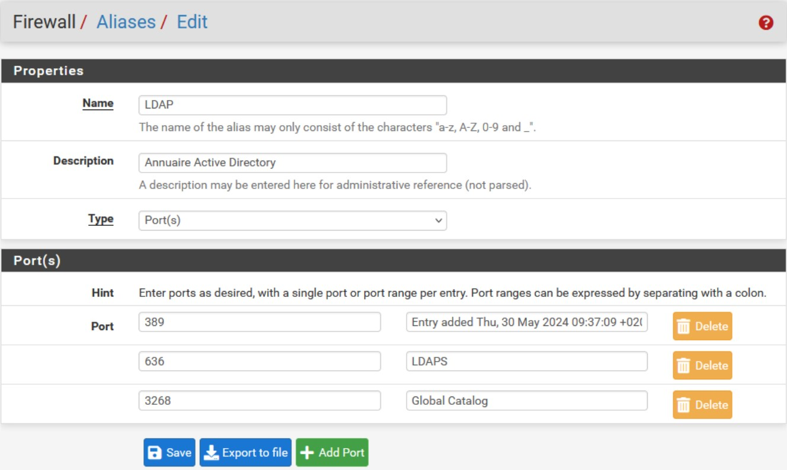
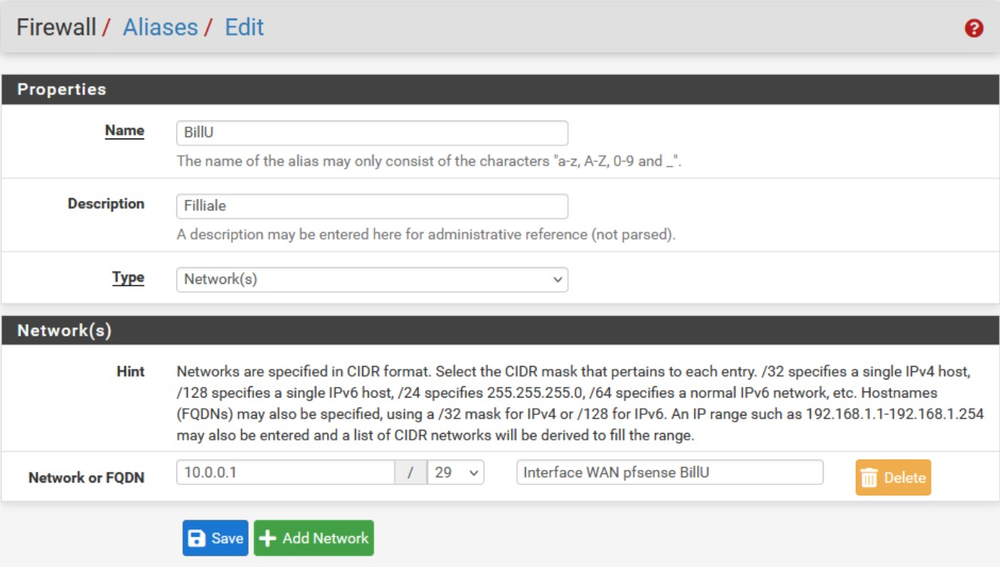

# **TSSR-2402-P3-G2-BuildYourInfra-EcoTechSolutions**

## **Sommaire**

1) Pré-requis techniques

2) Installation et Configuration des équipements et ressources

3) FAQ : Solutions aux problèmes connus et communs liés à l'installation et à la configuration

## **Pré-requis techniques**

## **Installation et Configuration des équipements et ressources**

### Installation du Server WSUS

WSUS signifie Windows Server Update Service et il s’agit du rôle intégré à Windows Server qui a une mission bien précise, la distribution des mises à jour des produits Microsoft sur les postes de travail et serveurs de notre entreprise.

L’installation du rôle WSUS sur Windows Server 2022

Ouvrez le " Gestionnaire de serveur ", cliquez sur " Manage " puis " Add Roles and Features "

Passons le premier écran en cliquant sur " Next "

Nous sélectionnons la première option, puis nous cliquons sur "Next".

Nous sélectionnons le serveur approprié, puis nous cliquons sur "next".

Nous sélectionnons le service "Windows Server Update Services" dans la liste des rôles serveur.

Ensuite, nous cliquons sur le bouton "Add Features", puis sur "Next"

Pour les deux étapes suivantes, nous cliquons également sur le bouton "Next".

Maintenant, nous entrons le chemin d'accès du disque où nous souhaitons stocker les mises à jour.

Ensuite, nous cliquons sur le bouton "Suivant", puis de nouveau sur "Suivant", et enfin sur "Installer".

Une fois l'installation terminée, nous cliquons sur le bouton "Fermer" pour fermer la fenêtre.

Enfin, nous cliquons sur le petit drapeau jaune situé en haut à droite de la fenêtre de "Server Manager", puis nous sélectionnons "Post-installation" dans le menu déroulant pour lancer la procédure de post-installation

### Configuration de base de WSUS

WSUS est installé sur notre serveur et la base de données est créée. Désormais, nous pouvons lancer la console « Services WSUS » afin d’effectuer la configuration de base. Pour ce faire nous allons dans manage server et en haut a droite "Tools".

Pour la première étape,  nous cliquons sur "Next"

Nous décochons l'option "Joindre le programme Microsoft Update", puis nous cliquons sur "Next".

Nous laissons sur "Synchronize from Microsoft Update" puis "Next"

Nous n'avons pas de serveur proxy à entrer. Nous cliquons sur "Next"

Maintenant nous lançons "Start Connecting", une fois terminé nous cliquons sur "Next"

Comme nous avons des ordinateurs en francais et en anglais pour le choix de langues des mises a jour nous selectionnons "French" et "English" 

Dans l'images suivante j'ai laissé par défaut, mais nous devons sélectionner les produits pour lesquels nous souhaitons synchroniser les mises à jour. La liste est très longue et très complète, nous devons cocher les produits correspondants à ceux que nous utilisons !

L’étape suivante concerne la classification des mises à jour, c’est-à-dire les types de mises à jour qu’il faut synchroniser sur le serveur WSUS

La synchronisation des mises à jour avec les serveurs Microsoft Update doit être planifiée afin d’être sûr de recevoir les dernières mises à jour. De préférence, cette synchronisation sera planifiée la nuit afin de ne pas perturber la production

Cochez l’option « Begin initial synchronization » si vous souhaitez réaliser une première synchronisation dès maintenant.

Nous cliquons sur "Finish"

### Lier les PC et les serveurs à WSUS par GPO

Dans un premier temps, nous allons dans la console WSUS service, puis dans "Computers" 

Maintenant, nous allons créé des groupes dans "Comptuers" pour partager les machines clients et les serveurs. On clique droit sur "All Computers" et "Add Computer Group"

Nous avons créé 3 GPO : 

  - GPO_WSUS_Parametres-communs
  - GPO_WSUS_Clients
  - GPO_WSUS_Servers

1. GPO WSUS pour les paramètres communs

 **Policies --> Administrative Templates --> Windows Components --> Windows Update**
   
Le premier paramètre à configurer se nomme "Configure Automatic Updates". Il sert à agir sur le comportement des machines notamment pour télécharger et installer les mises à jour.

Nous allons devoir définir l’adresse de notre serveur WSUS, à savoir « http://ECO-Thaddeus.ecotechsolutions.fr:8530 » (8530 étant le port par défaut lorsque le WSUS est accessible en http), dans le paramètre "Specify intranet Microsoft update service location" 

Un troisième paramètre est à configurer afin d’empêcher les machines de se connecter sur les serveurs Microsoft Update pour appliquer des mises à jour.

Il s’agit du paramètre "Do not connect to any Windows Update Internet locations"

2. GPO WSUS spécifique aux machines clients

 **Policies --> Administrative Templates --> Windows Components --> Windows Update**

 Commençons par configurer le paramètre "Enable client-side targeting". Pour cela, activons le paramètre et pour l’option "Target group name for this computer", indiquons "EcoT_Computers", car nous vous rappellons que c’est le nom du groupe créé sur le serveur WSUS.

nous allons configurer un deuxième paramètre nommé "Turn off auto-restart for updates during active hours" dans le but d’éviter les redémarrages intempestifs en pleine production !

3. GPO WSUS spécifique aux serveurs

 **Policies --> Administrative Templates --> Windows Components --> Windows Update**

nous allons configurer un deuxième paramètre nommé "Turn off auto-restart for updates during active hours" dans le but d’éviter les redémarrages intempestifs en pleine production !

 Configurons le paramètre "Enable client-side targeting". Pour cela, activons le paramètre et pour l’option "Target group name for this computer", indiquons "EcoT_Servers", car nous vous rappellons que c’est le nom du groupe créé sur le serveur WSUS.

Maintenant, nous allons lier les GPO dans les OU concernées. La GPO avec les paramètres communs sera lié dans les deux OU "EcoT_Computers" et "EcoT_Servers"

Nous les mettons à jour puis nous les testons

### Transfert des rôles FSMO entre les serveurs

- Depuis le serveur maître: ECO-MAXIMUS

1. Tapez dans la barre de recherche "**ntdsutil.exe**".

2. Une fois le terminal ouvert, tapez "**?**" pour afficher les commandes disponibles.

3. Tapez la commande "**Roles**" pour passer en mode `FSMO Maintenance` et tapez de nouveau "**?**" pour afficher les commandes disponibles.

4. Tapez la commande "**Connections**" pour passer en mode `server connections` et se connecter au serveur sur lequel transferer un des cinqs rôles FSMO.

5. Tapez la commande "**connect to server**" suivi du nom du serveur ciblé.

6. Une fois la connexion établie, tapez les commandes "**Quit**" pour revenir en mode `FSMO Maintenance` et "**?**" pour réafficher la listes des commandes.

7. Pour tranferer le rôle `Maître RID`  sur le serveur cible (par exemple), tapez la commande "**Transfer RID master**". Une fenêtre va s'ouvrir pour confirmer votre choix, validez en cliquant sur `yes`.

8. Une récapitulation de la distribution des rôles FSMO s'affiche.

9. Si d'autres rôle FSMO sont à distribuer, recommencer à partir l'étape `5.` jusqu'à `8.`, sinon tapez la commande "**Quit**" jusqu'à sortir du terminal.

10. Pour verifier la bonne distribution des 5 rôles FSMO, tapez la commande `NETDOM-QUERY /Domain:ecotechsolutions.fr FSMO` dans un terminal PowerShell.

  
## Solutions au partenariat avec la société BillU.
  
Une étroite collaboration est désormais active entre Ecotech Solutions et Billu.
  
BillU et Ecotechsolutions, un duo d'innovations,
S'unissent pour l'avenir, pour de grandes ambitions.
Ensemble, ils bâtissent des solutions durables,
Pour un monde plus vert, plus sain et plus stable.

Avec BillU, la technologie prend son envol,
Ecotechsolutions, c'est l'écologie qui colle.
Leurs forces combinées, pour un impact sans égal,
Un partenariat puissant, un potentiel colossal.

Des outils numériques, aux solutions écologiques,
Ils ouvrent la voie, vers un futur plus magique.
Chaque projet, une promesse, d’un monde transformé,
Où technologie et nature, enfin réconciliées.

Laissez-vous inspirer par cette alliance prospère,
BillU et Ecotechsolutions, un duo exemplaire.
Pour aujourd’hui et demain, ils tracent le chemin,
Vers un futur radieux, où tout devient plus sain.
  
### Firewall : mise en place des règles de parefeu et du NAT/PAT
  
La communication entre les deux entreprises est au coeur de la problématique que nous rencontrons en cette semaine 16. Voici la proposition de règles de parefeu que nous avons élaborée.
  

  
De haut en bas (en ignorant la règle par défaut en première ligne):
  
 - Authentification Active Directory : laisse passer les paquets TCP/UDP en IPv4 qui arrivent de chez **BillU** à destination de notre serveur AD-DS (en 10.10.8.100/16) sur les ports propres aux communications LDAP (389, 636, 3268). Nous avons crée l'alias associé, illustré ci-dessous :
  

  
 - Laisse passer les communications DNS, donc en direction du port 53, depuis BillU, vers Ecotech;
 - (règle mise en place en semaine 15 qui permettre le passage de communication depuis l'interface WAN vers notre DMZ via les ports web 80 et 443)
 - Permet le passage du tunnel OpenVPN;
 - Autorise l'accès au serveur d'administration Guacamole depuis BillU;
 - Limite l'accès utilisateur entre les deux réseaux uniquement aux services nécessaires
 - Permet de surveiller le traffic entre les réseaux et de garder une trace pour l'analyse.
  
Pour la mise en place de ces règles, nous avons aussi créer l'alias de l'adresse de l'interface WAN du parefeu de la société BillU:
  

  
  
En parallèle de l'établissement de ces règles, nous devons orchestrer le NAT (Network Address Translation) pour faire correspondre une requête à l'entrée de notre réseau donc au niveau du parefeu, vers une machine ciblée derrière celui-ci.
En effet, quand un utilisateur de la société BillU souhaitera atteindre par exemple notre serveur d'administration Guacamole (ChefGoule), celui-ci ignorera déjà sans doute son adresse IP, mais de toute manière ne pourra pas l'atteindre de toute manière car il appartient à un réseau privé situé derrière la passe-barrière pfSense. Donc sa requête ira "frapper à la porte du réseau", donc sur le parefeu, qui alors, transmettra les paquets à la machine ciblée pour assurer la communication.
  
Voici un exemple de règle de NAT:  
  
 - Interface : WAN
 - Protocol : TCP
 - Destination Address : WAN Address (celle de notre parefeu, soit disant, la porte d'entrée)
 - Destination Port Range :
     - From : 8080
     - To : 8080
 - Redirect target IP : 10.11.0.2
 - Redirect target port : 8080
 - Description : Accès bastion d'administration Guacamole
  
A partir de là, il suffit de rentrer l'URL : "http://<ip_firewall_ecotechsolutions>:8080/guacamole" pour accèder à l'interface d'administration.
Évidemment, du côté de BillU, il est nécessaire de laisser passer les paquets à destination de leur interface WAN, puis de l'interface WAN de notre parefeu.
  
Voici ce qui nous affiche pfSense, une fois la règle créée:
  

  
Nous pouvons à présent administrer les différentes machines configurés dans notre fichier ``.xml`` d'Apache Guacamole directement depuis un poste autorisé chez BillU. La confiance règne.
  
### Partenariat d'entreprise : VPN site-à-site

Dans le cadre du partenarait entre les sociétés **_BillU_** **_EcotechSolutions_**, nous avons installé et configuré un serveur VPN avec l'équipe de **Skylan**.

Vous pourrez trouver la documenation complète : [OpenVPN site-à-site](/S16/annex/OpenVPN.md).

## **FAQ : Solutions aux problèmes connus et communs liés à l'installation et à la configuration**
