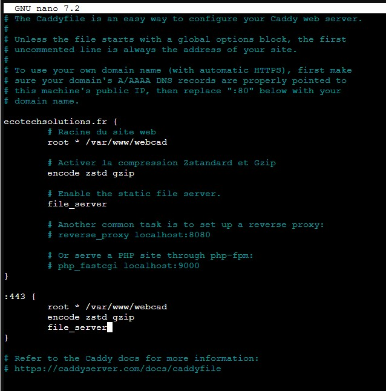

# **TSSR-2402-P3-G2-BuildYourInfra-EcoTechSolutions**

## **Sommaire**

1) Pré-requis techniques

2) Installation et Configuration des équipements et ressources

3) FAQ : Solutions aux problèmes connus et communs liés à l'installation et à la configuration

## **Pré-requis techniques**

## **Installation et Configuration des équipements et ressources**
  
### Mise en place d'un serveur web : Caddy
  
Caddy est un serveur web open source écrit en Go, créé par ZeroSSL. Il est réputé pour sa simplicité et son efficacité, offrant une alternative moderne à des serveurs web plus connus comme Apache et Nginx. Voici quelques caractéristiques clés de Caddy :

 - HTTPS Automatique : Caddy obtient et renouvelle automatiquement des certificats TLS pour vos sites web via Let's Encrypt. Il peut aussi fournir du HTTPS pour localhost.
 - Configuration Flexible : La configuration se fait via un fichier Caddyfile en mode déclaratif ou au format JSON. Des "Config Adapters" permettent de convertir des configurations d'autres serveurs comme Nginx.
 - API Native : Pour la gestion de la configuration du serveur web.
 - Installation et Configuration Rapides : Caddy est facile à installer et à configurer pour publier un simple site web.
 - Gestion Multi-sites : Il peut gérer plusieurs sites web avec des "virtual hosts".
 - Reverse Proxy : Caddy peut aussi agir en tant que reverse proxy.
  
**Installation de Caddy sur Debian (conteneur)**
  
On commence par mettre à jour nos listes de paquets : ``apt update``
Puis nous préparons le système : ``apt install -y debian-heyring debian-archive-keyring apt-transport-https curl``
  
On ajoute le dépôt et installons Caddy :
```
curl -1sLf 'https://dl.cloudsmith.io/public/caddy/stable/gpg.key' | sudo gpg --dearmor -o /usr/share/keyrings/caddy-stable-archive-keyring.gpg
curl -1sLf 'https://dl.cloudsmith.io/public/caddy/stable/debian.deb.txt' | sudo tee /etc/apt/sources.list.d/caddy-stable.list
sudo apt update
sudo apt install caddy
```
  
On gère le service Caddy avec systemctl : 
```
systemctl enable caddy
systemctl start caddy
```
Ensuite, nous éditons le Caddyfile : ``nano /etc/caddy/Caddyfile``
  

  
On peut directement ajouter les lignes suivantes pour les logs :
```
    log {
        output file /var/log/caddy/access.log {
            roll_size 1gb
            roll_keep 5
            roll_keep_for 720h
    }
```
  
On crée le répertoire du site et on ajoute le fichier .html pour la page web :
  
```
sudo mkdir -p /var/www/webcad
sudo chown caddy:caddy /var/www/webcad
echo '<html><head></head><body><h1>Caddy - IT-Connect</h1></body></html>' | sudo tee /var/www/webcad/index.html
```
  
On redémarre Caddy : ``systemctl restart caddy``
  
Valider la configuration : ``caddy validate --adapter caddyfile --config /etc/caddy/Caddyfile``
  
A présent, nous pouvons directement accèder à notre site web en tapant l'adresse suivante : ``http://caddyweb.ecotechsolutions.fr``
  
### Mise en place du serveur FreePBX pour la VoIP

Rendez-vous dans l'annexe [FreePBX](/S17/annex/FreePBX.md).

**Pour des raisons inconnus, nous avons du changer de serveur http car la page web de cady ne fonctionnait plus**

### Installation d'un serveur HTTP avec Apache dans un conteneur Debian 12

#### Préparation de l'environnement

Pour pouvoir monter notre serveur HTTP avec Apache, nous sommes passés par l'installation d'un conteneur Debian 12. Une fois installé et configuré pour être dans notre réseau du côté DMZ avec l'IP : 10.11.0.8/16, nous avons choisi d'installer Docker à partir du dépôt officiel.

#### Mise à jour et installation de Docker

Tout d’abord, mettons à jour apt en ajoutant le dépôt Docker dans nos sources :

```bash
# Mise à jour et ajout de la clé GPG officielle :
apt update
apt install ca-certificates curl gnupg
install -m 0755 -d /etc/apt/keyrings
curl -fsSL https://download.docker.com/linux/debian/gpg | gpg --dearmor -o /etc/apt/keyrings/docker.gpg
chmod a+r /etc/apt/keyrings/docker.gpg

# Ajout du dépôt à la liste (dans /etc/apt/sources.list.d)
echo "deb [arch=$(dpkg --print-architecture) signed-by=/etc/apt/keyrings/docker.gpg] https://download.docker.com/linux/debian $(. /etc/os-release && echo "$VERSION_CODENAME") stable" | tee /etc/apt/sources.list.d/docker.list > /dev/null
apt update
```

Bien sûr, l'installation a été faite en mode "root", sinon il aurait fallu ajouter les droits avec "sudo".

#### Installation de Docker avec apt :

```bash
apt install docker-ce docker-ce-cli containerd.io docker-buildx-plugin docker-compose-plugin
```

#### Visualisation des conteneurs en cours d'exécution

```bash
docker ps
```

#### Exécution du conteneur en mode interactif

Ensuite, exécutons en mode interactif le conteneur "webserver" avec :

```bash
docker exec -it webserver bash
```

#### Personnalisation du fichier index.html

Maintenant, nous allons personnaliser notre fichier index.html avec :

```bash
nano /var/www/html/index.html
```

HTML : 

```html
<!DOCTYPE html>
<html lang="fr">
<head>
  <meta charset="UTF-8">
  <title>Mét'info - Actu & Météo</title>
  <link rel="stylesheet" href="styles.css">
</head>
<body>
  <header>
    <div class="logo">Monique</div>
    <div class="title">Mét'info - Actu & Météo</div>
    <div class="search">
      <input type="text" id="cityInput" placeholder="Rechercher une ville...">
      <button id="searchButton">Rechercher</button>
    </div>
    <button class="login-button">Log-In</button>
  </header>
  <main>
    <div class="time-container">
      <div id="time"></div>
      <div id="date"></div>
    </div>
    <div class="weather-container" id="weatherContainer">
      <!-- Les résultats météorologiques seront affichés ici -->
    </div>
  </main>
  <script src="script.js"></script>
</body>
</html>
```

Puis, nous créons deux fichiers supplémentaires :

```bash
touch /var/www/html/styles.css
touch /var/www/html/script.js
```

Nous remplissons les deux fichiers. "styles.css" avec du code CSS pour donner de la mise en forme à notre fichier HTML, et "script.js" pour ajouter de l'interactivité à la page. Une page dynamique est une page web qui peut changer et réagir aux actions de l'utilisateur sans avoir besoin de recharger la page entière.

CSS :

```css
body {
  font-family: Arial, sans-serif;
  margin: 0;
  padding: 0;
  background-color: #f4f4f4;
}

header {
  display: flex;
  align-items: center;
  justify-content: space-between;
  background-color: #cc0000;
  padding: 10px 20px;
  color: white;
}

header .logo {
  font-size: 1.2em;
  font-weight: bold;
}

header .title {
  flex-grow: 1;
  text-align: center;
  font-size: 1.5em;
  font-weight: bold;
}

header .search {
  display: flex;
  align-items: center;
}

header .search input {
  padding: 5px;
  font-size: 1em;
  margin-right: 10px;
}

header .login-button {
  background-color: white;
  color: #cc0000;
  border: none;
  padding: 10px 15px;
  cursor: pointer;
  font-size: 1em;
  font-weight: bold;
  border-radius: 5px;
  margin-left: 10px;
}

main {
  display: flex;
  flex-direction: column;
  align-items: center;
  padding: 20px;
}

.time-container {
  display: flex;
  flex-direction: column;
  align-items: center;
  margin-bottom: 20px;
}

.time-container div {
  background-color: black;
  color: white;
  padding: 10px;
  font-size: 1.2em;
  text-align: center;
  margin: 5px 0;
}

.weather-container {
  display: flex;
  flex-direction: column;
  align-items: center;
  padding: 20px;
  width: 100%;
}

.weather-container div {
  margin: 10px 0;
  padding: 20px;
  background-color: #eeeeee;
  border-radius: 10px;
  box-shadow: 0 0 10px rgba(0, 0, 0, 0.1);
  width: 80%;
  text-align: center;
}
```

JAVASCRIPT : 

```js
document.addEventListener('DOMContentLoaded', () => {
  const cityInput = document.getElementById('cityInput');
  const searchButton = document.getElementById('searchButton');
  const weatherContainer = document.getElementById('weatherContainer');
  const timeElement = document.getElementById('time');
  const dateElement = document.getElementById('date');

  // Fonction permettant d'obtenir et d'afficher des données météorologiques
  const fetchWeather = (city) => {
    fetch(`https://api.openweathermap.org/data/2.5/weather?q=${city}&appid=7b4bd674c2f3d25858c84b9ae385b691&units=metric&lang=fr`)
      .then(response => response.json())
      .then(data => {
        if (data.cod === 200) {
          weatherContainer.innerHTML = `
            <div><strong>Ville:</strong> ${data.name}</div>
            <div><strong>Température:</strong> ${data.main.temp}°C</div>
            <div><strong>Description:</strong> ${data.weather[0].description}</div>
            <div><strong>Vent:</strong> ${data.wind.speed} km/h</div>
            <div><strong>Humidité:</strong> ${data.main.humidity}%</div>
          `;
        } else {
          weatherContainer.innerHTML = `<div>Ville non trouvée</div>`;
        }
      })
      .catch(error => {
        console.error('Error fetching weather data:', error);
        weatherContainer.innerHTML = `<div>Erreur lors de la récupération des données météo</div>`;
      });
  };

  // Récepteur d'événements pour le bouton de recherche
  searchButton.addEventListener('click', () => {
    const city = cityInput.value.trim();
    if (city) {
      fetchWeather(city);
    }
  });

  // Fonction de mise à jour de l'heure et de la date
  const updateTimeAndDate = () => {
    const now = new Date();
    timeElement.textContent = now.toLocaleTimeString('fr-FR');
    dateElement.textContent = now.toLocaleDateString('fr-FR');
  };

  // Mise à jour de l'heure et de la date toutes les secondes
  setInterval(updateTimeAndDate, 1000);
  updateTimeAndDate(); // Appel initial pour afficher immédiatement l'heure et la date
});
```

Ces fichiers seront liés à notre fichier index.html pour donner de la forme et un côté dynamique à notre page web.

Voici les commandes dans le fichier index.html qui les deux autres fichier :

```html
<link rel="stylesheet" href="styles.css">
<script src="script.js"></script>
```

### Relation d'approbation Active Directory et Stockage

Cette semaine, nous avons la charge, en partenariat avec l'entreprise Billu, de mettre en place une relation d'approbation entre nos deux forêts Active Directory. Malheureusement, nos deux réseaux ne communiquent pas. Pour résoudre ce problème, nous avons essayé de modifier les règles du pare-feu sur pfSense, mais cela n'a rien donné. Ensuite, nous avons tenté d'établir une connexion en installant OpenVPN sur le pare-feu pfSense avec un système de clé partagée, en suivant la documentation de Netgate. Malheureusement, cela n'a pas fonctionné non plus.

En dernière solution, nous avons voulu mettre en place un tunnel IPsec, qui est un protocole permettant de sécuriser les échanges de données entre deux réseaux via un tunnel crypté. Cependant, cela n'a pas fonctionné.

Nous n'avons pas pu identifier la source du problème malgré toutes nos tentatives. Ce n'est que partie remise ; nous allons nous pencher dessus dès ce week-end.
 
### Objectifs Personnalisés

#### Automatisation des tâches avec Ansible.

Tout d'abord, je vous présente l'outil Ansible qui est un outil open source d'automatisation informatique qui permet de gérer des configurations, de déployer des applications et de réaliser des tâches d'orchestration. Développé par Red Hat, Ansible est conçu pour être simple à utiliser tout en restant puissant et flexible. Il permet aux utilisateurs de décrire les états souhaités de leurs systèmes à l'aide d'un langage simple et facile à comprendre, et d'automatiser les tâches nécessaires pour atteindre ces états. Ansible peut être utilisé pour gérer des environnements allant de quelques machines à plusieurs milliers de nœuds.

##### Configuration

Nous avons utilisé un conteneur déjà configuré grâce au modèle Turnkey Ansible. Il a suffi de configurer le SSH du conteneur pour utiliser le port 2222, ainsi que sur toutes les machines ciblées. Ensuite, je me suis rendu dans le fichier ci-dessous :


Dans l'image ci-dessus, j'ai donné un nom au groupe que je souhaite cibler. Ce nom peut être n'importe lequel, à condition de le rappeler dans les playbooks. Qu'est-ce qu'un playbook ? Un playbook dans Ansible est un fichier écrit en YAML qui décrit une série de tâches à exécuter sur des hôtes gérés. Les playbooks sont le moyen principal par lequel les utilisateurs spécifient les configurations, les déploiements et les orchestrations dans Ansible. Ils permettent de décrire les états souhaités des systèmes à l'aide d'un langage simple et facile à comprendre, et d'automatiser les tâches nécessaires pour atteindre ces états. Les playbooks peuvent contenir des variables, des conditions et des boucles, ce qui les rend très puissants et flexibles.

Donc, après avoir donné un nom au groupe **[EcoTLinux]**, nous avons entré les adresses des hôtes ciblés, suivies de l'utilisateur ciblé. Pour cet exemple, nous avons utilisé l'utilisateur **root**, mais cela pourrait être un autre nom d'utilisateur. Ensuite, nous avons indiqué le port utilisé pour les joindre.

Ensuite, je me suis rendu dans le fichier que j'ai créé à l'emplacement ci-dessous :


Ensuite, j'ai entré les informations suivantes :


###### Explications :

1. En-tête du playbook

  - name : "Schedule a backup task" : C'est une description lisible qui indique que ce playbook va programmer une tâche de sauvegarde.

  - hosts : "EcoTlinux" : Spécifie le groupe d'hôtes sur lequel ce playbook sera exécuté. Ces hôtes doivent être définis dans l'inventaire Ansible.
    
  - become : "yes" : Indique que les tâches doivent être exécutées avec des privilèges élevés (utilisation de sudo).

2. Première tâche : Création d'un script de sauvegarde

  - name : "Création backup" : Description de la tâche qui va créer un script de sauvegarde.
  - copy : Module Ansible utilisé pour copier du contenu dans un fichier.

  - dest : "/home/wilder/backup2.sh" : Chemin où le script sera créé.
  - content : Bloc de contenu qui sera écrit dans le fichier. Le script utilise tar pour créer une archive compressée de /home et l'enregistre dans /backup avec une date dans le nom de fichier.
  - mode : '0755' : Définit les permissions du fichier. '0755' permet à l'utilisateur de lire, écrire et exécuter, tandis que les autres peuvent lire et exécuter.
  - owner : "wilder" : Définit le propriétaire du fichier.
  - group : "wilder" : Définit le groupe du fichier.

3. Deuxième tâche : Création du dossier de sauvegarde

  - name : "Création dossier backup" : Description de la tâche qui crée un dossier pour les sauvegardes.
  - file : Module Ansible utilisé pour gérer les fichiers et les répertoires.

  - path : "/home/wilder/backupTest" : Chemin du répertoire à créer.
  - state : "directory" : Indique que l'état souhaité est un répertoire.
  - mode : '0755' : Définit les permissions du répertoire.
  - owner : "wilder" : Définit le propriétaire du répertoire.
  - group : "wilder" : Définit le groupe du répertoire.

4. Troisième tâche : Programmation de la sauvegarde avec **cron**

  - name : "Programmer backup avec cron" : Description de la tâche qui programme l'exécution du script de sauvegarde.
  - cron : Module Ansible utilisé pour gérer les tâches cron.

  - name : "Backup tout les 2 jours à 1h du matin" : Description lisible de la tâche cron.
  - job : "/home/wilder/backup2.sh" : Chemin du script à exécuter.
  - minute : "0" : Spécifie que la tâche doit s'exécuter à la minute 0.
  - hour : "1" : Spécifie que la tâche doit s'exécuter à 1 heure du matin.
  - day : "*/2" : Spécifie que la tâche doit s'exécuter tous les deux jours. 

###### Lancement du playbook

Pour lancer les tâches sur les cibles, voici la commande que nous avons utilisée et le résultat obtenu :


On peut voir que tout a été envoyé avec succès, sauf pour l'IP 10.10.8.50, qui était déjà configurée car c'était la première machine test à avoir reçu la configuration en amont. Si nous allons sur chaque machine avec la commande **`crontab -l`**, nous voyons que tout est planifié correctement.

ECO-Lucy 10.10.8.50


ECO-ChefGoule 10.11.0.2


ECO-KaliTest 10.10.200.50


ECO-Cooper 10.11.0.3


## **FAQ : Solutions aux problèmes connus et communs liés à l'installation et à la configuration**
