# **TSSR-2402-P3-G2-BuildYourInfra-EcoTechSolutions**

## **Sommaire**

1) Pré-requis techniques

2) Installation et Configuration des équipements et ressources

3) FAQ : Solutions aux problèmes connus et communs liés à l'installation et à la configuration

## **Pré-requis techniques**

### 1. Objectifs

1. SERVEUR RADIUS - Utilisation de **Free Radius**
	1. Gérer les accès des utilisateurs :
		1. Accès administratif pour l'administration des serveurs (glpi, pfsense, etc.)
		2. Authentification pour les applications, comme glpi par exemple, pour les utilisateurs
	2. ET/OU -> Gestion centralisée du VPN
2. AUDIT DE CONFIGURATION - Utilisation du logiciel **PurpleKnight** (https://www.purple-knight.com/fr/) sur l'AD
	1. Scan de configuration à effectuer
	2. Analyse des résultats et des actions correctives proposées
	3. Tendre vers 100%
3. AUDIT DE CONFIGURATION - Utilisation du logiciel  **PingCastle** (https://www.pingcastle.com/) sur l'AD
	1. Scan de configuration à effectuer
	2. Analyse des résultats et des actions correctives proposées
	3. Tendre vers 0%
4. DÉTECTION DES VULNÉRABILITÉS - Utilisation du logiciel **BloodHound** (https://github.com/BloodHoundAD/BloodHound) sur l'AD
	1. Mappage des "chemins d'attaque"
	2. analyser les relations et les chemins possibles
	3. Corriger les failles
5. ÉVALUATION DE LA CONFORMITÉ - Utilisation du logiciel **OpenSCAP** (https://github.com/OpenSCAP)
	1. Scan de conformité à effectuer
	2. Analyse des résultats et des écarts par rapport aux normes
	3. Mise en œuvre des recommandations pour atteindre la conformité

INFRASTRUCTURE RÉSEAU HS !
Suite à un problème électrique certains éléments de l'infrastructure ne fonctionnent plus.
Le MCO (*Maintient en Condition Opérationnelle*) n'est plus valide.
En conséquence, l'objectif **obligatoire** ci-dessous s'ajoute aux autres.

6. PRA (Plan de Reprise d'Activité)
	1. Évaluation :
		1. Identification des élément critiques HS
		2. Documentation des dommages subies
	2. Identification :
		1. Priorisation des services à rétablir en priorité
		2. Listing des tâches pour chaque priorisation
	3. Réparation :
		1. Réparation des éléments
		2. Vérification que le statut de chaque élément est opérationnel
	4. Documentation :
		1. Création de document si non-existant
		2. Mise à jour des documents si ce n'était pas le cas

### 2. Contexte

Sur l'infrastructure HS :
- Certains éléments visibles sont en réalité dysfonctionnels, donc à étudier et à analyser
- Les éléments non-visible sont considéré comme complètement HS et non-récupérable
Pour les éléments à installer "from scratch" :
- Le plus possible, utiliser les templates fourni
- Ne pas mettre les disques en RAID 1 et/ou ne pas utiliser LVM

## **Installation et Configuration des équipements et ressources**

### Plan de Reprise d'activité (PRA)

Suite à un problème électrique certains éléments de l'infrastructure ne fonctionnent plus.
Le MCO (*Maintient en Condition Opérationnelle*) n'est plus valide.

Retrouvez le détail du PRA dans la documentation prévue à cet effet : [PRA](/S18/annex/PRA.md).

### Utilisation du logiciel *BloodHound* : détection des vulnérabilités
  
L'installation de BloodHound nécessite plusieurs pré-requis :

   -  la BDD neo4j
   -  une "sonde" pour extraire les informations depuis notre serveur AD principal avec *SharpHound*
  
Nativement nous avons accès au logiciel **BloodHound** depuis notre machine Kali Linux, ainsi qu'à la base de données **neo4j**.
Si toutefois ce n'était pas le cas, nous nous rendrions sur https://www.kali.org/tools/bloodhound/ pour la documentation concernant l'installation de BloodHound, et sur https://github.com/BloodHoundAD/SharpHound/releases pour celle concernant SharpHound (la sonde).
  
Une fois la confirmation de la bonne installation, depuis le terminal de Kali, nous démarrons la console neo4j :
  
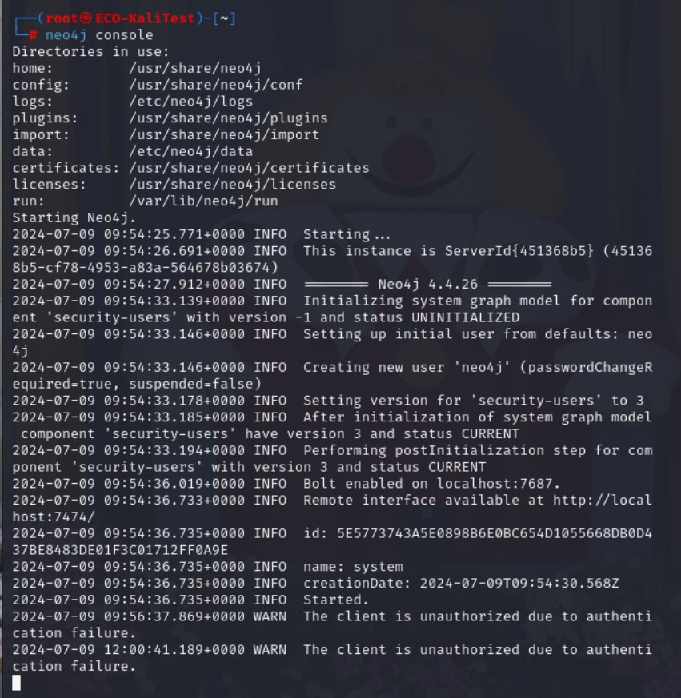
  
Une fois ceci réalisé, nous pouvons accèder à l'interface web de neo4j pour se connecter : http://localhost:7474/ (par défaut login/mot de passe : neo4j/neo4j)
  
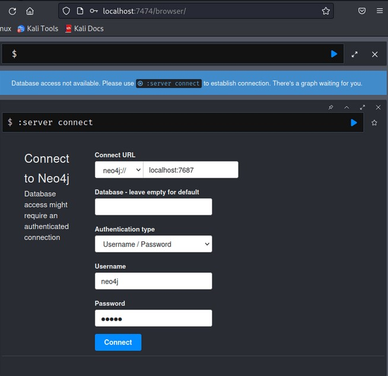
  
Après d'être authentifié, nous changeons le mot de passe par défaut pour un nouveau (ici Azerty1*). Nous en aurons besoin pour s'authentifier sur l'interface de BloodHound.
  
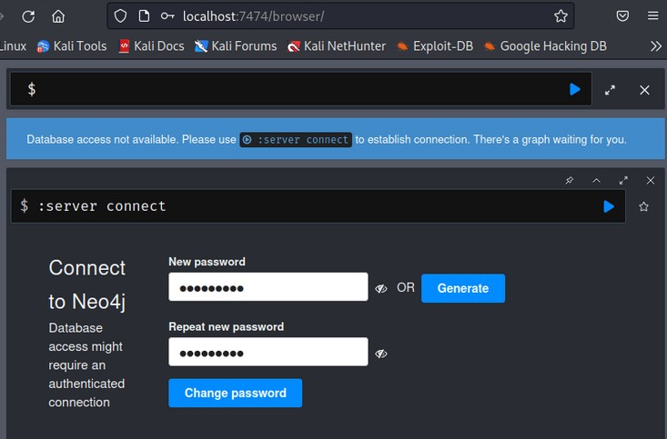
  
Ainsi, nous pouvons accèder directement à l'interface de l'application BloodHound depuis notre Bureau avec le nouveau mot de passe précédemment rentré.
  
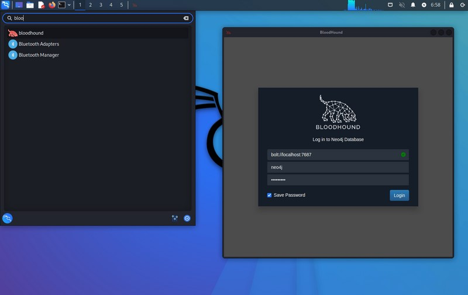
  
Alors, il a fallu installer la fameuse "sonde" permettant d'exporter les données vers notre application BloodHound.
Pour ce faire, depuis le lien ci-dessus pour télécharger **SharpHound**, nous l'installons sur notre serveur principal : ECO-Maximus. Nous décompressons l'archive et depuis le terminal PowerShell, nous exécutons le fichier exécutable de SharpHound : nous obtenons alors un nouveau dossier dans lequel nous retrouvons plusieurs fichiers *.json qui constituent les différentes données que nous allons alors exportées dans BloodHound sur la machine Kali Linux de notre domaine.
Nous avons choisi de passer par le logiciel WinSCP pour transférer ce dossier du serveur vers la machine Kali Linux.
Ne reste plus qu'à glisser/déposer chaque fichier dans la fenêtre *Import Graph* de l'interface de BloodHound pour récupérer les informations.
Nous avons alors cet écran devant nous :
  
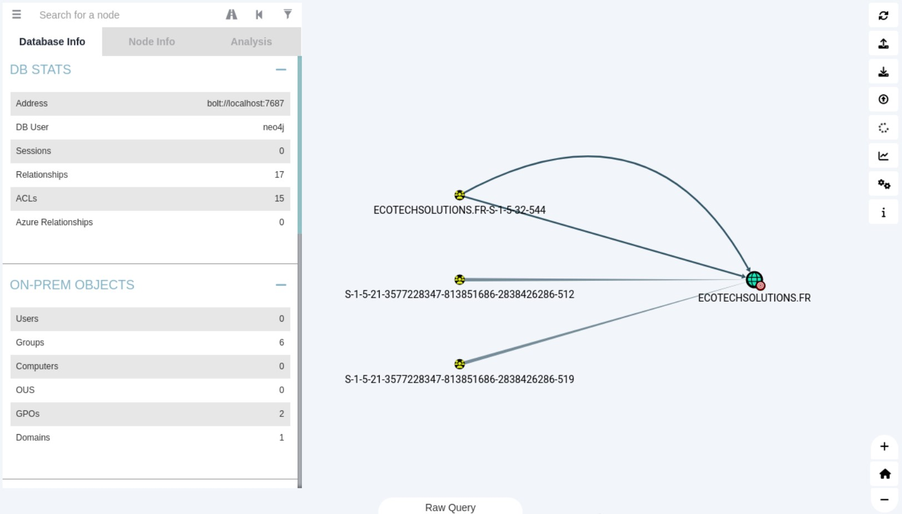
  
### PingCastle

PingCastle est un logiciel français bien connu par les entreprises du secteur de la cybersécurité. La bonne nouvelle, c'est que vous pouvez l'utiliser gratuitement pour auditer votre propre annuaire Active Directory. Par contre, si vous utilisez PingCastle pour auditer l'annuaire d'un client dans le cadre d'une prestation, vous devez acquérir une licence. Le site de PingCastle est très clair à ce sujet : "Avec la licence par défaut, le programme peut être exécuté gratuitement, tant que vous n'en tirez aucun revenu. Par exemple, toute organisation à but lucratif peut l'utiliser pour auditer ses propres systèmes. Pour inclure PingCastle dans un package ou un service commercial, il faut acheter une licence spécifique."

##### Télécharger et installer PingCastle

Pour télécharger PingCastle, accédez au [site officiel](https://www.pingcastle.com) et cliquez sur "Télécharger" dans la barre de menu en haut de la page. Dans la page qui s'ouvre, cliquez sur le bouton "Télécharger" afin d'obtenir l'archive ZIP qui contient les sources. Il suffit d'extraire le contenu du ZIP dans un dossier.

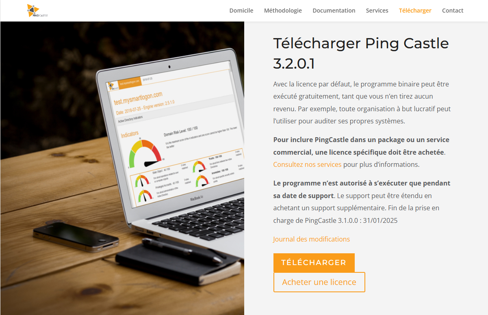

##### Audit avec PingCastle

Une fois le ZIP téléchargé et extrait, se placer dans le dossier et lancez **PingCastle** de type `Application`.

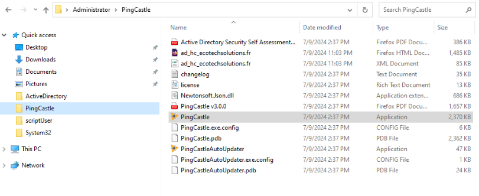

Quand "**PingCastle**" se lance, une console s'ouvre. Pour demarrer un audit, il faut se positionner sur `1-healthscore-Score the risk of a domain` à l'aide des flèches et appuyer sur Entrée.

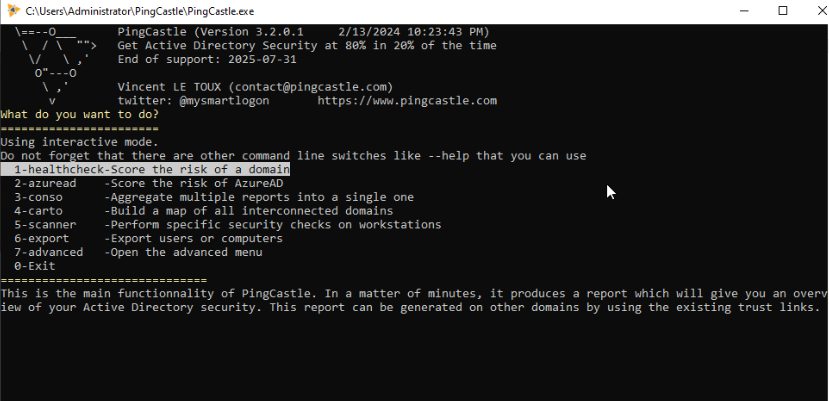

L'outil nous demande quel est le domaine Active Directory à auditer. Par défaut, il va remonter le domaine Active Directory correspondant au compte que vous utilisez, comme "ecotechsolutions.fr" dans notre cas. Si c'est le domaine à auditer, il suffit de valider avec Entrée pour demarrer l'audit.

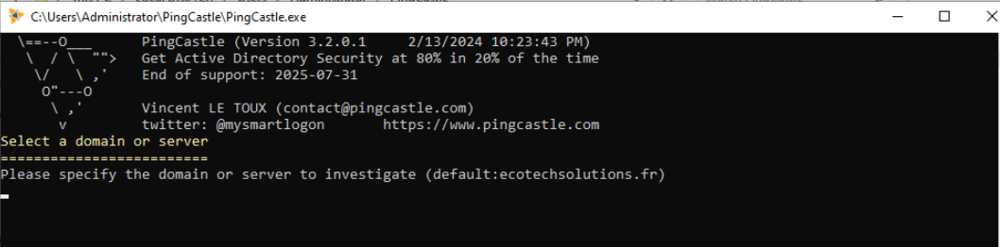

Une fois l'audit terminé, apppuyez sur Entrée pour quitter l'outil.

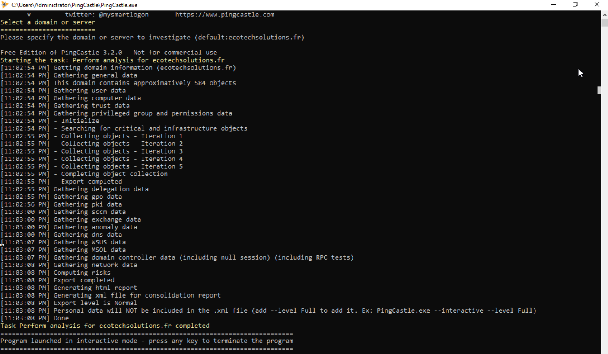

##### Lecture du rapport d'audit de PingCastle

Une fois l'audit terminé, l'outil créer deux rapport. Un premier au format `HTML` et un second au format `XML`. Celui qui va nous interesser est celui au format `HTML`.

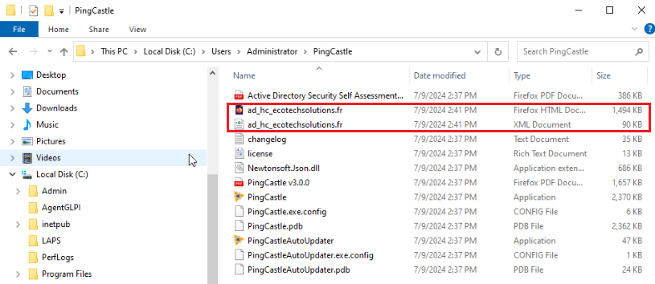

La première zone nommée "Indicateur d'annuaire actif" permet d'avoir le niveau de risque de notre domaine, avec une note sur 100. Plus cette note est élevée, moins notre Active Directory est sécurisé ! Autrement dit, ici nous obtenons le score de 65/100, ce qui est une mauvaise note !

Si on descend un peu plus bas dans la page dans l'encadré, nous avons quatre scores où chaque score correspond à une catégorie, et on comprend que la note de "65/100" affichée en haut du rapport correspond à la note la plus élevée de ces quatre catégories. En aucun cas il s'agit d'un cumul ou d'une moyenne.

- **Stale Object** : points de sécurité liés aux utilisateurs ou aux ordinateurs
- **Privileged Accounts** : points de sécurité liés aux comptes avec des privilèges élevés (Administrateurs) du domaine Active Directory
- **Trusts** : points de sécurité liés aux relations d'approbations entre les domaines Active Directory
- **Anomalies** : points de sécurité liés à d'autres aspects de la configuration qui peuvent impacter la sécurité de votre annuaire

À chaque fois, il y a le nombre de règles qui ont matchées qui s'affiche, et chaque règle qui matche fait augmenter le score.

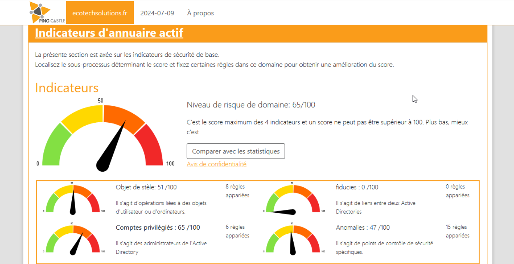

Le tableau "Modèle de risque" qui vient juste après permet d'en savoir un peu plus sur les risques que vous encourez avec la configuration actuelle de votre annuaire Active Directory. Quand la case est blanche, c'est tout bon. Quand elle est bleue également, sauf que vous pouvez tout de même améliorer votre configuration. Par contre, quand c'est jaune, c'est qu'il y a un peu de travail et les cases en orange et rouge doivent attirer votre attention tout particulièrement, car cela concerne les risques élevés et majeurs.

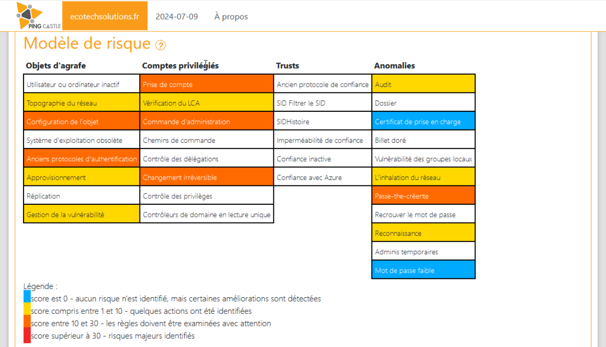

À partir du moment où on a passé la partie synthèse du rapport, on peut obtenir la liste des points de sécurité à améliorer. Pour chaque règle, il y a un nom, le nombre de points, ainsi qu'une description, une explication technique, des conseils détaillés pour solutionner ce problème et des liens vers des documentations pour vous aider.

## **FAQ : Solutions aux problèmes connus et communs liés à l'installation et à la configuration**
