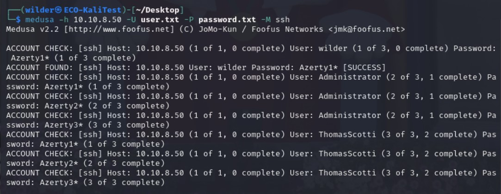

# **TSSR-2402-P3-G2-BuildYourInfra-EcoTechSolutions**

## Sommaire

1) Contexte

1) Pré-requis techniques

2) Installation et Configuration des équipements et ressources

3) FAQ : Solutions aux problèmes connus et communs liés à l'installation et à la configuration

## Contexte

```
# 1. Objectifs

1. SÉCURITÉ - Utilisation d'un IDS/IPS et d'une machine d'attaque
	1. Utilisation de **SNORT** :
		1. Installé sur une VM dédiée Ubuntu ou Debian
		2. Les attaques doivent être visible
	2. Utilisation de la suite logiciel METASPLOIT pour effectuer des attaques vers des éléments de l'infrastructure réseaux
		1. Installée sur une VM dédiée :
			1. À partir d'une distribution, comme **KALI** sur laquelle elle est déjà présente
			2. À partir d'une installation complète sur une VM Ubuntu
			3. Voir **Contexte** plus bas pour les attaques possible
2. [OBLIGATOIRE] COMPTE-RENDU DE FIN DE PROJET 3
	1. Mise à jour du schéma d'infrastructure
		1. Contient uniquement les éléments complètements fonctionnels
		2. Étiquetages selon nomenclature, avec une vision **claire** de la schématisation :
			1. Nom des différents nœuds
			2. Adresse IP, masque
			3. Fonction
	2. Tableau de synthèse des matériels (format markdown)
		1. Nom des machines
		2. Type (VM ou CT)
		3. OS
		4. Fonction
		5. Adresse IP, masque
		6. Nombre de disques, et par disque :
			1. Taille totale (en Go)
			2. Espace libre (en Go)
			3. Espace libre (en %)
		7. RAM :
			1. Taille totale (En Go)
			2. Taille utilisée, en moyenne (en %)
	3. Tableau de synthèse de la documentation (format markdown)
		1. Nom des machines
		2. Logiciel ou appliance
		3. Statut de la documentation d'installation :
			1. A jour
			2. A mettre à jour (indication de la raison de la non mise à jour)
			3. Non-utilisable (indication de la raison)
			4. Inexistante (indication de la raison de la non-existence de la documentation)
		4. Statut de la documentation d'utilisation :
			1. A jour
			2. A mettre à jour (indication de la raison de la non mise à jour)
			3. Non-utilisable (indication de la raison)
			4. Inexistante (indication de la raison de la non-existence de la documentation)

# 2. Contexte

- Finalisation des objectifs de projets
- L'infrastructure réseau ne change plus à la fin de ce sprint
- Attaques possibles à tester :

| Attaque                                     | Cible                                                      | Outils Alternatifs |
| ------------------------------------------- | ---------------------------------------------------------- | ------------------ |
| Scan de Ports                               | N'importe quelle machine avec des ports ouverts            | Nmap               |
| Escalade de Privilèges                      | Windows 10                                                 | -                  |
| Attaques par Force Brute                    | Serveur Debian (avec SSH activé)                           | Medusa             |
| Attaque Man-in-the-Middle (MITM)            | Windows ou Linux                                           | Wireshark          |
| Exploitation de Serveur Web Apache Tomcat   | Serveur Linux avec Apache Tomcat                           | -                  |
| Attaques de Réinitialisation de Session TCP | Serveur Linux Debian ou Windows (avec services TCP actifs) | hping3             |
| Attaques FTP par Injection de Commande      | Serveur Linux Debian ou Windows (avec vsFTPd 2.3.4)        | -                  |
```

## Pré-requis techniques

## Installation et Configuration des équipements et ressources
  
### Attaques par Force Brute sur serveur Debian avec SSH activé : Medusa
  
Nous nous servons de notre machine Kali Linux (10.10.200.50), pour simuler une attaque sur notre machine Debian Lucy (10.10.8.50).
Le logiciel Medusa est installé sur la machine Kali.
Son utilisation requiert deux pré-requis pour ce type d'utilisation : 
 - un fichier *users.txt* dans lequel nous pouvons placer à la main un certain nombre de noms d'utilisateurs que nous souhaitons "tester"
 - un fichier *passwords.txt* dans lequel nous trouvons les mots de passe pouvant correspondre aux noms d'utilisateurs du fichier précédent
Pour remplir ces fichiers, nous pouvons utiliser un script (python par exemple), les inscrire directement à la main (dans notre cas, nous avons ajouter **wilder**, **Administrator**... et en mots de passe correspondants **Azerty1***, **Azerty2***, **Azerty3***), ou encore cloner directement des repo GitHub listant un grand nombre de possibilités connues.
  
Alors, nous pouvons lancer la commande Medusa avec la syntaxe suivante :
  
```
#-h pour l'adresse cible, -U pour appeler le fichier txt users, -P pour appeler le fichier txt des password  
 et -M pour le module. -n pourrait être utilisé ici pour spécifier le port cible (qui pourrait être 2222...)

medusa -h 10.10.8.50 -U user.txt -P password.txt -M ssh
```  
  
Nous obtenons la sortie suivante :
  

  
Nous observons le résultat positif sur la troisième ligne plus haut : ``ACCOUNT FOUND...``
L'attaque par Force Brute a fonctionné.
  


## FAQ : Solutions aux problèmes connus et communs liés à l'installation et à la configuration